# Incremental Graphs with *minigraph*

## Minigraph Functions

Constructs graphs

Maps sequences to graphs

https://github.com/lh3/minigraph


## Minigraph Overview

Finds approximate positions of diverged sequences and adds them into the graph iteratively. It is not reference-free nor does it aim to find every single variant, but it does well in finding structural variants.

1-to-1 orthogonal regions

<center>
{width=50%}
</center>

## Minimizers and Minimap2
Minigraph is built off of ideas and code from Minimap2.

### Minimizers {-}
From the minimap2 usage:
"A minimizer is the smallest k-mer in a window of w consecutive k-mers."

Essentially a minimizer tags a sequence window with the kmer that is first alphabetically.


A nice tutorial:  
+ https://homolog.us/blogs/bioinfo/2017/10/25/intro-minimizer/

### Minimap2 {-}
Minimap2 is a fast sequence aligner.
It can align short or long reads or assemblies against a reference using the seed-chain-align approach that many aligners employ. It finds exact matches (anchors) between query minimizers (seeds) and indexed reference minimizers. It links colinear anchors together (chains). For nt-level alignment it fills in regions between anchors within chains and between chains (align).

https://github.com/lh3/minimap2  
https://academic.oup.com/bioinformatics/article/34/18/3094/4994778

## Pipeline

1. Prepare the input
2. Build graphs
+ Build a single genome graph and incrementally add more sequences
+ Or build a graph for all sequences at once
3. View with Bandage

## Yeast Assemblies

*12 Mb*  
*16 chromosomes*

<br>
Yeast Population Reference Panel (YPRP)  https://yjx1217.github.io/Yeast_PacBio_2016/data/

12 Yeast PacBio Assemblies (Chromosome level)

>1. ~100-200x PacBio sequencing reads 
>2. HGAP + Quiver polishing  
>3. ~200-500x Illumina (Pilon correction)  
>4. Manual curation  
>5. Annotation

<br>


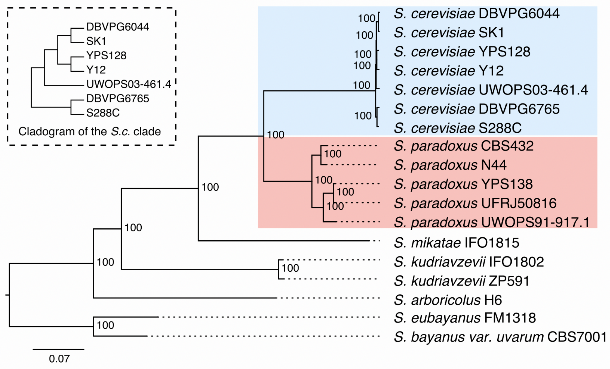{width=100%}


<br>

>Make sure your chromosome names are unique across all samples and that they contain the sample name. We’re using \<strain name>.\<chromosome> (>S288C.chrVIII)

<br>

## Prepare the Input

1. Make sure you're working in a **screen**

2. Make sure you've sourced the pangenomics environment file
```
source /home/pangenomics/pangenomics_env
```

3. Make Directory

```{bash, eval=FALSE}
mkdir ~/minigraph
```
4. Navigate to the Directory

```{bash, eval=FALSE}
cd ~/minigraph
```
5. Link to data

```{bash, eval=FALSE}
ln -s /home/pangenomics/data/yprp/assemblies/*.fa .
```

## Graphical Fragment Assembly (GFA) format


Tab-delimited text

Lines start with one of the following types:


| Type | Description | Explanation |
|:--|:-----|:---------|
| **H**  |  Header  |       |
| **S**  |  Segment  |  A continuous sequence or subsequence   |
| **L** |  Link |  Segment overlaps (basepairs & orientations)  |
| **J** | Jump | Jumps link sequences across gaps |
| **C** | Containment | Segment contained in another segment |
| **P** | Path | An ordered & oriented list of linked segments |
| **W** | Walk | An ordered & oriented list of segments w/o overlaps |
| **#** | Comment | |

Optional Fields TAG:TYPE:VALUE  
http://gfa-spec.github.io/GFA-spec/GFA1.html

Let's go to the specification to look at optional fields and an example:  
http://gfa-spec.github.io/GFA-spec/GFA1.html


## *reference* Graphical Fragment Assembly (rGFA)

https://github.com/lh3/gfatools/blob/master/doc/rGFA.md

+ Strict subset of GFA
+ Tags that trace origin
+ Stable coordinates

<center>
{width=80%}

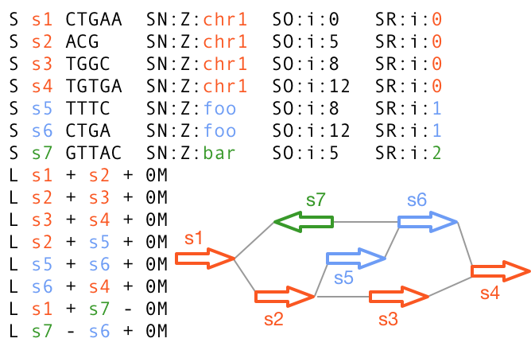{width=70%}
</center>

## Build Graphs


1. The first sequence in the graph is used as a “reference”:

```{bash, eval=FALSE}
minigraph -xggs reference.fa -t 20 > ref.minigraph.gfa
```

+ **-xggs** 
    + build a graph using a simple (ggs) algorithm
+ **-t 20**
    + use 20 threads

2. Incrementally add strains to graph:

```{bash, eval=FALSE}
minigraph -xggs ref.minigraph.gfa strain_1.fa > strain_1.minigraph.gfa

minigraph -xggs strain_1.gfa strain_2.fa > strain_2.minigrpah.gfa
...

minigraph -xggs string_N-1.gfa strain_N.fa > yprp.minigraph.gfa
```

3. Or build a graph for all strains at once:

```{bash, eval=FALSE}
minigraph -xggs ref.minigraph.gfa strain_*.fa > yprp.minigraph.gfa
```

## Reference Graph

Activate the environment
```{bash, eval=FALSE}
source /home/pangenomics/pangenomics_env
```

Let's create a graph for the reference (S288C) and answer the following questions.


1. Make the reference graph

```{bash, eval=FALSE}
minigraph -xggs S288C.genome.fa > ref.minigraph.gfa
```

2. How many lines in the gfa file?

```{bash, eval=FALSE}
wc -l ref.minigraph.gfa
```

3. What type of lines are they?

```{bash, eval=FALSE}
cut -f 1 ref.minigraph.gfa | sort | uniq -c
```

### Reference Graph Bandage Visualization {-}

Download your gfa file onto your computer and upload it into Bandage.

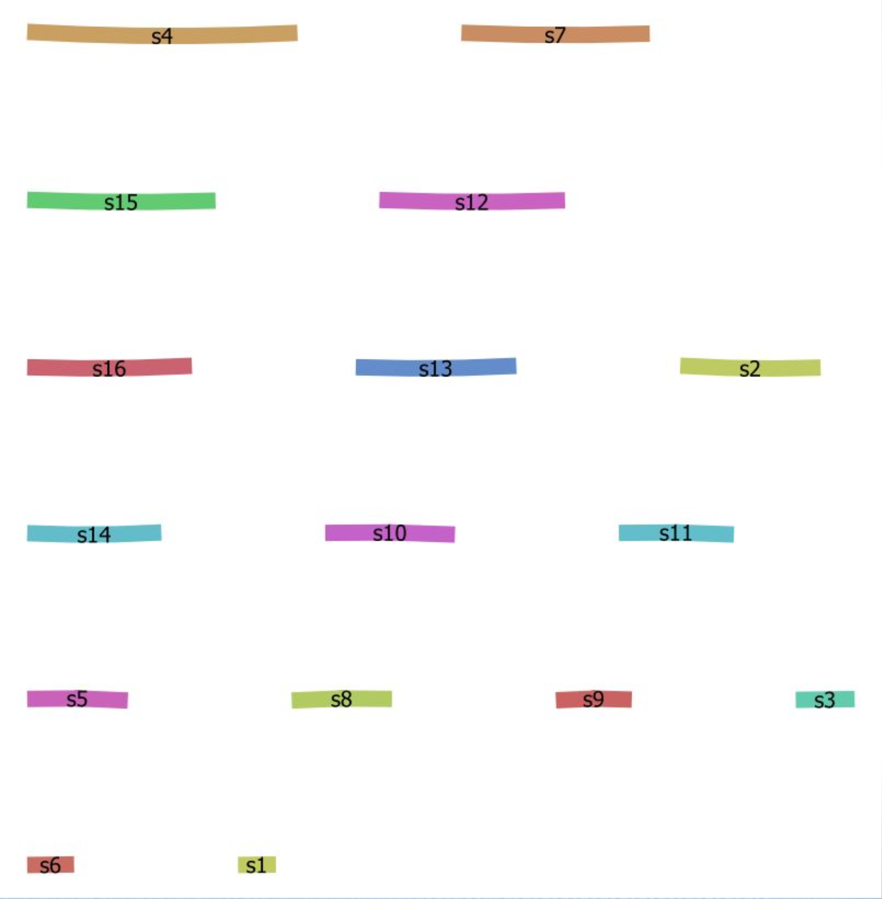{width=70%}

## YPRP Graphs


1. Add in the rest of the lines
+ we’ll do this alphabetically
+ capture the stderr

```{bash, eval=FALSE}
minigraph -xggs ref.minigraph.gfa $(ls *.fa | grep -v S288C) > yprp.minigraph.gfa 2>yprp.minigraph.err
```

*Note:* We can simply use the reference fasta instead of a gfa

```{bash, eval=FALSE}
minigraph -xggs S288C.genome.fa $(ls *fa | grep -v S288C) > yprp.minigraph.gfa 2>yprp.minigraph.err
```

Try to answer the following questions:

1. How many lines are in the gfa file?

```{bash, eval=FALSE}

```

2. What type of lines are they?

```{bash, eval=FALSE}

```

3. How many yeast assemblies have inversions compared to S288C (hint: look in the stderr)?

```{bash, eval=FALSE}

```

### YPRP Commands {-}

1. How many lines are in the gfa file?

```{bash, eval=FALSE}
wc -l yprp.minigraph.gfa
```

2. What type of lines are they?

```{bash, eval=FALSE}
cut -f 1 yprp.minigraph.gfa | sort | uniq -c
```

3. How many yeast assemblies have inversions compared to S288C (hint: look in the stderr)?

```{bash, eval=FALSE}
grep inv yprp.minigraph.err
```

### YPRP Graph Statistics {-}

```{bash, eval=FALSE}
export PATH=$PATH:/home/vesw/gfatools/
gfatools stat yprp.minigraph.gfa
```

Number of segments: 2729

Number of links: 3864

Number of arcs: 7728

Max rank: 11

Total segment length: 13243550

Average segment length: 4852.895

Sum of rank-0 segment lengths: 12157149

Max degree: 7

Average degree: 1.416


### YPRP Graph in Bandage {-}

Take a look at the YPRP graph in Bandage. Your might be rendered differently.

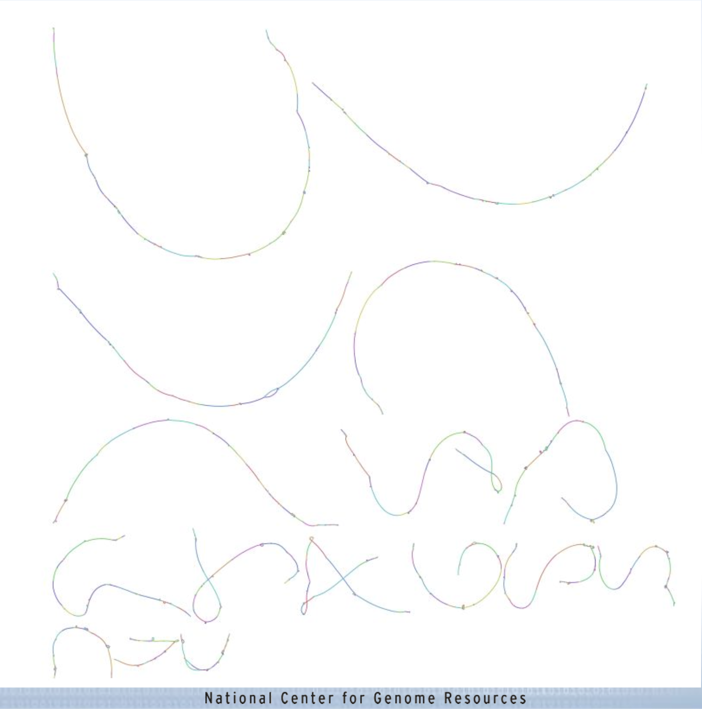{width=100%} 
<br>
<br>

## Structures in the graph

### Insertions and Diverged Regions {-}

Zoom in on segment s1054.

Trace the S288C path (hint: the S288C segments are numbered sequentially).

Identify insertions and regions that have diverged.

 
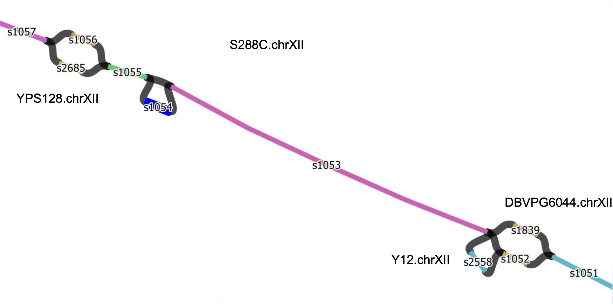{width=100%} 

### Group Exercise{-}

1. Find a simple and a complex region
2. Discuss it in your group
3. Share it with everyone
4. Keep track of the segments

### Inversions {-}

Here are some examples of inversions.

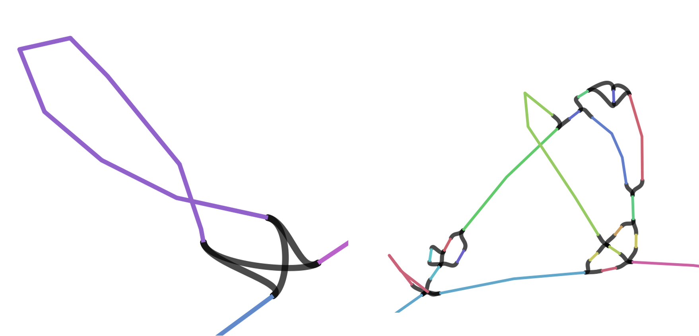{width=75%} 

Let's find them in bandage.

s1289 LN:i:24089 SN:Z:S288C.chrXIV SO:i:567595

s1672 LN:i:257 SN:Z:DBVPG6044.chrV SO:i:446168


Click on the links (black) to see the direction that paths can travel.

Do a web-blast in Bandage to see what they might code for. Also blast the adjacent segments to get some context.


### Inversions in the GFA {-}

I found the inversions by searching the graph GFA file for pairs of segments that have two links between them.

```{bash, eval=FALSE}
 grep '^L' yprp.minigraph.gfa | awk '{print $2 "\t" $4}'|sort|uniq -c|awk '$1>=2{print}'
```


2 s1288 s1289  
2 s1289 s1290  
2 s1671 s1672  
2 s1672 s1673


1. Pull out s1289, its adjacent segments and the links connecting them

```{bash, eval=FALSE}
gfatools view -l s1289 -r 1 yprp.minigraph.gfa
```

>**-l STR/@FILE**.       segment list to subset [ ]   
>**-r INT**.       subset radius (effective with -l) [0]
    
Showing just the links here:  
L       s1288   +       s1289   +       0M      SR:i:0  L1:i:4105       L2:i:24089  
L       s1288   +       s1289   -       0M      SR:i:5  L1:i:4105       L2:i:24089  
L       s1289   +       s1290   +       0M      SR:i:0  L1:i:24089      L2:i:1511  
L       s1289   -       s1290   +       0M      SR:i:5  L1:i:24089      L2:i:1511

2. Now do the same for s1672

3. Try extending the surrounding region by increasing the -r parameter

## Minigraph Blog

Heng Li
http://lh3.github.io/2021/01/11/minigraph-as-a-multi-assembly-sv-caller

## Bonus Questions

1. What is the longest segment in the graph?
[Hint: Parse out the number from the 4th field of the segment line]
2. What is the shortest segment in the graph?
3. What cigar strings exist for the overlaps in the links? [Hint:
Field 6 of the link line]
4. How many segments are attributed to each genome? [Hint: Parse out field 5 of the segment line]
 
### Commands for Bonus Questions {-}

1. What is the longest segment in the graph?

```{bash, eval=FALSE}
grep "^S" yprp.minigraph.gfa |cut -f 4|sed 's/.\+://'|sort -n | tail -1
```

2. What is the shortest segment in the graph?

```{bash, eval=FALSE}
grep "^S" yprp.minigraph.gfa |cut -f 4|sed 's/.\+://'|sort -n | head -1
```

3. What cigar strings exist for the overlaps in the links? [Hint: Field 6 of the link line]

```{bash, eval=FALSE}
grep "^L" yprp.minigraph.gfa |cut -f 6|sort -u
```

4. How many segments are attributed to each genome?

```{bash, eval=FALSE}
grep "^S" yprp.minigraph.gfa |cut -f 5|sed 's/SN:Z://'|sed 's/\..\+//'|sort|uniq -c
```

*Note:* There are lots of ways to do this.

## Graph to Fasta

We can convert the gfa graph file to a fasta file the represents the sequence of the pangenome.

>Fasta format:  
>>header  
>ACGCGCTAGCGCGAC  
>ACGGCGTAGGGGCAG  
>ACGGCT

```{bash, eval=FALSE}
gfatools gfa2fa -s yprp.minigraph.gfa > minigraph.stable.fa
```

### FASTA questions {-}

Answer the following questions:

1. How many sequences?

```{bash, eval=FALSE}

```

2. Take a look at the headers

```{bash, eval=FALSE}

```

### FASTA Commands {-}

1. How many sequences?

```{bash, eval=FALSE}
grep -c '>' minigraph.stable.fa
```

2. Take a look at the headers

```{bash, eval=FALSE}
grep '>' minigraph.stable.fa|less
```

## GAF format

“The only visual difference between GAF and PAF is that the 6th column in GAF may encode a graph path like >MT_human:0-4001<MT_orang:3426-3927 instead of a contig/chromosome name.”

https://github.com/lh3/minigraph


Let's look at PAF format
https://lh3.github.io/minimap2/minimap2.html


## Read Mapping

Align reads from SK1 to the minigraph

21,906,518 paired Illumina reads  
Read length = 151 nts

```{bash, eval=FALSE}
minigraph -x sr yprp.minigraph.gfa /home/pangenomics/data/yprp/reads/SK1.illumina.fastq.gz -t 20 > SK1.mapped.gaf
```

>**-x sr**        map short reads (sr)


## Read Mapping Stats

Ideally we would convert from GAF to GAM using vg convert the calculate stats with vg stats but it doesn't work.

Count the number of primary alignments

```{bash, eval=FALSE}
grep -c "tp:A:P" SK1.mapped.gaf
```

18092858 primary alignments  

Calculate the percent of reads that had alignments

18092858/21906518 = 82.59% of reads aligned


## Structural Variant Calling

Call structural variants with gfatools (doesn’t work with VG graphs):

```{bash, eval=FALSE}
gfatools bubble yprp.minigraph.gfa > yprp.minigraph.structural.bed
```
 

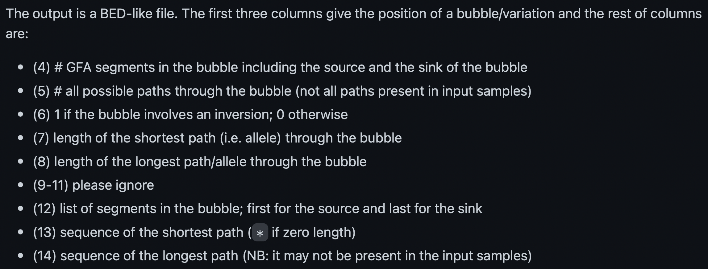{width=100%}
https://github.com/lh3/minigraph
 
### Structural Variant Stats {-}

1. Total number of variants:

```{bash, eval=FALSE}
wc -l yprp.minigraph.structural.bed
```

2. Indels (the shortest path is 0)

```{bash, eval=FALSE}
awk '$7==0{print}' yprp.minigraph.structural.bed|wc -l
```

3. Inversions

```{bash, eval=FALSE}
awk '$6==1{print}' yprp.minigraph.structural.bed | cut -f 1-12
```

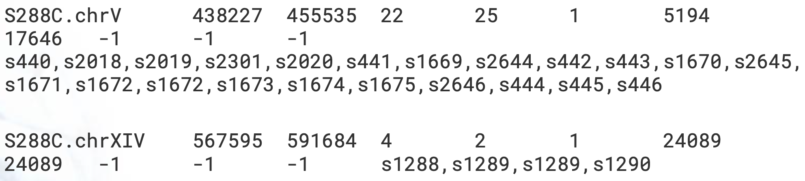{width=100%}


## CUP1

### Visualize the CUP1 region {-}

10 working copies + 1 pseudogene in S288C

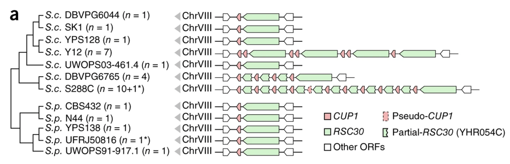{width=100%}
 
1. Find the region in the graph based on its S288C coordinates  
S288C.chrVIII:213045-233214

```{bash, eval=FALSE}
gfatools view -R S288C.chrVIII:213045-233214 yprp.minigraph.gfa > cup1.gfa
```


2. Create a .csv to bring in the segment names  
Note that you need a header

```{bash, eval=FALSE}
 cat <(echo "Segment,Name") <(grep "^S" cup1.gfa | awk '{print $2 "," $5}') > cup1.csv
```

3. Load the graph and the .csv file into Bandage

<center>
{width=60%}
</center>


This compares S288C and SK1.

<center>
{width=35%}

{width=100%}
</center>

If you have blast installed on your computer, you can blast the two gene sequences to their positions. CUP1 is the smaller one. Gene sequences are in: /home/pangenomics/data/yprp/genes/

<center>
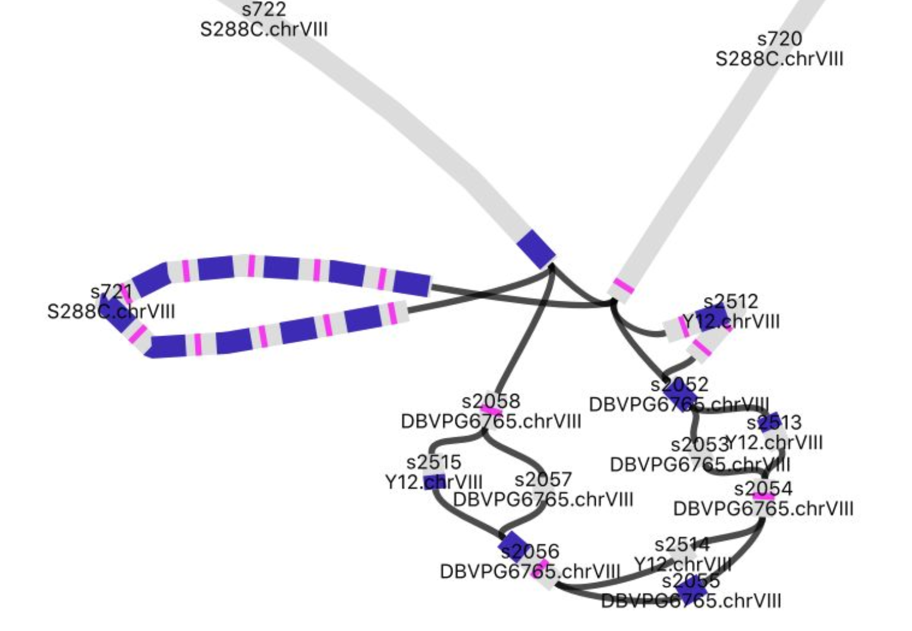{width=70%}
</center>

### CUP1 Paths in Y12 {-}

Let's find the Y12 paths through the graph for all bubbles in the CUP1 graph file.

```{bash, eval=FALSE}
minigraph -xasm -l100 --call cup1.gfa Y12.genome.fa > Y12.call.bed
```

Output
S288C.chrVIII   213609  233593  >s720   >s722 >s2512>s2052>s2513>s2054>s2514>s2056>s2515>s2058:11410:+:Y12.chrVIII:206778:21819

alignment path through the bubble:path length:mapping strand:the contig name:approximate contig start:approximate contig end


### CUP1 Paths in all yeast genomes {-}

Let’s do all the samples:

```{bash, eval=FALSE}
for i in *.fa; do
   minigraph -xasm -l100 --call cup1.gfa $i > $i.call.bed
done
```

Compare to the Bandage Graph

## Minigraph Pros and Cons

**Pros**

Captures length variation   
Efficient   
Easy to add new genomes

**Cons**

Lack of base level alignment + sample input order dependency =  
    + suboptimal mappings  
    + suboptimal local graphs  
Needs collinear chains so it doesn’t work well with many short segments such as rare SNPs.

https://github.com/lh3/minigraph#limitations

“Please do not overinterpret complex subgraphs. If you are interested in a particular subgraph, it is recommended to extract the input contig subsequences involved in the subgraph with the --call option and manually curated the results.”

## Blog Battle

**Heng Li (Minigraph)**

https://lh3.github.io/2019/07/08/on-a-reference-pan-genome-model

**Erik Garrison (VG)**

https://ekg.github.io/2019/07/09/Untangling-graphical-pangenomics

Focus on the "Working with other pangenomic methods" section

**Heng Li (Minigraph)**

https://lh3.github.io/2019/07/12/on-a-reference-pan-genome-model-part-ii
 
## Exercises

### Start with another reference {-}

1. What reference did you choose? 
2. What order are the other samples in?
3. How does the graph compare?
4. How does read mapping compare?
5. How do structural variant calls compare? 
6. How does the cup1 region compare? 
7. Any other interesting differences?

### Another Yeast Dataset {-}

A subset of yeast genomes from: https://www.nature.com/articles/s41586-018-0030-5.pdf
We will use 127 of these genomes.

Data are in: /home/pangenomics/data/1011yeast/assemblies/*fa.gz

Note that 1011genomes.fasta.gz contains all of the assemblies. We'll need that for cuttlefish but if you use it for minigraph it will treat it as one assembly and try to put it on all at once. So, use the individual assemblies.

1. How many sequences in each assembly? Min? Max?
2. Make and characterize a minigraph
+ Choose 13 lines to match the number of genomes we ran earlier   
+ Try all 127 assemblies  
3. How do these graphs compare to our previous yeast graph? 
4. Pick a region from one of the graphs and make and characterize a subgraph.

### Human GFA {-}

**lipoprotein(a) - LPA** 

See if you can pull out and visualize the LPA region pictured below from two human GFA files from different versions of the human reference (GRCh38.p13 and CHM13). BLAST the LPA gene against the graphs in Bandage.

GFA files are in /home/pangenomics/data/1011yeast/assemblies/. The LPA gene sequence is in /home/pangenomics/data/human/genes/

Approximate Positions:

+ GRCh38.p13 chr6 160000000-161000000 complement

+ CHM13 chr6 161200000-162200000


<center>
{width=60%}
http://lh3.github.io/2021/01/11/minigraph-as-a-multi-assembly-sv-caller
</center>

Your results should look something like this.

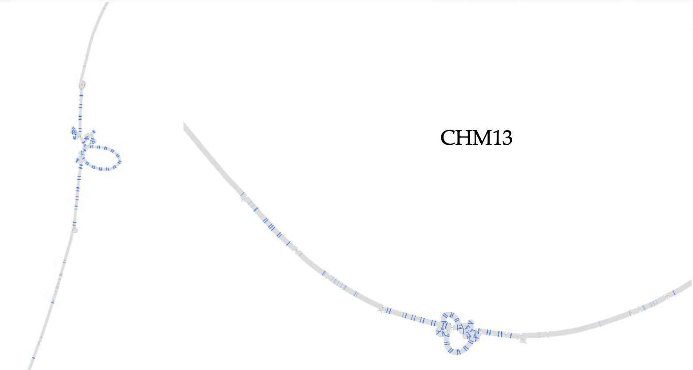{width=100%}

### Convert to VG and call variants {-}

Convert minigraph to vg (<1min):

```{bash, eval=FALSE}
vg convert -g yprp.minigraph.gfa -v -t 20 > yprp.minigraph.vg
```

>**-g**        input GFA graph
>**-v**        output VG graph
>**-t 20**       use 20 threads
    
Make vertices small enough (<=1024bp) for indexing (<1min):

```{bash, eval=FALSE}
vg mod -X 256 yprp.minigraph.vg -t 20 > yprp.minigraph.mod.vg
```

>**-X**       max node size
>**-t 20**       use 20 threads
    
*NOTE:* Converting to VG isn’t required if not calling variants, i.e. you can index and map directly on GFA.

1. Use vg to index the VG graph (2min)
2. Use vg to map SK1 reads to minigraph GFA (17min)
3. Use vg to call variants on read mapping GAM
    a. pack (20min)
    b. call (<1min)
    c. don’t do augment; run-time too long!

