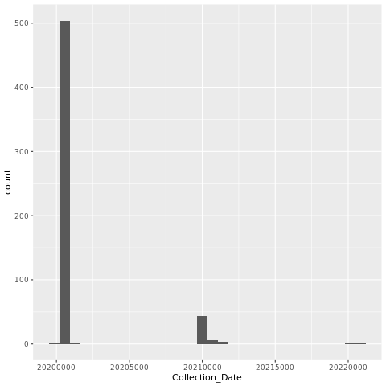
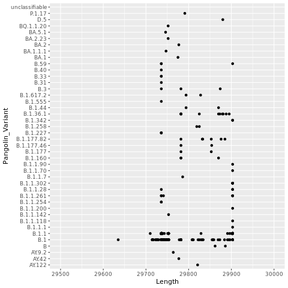
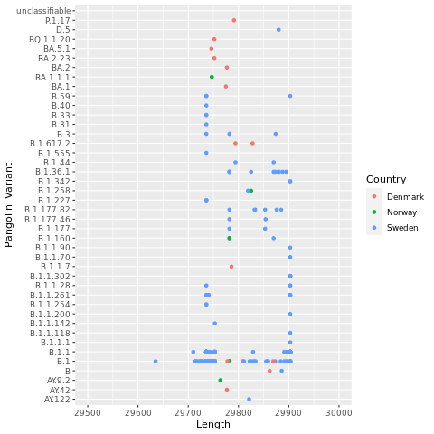

<!-- Add in pictures of the plots. -->

# NCBI SARS-CoV-2 Genome Sequences

## Getting Sequences from NCBI

See pdf.

Change the name of the sequence file with Denmark, Norway, and Sweden to DNS.sequences.fasta

<details>
  <summary>Click for Answer</summary>
  mv sequences.fasta DNS.sequences.fasta
</details>

Change the name of your three countries file to something that identifies the countries.

## Exploring Sequence Files

Let's start with the Denmark, Norway, Sweden files. Make sure you are in the NCBIdata directory.

1. Grab just the sequence header lines.

2. How many sequences are there for Denmark?

3. Grab just the country out of the fasta headers

Your headers should have these fields, delimitted by a pipe (make sure you put the pipes in quotes so it doesn't interpret it):

```
  1) Accession
  2) Genbank Title
  3) Collection Date
  4) Country
  5) GEO Location
  6) Length
  7) Pangolin (variant)
  8) SRA Accession
  9) Sequence Type
```

4. How many sequences are there for each country?

Hint: Use sort then uniq -c (the latter gets counts of all the unique values).

5. How many sequences are there for each Geo Location? Some will just have the country there but others will have more granular information.

6. How many sequences are there for each pangolin variant? What is the dominant one? Look up more information for the dominant lineage at this site: https://cov-lineages.org/lineage_list.html

7. Haw many sequences are there for each pangolin variant in each country?

8. How many sequences are not blank in the collection data field?

```
Hint: Use "^$" in grep to find lines that have nothing between the start "^" and end "$" of the line.
```

9. What is the first and last date in your sequence file?

Hint: There are lots of different ways to do this, some of which involve more scrolling than others. Here is one strategy that just gets the earliest dates. Do each step and check it then pipe it into the next step. Repeat and get the latest date.

```
  a) Get the header lines
  b) Grab the collection data column (#3)
  c) Remove blanks
  d) Sort numerically: sort -n
  e) grab the last line
```

10. Find the first and last collection date in your sequence file for each country. Try to use a for loop. Since we haven't used these much I'll put an answer here for you.


<details>
  <summary>Click for Answer</summary>
  
  ```
    for i in 'Denmark' 'Norway' 'Sweden'; do
      echo $i
      grep $i sequences.fasta | cut -f 3 -d '|' | grep -v "^$" | sort -n | head -1
  done
  ```
  
</details>
\

<details>
  <summary>Click for All Answers</summary>
  
Note that there are often several ways to do things in linux and not all methods are shown.

Since the number of sequences in NCBI changes, the numbers given below might have changed.
```
1. grep '>' sequences.fasta

2. grep -c 'Denmark' sequences.fasta

14 sequences for Denmark

3. grep '>' sequences.fasta | cut -f 4 -d '|'

4. grep '>' sequences.fasta | cut -f 4 -d '|' | sort |uniq -c

     14 Denmark
     
      5 Norway
      
    616 Sweden

5. grep '>' sequences.fasta | cut -f 5 -d '|' | sort |uniq -c

     14 Denmark
     
      2 Norway
      
      3 Norway: Bergen
      
    566 Sweden
    
      1 Sweden:Goteborg
      
     44 Sweden: Orebro
     
      5 Sweden:Stockholm, Sweden

6. grep '>' sequences.fasta | cut -f 7 -d '|' | sort |uniq -c

The dominant pangolin variant is B.1 which occurs 429 times.

7. grep '>' sequences.fasta | cut -f 4,7 -d '|' | sort |uniq -c

8. grep '>' sequences.fasta | cut -f 3 -d '|' |grep -c "^$"

9. grep '>' sequences.fasta | cut -f 3 -d '|' | grep -v "^$" | sort -n | (head -1; tail -1)

10. The first is for the earliest date and the second for the latest date.

for i in 'Denmark' 'Norway' 'Sweden'; do
  echo $i
  grep $i sequences.fasta | cut -f 3 -d '|' | grep -v "^$" | sort -n | head -1
done

for i in 'Denmark' 'Norway' 'Sweden'; do
  echo $i
  grep $i sequences.fasta | cut -f 3 -d '|' | grep -v "^$" | sort -n | tail -1
done

```
</details> 

## Practice with your 3 countries

Run through these exercises again with your 3 countries and record the answers in your project powerpoint or elsewhere. We'll talk about what you found.

## Plotting

We'll plot some of the information about our sequences using R on the command line and the ggplot2 library. Get into a screen if you aren't already in one (screen -dr will reconnect you to a previous screen). Navigate to your NCBIdata directory.

Note that your plots might be slightly different than those shown below because more sequences may have been added to the database.

## R

The R Project for Statistical Computing

https://www.r-project.org/

R studio (Integrated Development Environment)

https://posit.co/download/rstudio-desktop/

## ggplot2

Handy gglot2 references:

ggplot2 gallery

http://www.r-graph-gallery.com/portfolio/ggplot2-package/

ggplot2 cheatsheets

http://ggplot2.tidyverse.org/reference/

ggplot2 documentation

https://cran.r-project.org/web/packages/ggplot2/ggplot2.pdf


11. Make a tab-delimitted text file with the information from your sequence headers.

```
1) Grab the sequence headers
2) Remove the greater than sign at the beginning of the header line
3) Replace the pipes with tabs (Hint: In sed use \t to represent a tab)
4) Put it into a file called Denmark_Norway_Sweden_seq_info.txt
```

Open up R.

```
R
```

Now we are in R. The R command line is similar to linux but the commands are a little bit different as you will notice as we walk through it. Note that you can use the up arrow to get back previous commands as in linux. ctrl-c works the same as well.

Load the ggplot2 library.

```
library(ggplot2)
```

See what your working directory is (it should be the directory you were in when you entered R). Note that you can change your working directory with the setwd() command, putting the path to the new directory in the parentheses.

```
getwd()
```

Let's read in the tab-delimitted file we created. We'll use the read.table command. To find out more, let's look at the help for that command using a question mark before the command (equivalent to the man command in linux).

```
?read.table
```

It prints out a lot of documentation including commands that are similar. The first part is below. The help documentation describes the command and gives you all the arguments you can use along with their defaults. Arguments go in the parentheses. Some are required but others are optional.

12. The two arguments that I use the most are "header" and "sep". Look at the usage section of the help below or in your terminal. What are the defaults for these two arguments?

13. Scroll down in the help (the up and down arrows go up or down line by line; the space bar jumps you down a page at a time) to the arguments section. Read about header and sep. What do these arguments do? What do the defaults mean?

Note: To get out of help, hit "q".

Read in our data file and put it into a variable. We'll name our variable dns for Denmark, Norway, Sweden.

```
dns = read.table("Denmark_Norway_Sweden_seq_info.txt", header=FALSE, sep="\t")
```

Let's take a look at the variable with our data. The head command in R has 6 rows by default and it wraps lines as a group if they are too long for the screen.

```
head(dns)
```

14. Take a look at the help for the head command and see if you can figure out how to show 10 lines.

15. How do you think you could look at the end of the dns variable?

When you look at the dns variable, it shows column and row names. Since we didn't have a header line in our tab-delimitted file, it just defaults to V1, V2 (V stands for vector). Since we didn't have row names, it defaults to numbers. Let's fix the column names. The "c" concatenates a list of things together to be fed in as a group.

```
colnames(dns) = c("Accession", "Genbank_Title", "Collection_Date", "Country", "GEO_Location", "Length", "Pangolin_Variant", "SRA_Accession", "Sequence_Type")
```

Then check it with the head command.

```
    Accession
1 OR079912.1
2 OQ843561.1
3 OQ816151.1
4 OQ816152.1
5 OQ816154.1
6 OQ816156.1
                                                                                                           Genbank Title
1                  Severe acute respiratory syndrome coronavirus 2 isolate SARS-CoV-2/human/NOR/P9/2020, complete genome
2             Severe acute respiratory syndrome coronavirus 2 isolate SARS-CoV-2/human/DNK/DK-AHH8/2022, complete genome
3 Severe acute respiratory syndrome coronavirus 2 isolate SARS-CoV-2/human/SWE/01_SE100_21CS503718/2020, complete genome
4 Severe acute respiratory syndrome coronavirus 2 isolate SARS-CoV-2/human/SWE/01_SE100_21CS504474/2020, complete genome
5 Severe acute respiratory syndrome coronavirus 2 isolate SARS-CoV-2/human/SWE/01_SE100_21CS503085/2020, complete genome
6 Severe acute respiratory syndrome coronavirus 2 isolate SARS-CoV-2/human/SWE/01_SE100_21CS502014/2020, complete genome
  Collection Date Country GEO Location Length Pangolin Variant SRA Accession
1      2020-10-14  Norway       Norway  29825          B.1.258
2      2022-12-01 Denmark      Denmark  29752        BQ.1.1.20
3      2020-03-03  Sweden       Sweden  29736              B.1
4      2020-03-10  Sweden       Sweden  29736              B.1
5      2020-03-11  Sweden       Sweden  29736              B.1
6      2020-03-13  Sweden       Sweden  29736              B.1
  Sequence Type
1       GenBank
2       GenBank
3       GenBank
4       GenBank
5       GenBank
6       GenBank
```
\


The Collection Date wasn't recognized as a date so let's fix that. The $ after the dns refers to a column. We will just overwrite it in the same column.

```
dns$Collection_Date = as.Date(myTable$Collection_Date, format="%Y-%m-%d")
```

Time to plot!

The gglot2 library allows you to have a large amount of control over nearly all aspects of the plot. It also allows you to plot in layers, getting a base plot and then adding colors, lines, text, etc on top of it. It is part of the tidyverse universe and uses a Layered Grammar of Graphics (https://towardsdatascience.com/a-comprehensive-guide-to-the-grammar-of-graphics-for-effective-visualization-of-multi-dimensional-1f92b4ed4149 and https://www.jstor.org/stable/pdf/25651297.pdf?casa_token=KAMBWbsPZdwAAAAA:VHQTVEC762l7U6s6GWzRlYJNz5JaqfduQy1S04_LF6f3PUZjAh71Bva7WEIpROPBUx2BF9GL5bM0HOtDH_Zft81ycAcJ0971YeHDfrfHKBrgyw6G6fAG) to concisely describe graphical components that are shared across different graphs. In other words, it gives you tools to add and manipulate specific pieces of graphical output.


We will put each plot into a png file. Note that we can also put it into a pdf file by changing the code below to pdf. The pdf has the advantage of being able to put in multiple plots on separate pages. After plotting we need to use dev.off() so that R closes the file it is printing to.

### Histogram of Collection Dates

```
png("dates_histogram.png")

ggplot(dns, aes(x=Collection_Date)) + geom_histogram()

dev.off()
```

{width=50%}


### Plot Length x Variants

Let's plot the genome length by the variant to see if there are any patterns. Some variants have insertions or deletions compared to others, for instance. On the other hand, not all genome assemblies make it to the ends of the viral RNA genome so this will add some noise. 

We'll use a scatter plot. First we identify the data frame (dns) that we want to use. Then we assign fields to the x and y axis. After that we'll add the scatter plot layer (geom_point). We'll add another layer to limit the x axis.

```
png("lengthxvariants.png")

ggplot(dns, aes(x=Length,y=Pangolin_Variant)) + geom_point() + xlim(29500,30000)

dev.off()
```

{width=50%}


Now, let's color the points by Country.

```
png("lengthxvariants.color.png")

ggplot(dns, aes(x=Length,y=Pangolin_Variant,color=Country)) + geom_point() + xlim(29500,30000)

dev.off()
```

{width=50%}


### Plot Collection Date x Variants

16. Now try to plot the collection date (x axis) by the variants (y axis), coloring by the country.

### Plot Collection Date x Variants for your 3 countries

Now make a plot of Collection Date x Variants for your 3 countries and add it to your powerpoint.

Go to https://covariants.org/ to scroll down to the table and the phylogenetic tree to put some context around the variants.

At that same site, explore the "per country" and "cases" buttons for your 3 countries. Note that the graphs are interactive so you can hover over specific dates where you might have a lot of NCBI genome sequences. Grab screenshots to put into your powerpoint (be sure to record the date you grabbed the screenshot on the slide). How representative are the NCBI genome sequences?

Note: we'll be getting sequences from another source as well so don't worry if they aren't too representative.

<details>
  <summary>Click for All Answers</summary>
  
```
11. grep '>' sequences.fasta | sed 's/>//'|sed 's/|/\t/g' > Denmark_Norway_Sweden_seq_info.txt

12. header = FALSE and sep = ""

13. The header arguement determines whether you have a header line in your file with the names of variables.

While the header default is false, if you don't explicitly put in header=FALSE, it might decide that there is a header line if the first row has one fewer field than the rest. I like to explicitly tell read.table whether there is a header row or not.

The sep variable determines the field separator character.

The sep default is blank ("") and means white space. In other words, read.table will split the file up on one or more spaces, tabs, etc. With tab-delimitted files, you don't normally have to specify the tab variable but since we also have spaces in some of our fields, if we keep sep as whitespace, it will separate on all the spaces as well. So we will need to specify it.

14. head(dns, n=10) or head(dns, n=10L)

15. tail(dns)

16.

png("datexvariants.color.png")

ggplot(dns, aes(x=Collection_Date,y=Pangolin_Variant,color=Country)) + geom_point()

dev.off()

```
</details>
