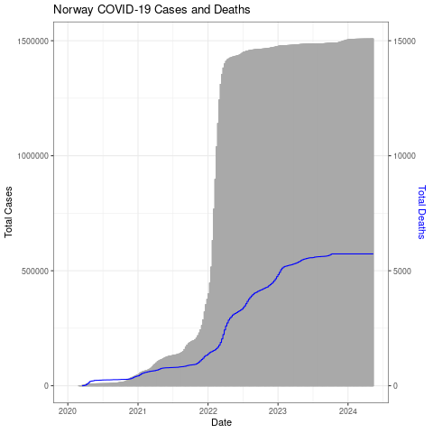
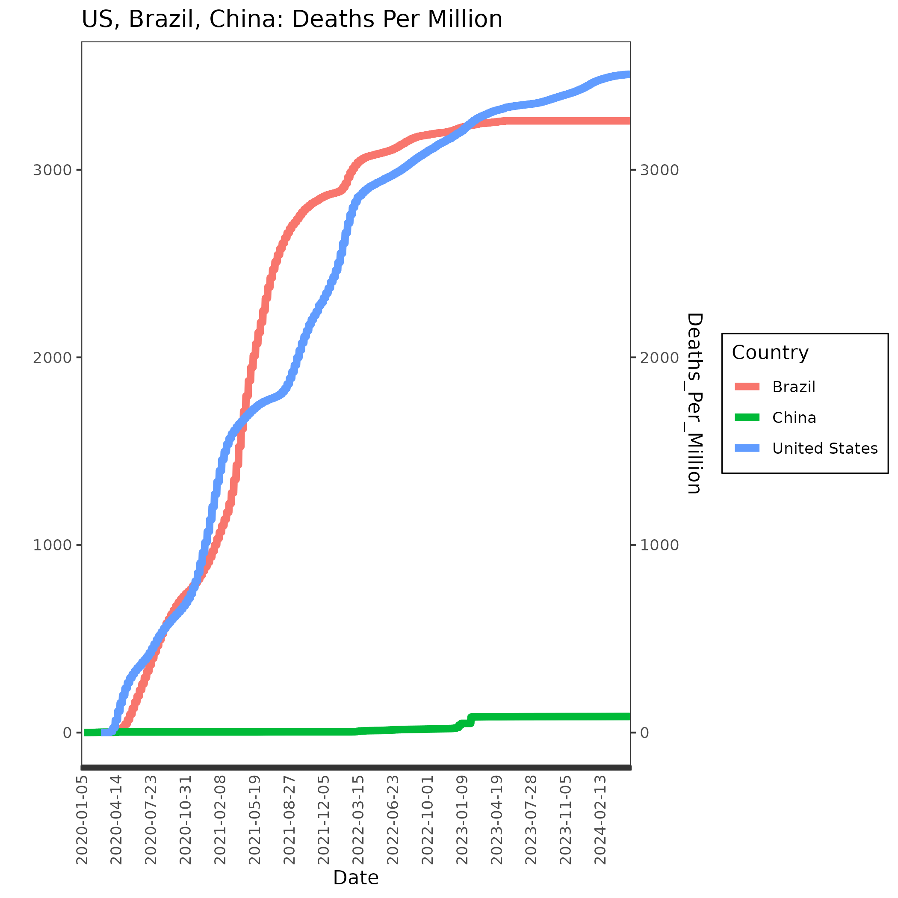

<!-- Could add in plotly; already installed as is htmlwidgets -->

# Our World in Data (plots)

Now let's use the data from "Our World in Data" that you created yesterday. We'll start with the Norway file.

Move into the parse directory.

<details>
  <summary>Click for Answer</summary>
  
```
cd ~/parse
```
</details>

&nbsp;

Open up R.

<details>
  <summary>Click for Answer</summary>
  
```
R
```
</details>

&nbsp;

Load ggplot2.

```
library ggplot2
```

Read in "Norwaydata.csv", which you made in the last chapter. It has no header and it is comma separated.

<details>
  <summary>Click for Answer</summary>
```
nor=read.table("Norwaydata.csv", header=FALSE, sep=",")
```
</details>

&nbsp;

Add column names: Location, Date, Total_Cases, Total_Deaths, Total_Cases_Per_Million, Total_Deaths_Per_Million,
ICU_Patients, ICU_Patients_Per_Million, Fully_Vaccinated, Fully_Vaccinated_Per_Hundred

<details>
  <summary>Click for Answer</summary>
```
colnames(nor) = c("Location", "Date", "Total_Cases", "Total_Deaths",
"Total_Cases_Per_Million", "Total_Deaths_Per_Million",
"ICU_Patients", "ICU_Patients_Per_Million",
"Fully_Vaccinated", "Fully_Vaccinated_Per_Hundred")
```
</details>

&nbsp;

Fix the date field

<details>
  <summary>Click for Answer</summary>
```
nor$Date=as.Date(nor$Date, format="%Y-%m-%d")
```
</details>


## Bar chart

Plot a bar chart of Date x Total_Cases. The "geom_col" layer will make a bar chart.

We'll use the width parameter to make the width 100% (no space between bars).

```
png("datexcases.png")

ggplot(nor, aes(x=Date, y=Total_Cases)) + geom_col(width=1)

dev.off()
```

{width=50%}

Let's add a title.

```
png("datexcases_title.png")

ggplot(nor, aes(x=Date, y=Total_Cases)) +
  geom_col(width=1) +
  ggtitle("Norway COVID-19 Cases")

dev.off()
```

{width=50%}

## Line chart

Now let's make a line chart of total deaths.

```
png("datexdeaths.png")

ggplot(nor, aes(x=Date, y=Total_Deaths)) +
  geom_line() +
  ggtitle("Norway COVID-19 Deaths")

dev.off()
```

{width=50%}


Let's put them both on the same chart. We'll make the bar chart (cases) gray and the line (deaths) blue so it shows up better.

```
png("datexcases_deaths.png")

ggplot(nor, aes(x=Date, y=Total_Cases)) +
geom_col(width=1,color="darkgray") +
geom_line(aes(y=Total_Deaths),color="blue") +
scale_y_continuous(
# Features of the first axis
name = "Total Cases",
# Add a second axis and specify its features
sec.axis = sec_axis(trans=~., name="Total Deaths")
)

dev.off()
```

{width=50%}

The number of deaths is really low compared to the number of cases (thankfully!) so the blue line is right at the bottom. Let's adjust the axis (multiply by 100).

We'll also give it a white background by changing to the black and white theme, color the right axis label blue, and add a title.

```
png("datexcases_deaths_adjust.png")

ggplot(nor, aes(x=Date, y=Total_Cases)) +
geom_col(width=1,color="darkgray") +
geom_line(aes(y=Total_Deaths*100),color="blue") +
scale_y_continuous(
# Features of the first axis
name = "Total Cases",
# Add a second axis and specify its features
sec.axis = sec_axis(trans=~./100, name="Total Deaths")
) +
theme_bw() +
ggtitle("Norway COVID-19 Cases and Deaths") +
theme(axis.title.y.right = element_text(color = "blue"))

dev.off()
```

{width=50%}


Try some on your own using some of the other variables, scales, and/or plot types.

Note: Some of the variables in OWID are not reported every day for all countries. If something is only reported once a week, for example, and you are trying to create a geom_line, you will see nothing. This is because it will only connect adjacent datapoints and since there is a row for every day, the line will only connect adjacent days. Since there isn't any data from adjacent days, it doesn't plot anything. If you have that issue, here is an example of how to get around that. Before plotting the fully vaccinated column we remove rows that are NA in that column (but we keep all the rows for Total_Cases.)

```{R, eval=FALSE}
ggplot(df, aes(x=Date, y=Total_Cases)) + geom_col(width=100) + geom_line(data=cr[!is.na(cr$Fully_Vaccinated),],aes(x=Date, y=Fully_Vaccinated)) + scale_y_continuous(name = "Total Cases", sec.axis = sec_axis(transform=~., name="Total Vaccinated"))
```

## Plot all 3 countries + transparency

ggplot2 makes it easy to get all 3 countries on a single plot. It is also easy to make transparent plots so you can stack them together (though doing layers in ggplot2 is a similar concept), combine them with other objects or allow some of the background to show through.

Here is an example of plotting the date (x axis) vs COVID-19 cases per million (y axis). Read in the data for Norway, Denmark, and Sweden. I have combined Norwaydata.csv, Denmarkdata.csv, and Swedendata.csv in the file: /home/data/nise/nds.csv

```
nds = read.table("/home/data/nise/nds.csv", header=FALSE, sep=",")
```

Give it some headers.

```
colnames(nds) = c("Country", "Date", "Total_Cases", "Total_Deaths",
"Cases_Per_Million", "Deaths_Per_Million",
"ICU_Patients", "ICU_Patients_Per_Million",
"Fully_Vaccinated", "Fully_Vaccinated_Per_Hundred")
```

Fix the date field

```
nds$Date=as.Date(nor$Date, format="%Y-%m-%d")
```

The x axis dates overwrite each other so first let's get a data frame that has all but every 100th date blanked out. We'll use this to replace the x axis labels (+ scale_x_discrete(labels = xlabels).

```
xlabels <- sort(unique(nds$Date))
for (x in 2:100) {
    xlabels[seq(x, length(xlabels), 100)] <- ""
}
```

We'll add some layers that make the plot transparent. We put the plot into a variable and then print the variable through ggsave so we can tell it to keep the background transparent while exporting. We'll use a PDF to keep the image sharp.

We tell it to group and color the data by Country (group=Country, col=Country, fill=Country). We are also switching from geom_bar to geom_area which makes it easier to make the 3 countries each semi-transparent (using alpha) so we can plot them on top of each other (position="identity"). We will also turn the x labels 90 degrees. We'll also add several lines to make the background and other parts of the plot transparent.

```
p=ggplot(nds, aes(x=Date, y=Cases_Per_Million, group=Country, col=Country, fill=Country)) +
	geom_area(aes(y=Cases_Per_Million),alpha=0.2,position="identity")+
	ggtitle("Norway, Denmark, Sweden: COVID-19 Cases Per Million") +
	theme_bw()+
	theme(
		axis.text.x = element_text(angle = 90, vjust = 0.5, hjust = 1),
		panel.background = element_rect(fill='transparent'), #transparent panel bg
		plot.background = element_rect(fill='transparent', color=NA), #transparent plot bg
		panel.grid.major = element_blank(), #remove major gridlines
		panel.grid.minor = element_blank(), #remove minor gridlines
		legend.background = element_rect(fill='transparent'), #transparent legend bg
		legend.box.background = element_rect(fill='transparent') #transparent legend panel
	) + scale_x_discrete(labels = xlabels)

ggsave('cases_perM.png', p, bg='transparent')
```

{width=80%}

We'll do the same thing for Deaths_Per_Million except that we will plot lines this time. We'll use the same xlabels data frame that we made for the previous plot.

```
p=ggplot(nds, aes(x=Date, y=Deaths_Per_Million, group=Country, col=Country, fill=Country)) +
	geom_line(size=2)+
ggtitle("Norway, Denmark, Sweden: Deaths Per Million") +
	theme_bw()+
	theme(
		axis.text.x = element_text(angle = 90, vjust = 0.5, hjust = 1),
		panel.background = element_rect(fill='transparent'), #transparent panel bg
		plot.background = element_rect(fill='transparent', color=NA), #transparent plot bg
		panel.grid.major = element_blank(), #remove major gridlines
		panel.grid.minor = element_blank(), #remove minor gridlines
		legend.background = element_rect(fill='transparent'), #transparent legend bg
		legend.box.background = element_rect(fill='transparent') #transparent legend panel
	) + scale_x_discrete(labels = xlabels) +
	scale_y_continuous(
	name="",
	sec.axis = sec_axis(trans=~./1, name="Deaths_Per_Million")
	)

ggsave('deaths_perM.png', p, bg='transparent')
```

{width=80%}

And, finally, let's combine them. It will make the plot a little busy so think about it it really is useful to have everything on the same plot.

```
p=ggplot(nds, aes(x=Date, y=Cases_Deaths_Per_Million, group=Country, col=Country, fill=Country)) +
	geom_area(aes(y=Cases_Per_Million),alpha=0.4,color=NA,position="identity", show.legend = FALSE)+
geom_line(data=uscb,aes(y=Deaths_Per_Million*100,color=Country),size=2) +
scale_y_continuous(
name = "Cases Per Million (Shading)",
sec.axis = sec_axis(trans=~./100, name="Deaths Per Million (Lines)")
) +
	ggtitle("Norway, Denmark, Sweden: COVID-19 Cases and Deaths Per Million") +
	theme_bw()+
	theme(
		axis.text.x = element_text(angle = 90, vjust = 0.5, hjust = 1),
		panel.background = element_rect(fill='transparent'), #transparent panel bg
		plot.background = element_rect(fill='transparent', color=NA), #transparent plot bg
		panel.grid.major = element_blank(), #remove major gridlines
		panel.grid.minor = element_blank(), #remove minor gridlines
		legend.background = element_rect(fill='transparent'), #transparent legend bg
		legend.box.background = element_rect(fill='transparent') #transparent legend panel
	) + scale_x_discrete(labels = xlabels)

ggsave('cases_deaths_perM.png', p, bg='transparent', width=12, height=10, units="in", dpi=600)
```

{width=80%}


BONUS: Interactive plots

Turning ggplot2 plots into interactive html plots is straightforward with the plotly library. Let's do the last one we did.

You should still be in R.

Make sure the following libraries are loaded.

```
library(ggplot2)
library(plotly)
library(htmlwidgets)
```

Put the plot into a variable. We'll call it myplot.

```
myplot = ggplot(nor, aes(x=Date, y=Total_Cases)) +
geom_col(width=1,color="darkgray") +
geom_line(aes(y=Total_Deaths*100),color="blue") +
scale_y_continuous(
# Features of the first axis
name = "Total Cases",
# Add a second axis and specify its features
sec.axis = sec_axis(transform=~./100, name="Total Deaths")
) +
theme_bw() +
ggtitle("Norway COVID-19 Cases and Deaths") +
theme(axis.title.y.right = element_text(color = "blue"))
```

Make an interactive version of myplot.
```
myplotint = ggplotly(myplot)
```

Save it as an HTML file with an accompanying library folder (“lib”)
```
saveWidget(myplotint, "datexcases_deaths_adjust.html", selfcontained = F, libdir = "lib")
```

Use scp to copy both the html file and the library file to your computer (use -r for recursive to get the lib folder plus everything in it). The lib folder has to be in the same folder as the html file.

Open up the html file.
