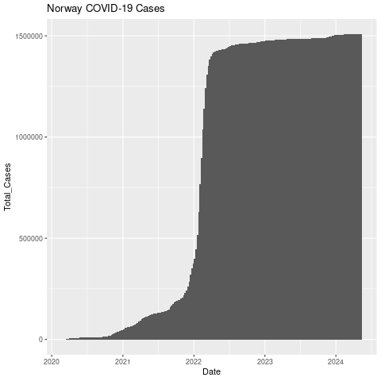
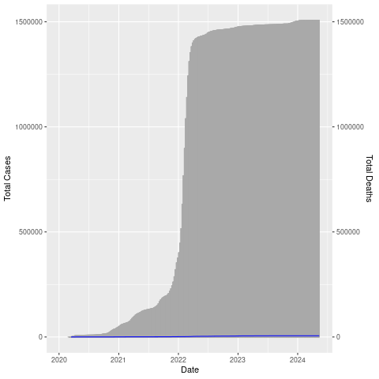

<!-- Could add in plotly; already installed as is htmlwidgets -->

# Our World in Data (plots)

Now let's use the data from "Our World in Data" that you created yesterday. We'll start with the Norway file.

Move into the parse directory.

<details>
  <summary>Click for Answer</summary>
  
```
cd ~/parse
```
</details>

&nbsp;

Open up R.

<details>
  <summary>Click for Answer</summary>
  
```
R
```
</details>

&nbsp;

Load ggplot2.

```
library ggplot2
```

Read in "Norwaydata.csv", which you made in the last chapter. It has no header and it is comma separated.

<details>
  <summary>Click for Answer</summary>
```
nor=read.table("Norwaydata.csv", header=FALSE, sep=",")
```
</details>

&nbsp;

Add column names: Location, Date, Total_Cases, Total_Deaths, Total_Cases_Per_Million, Total_Deaths_Per_Million,
ICU_Patients, ICU_Patients_Per_Million, Fully_Vaccinated, Fully_Vaccinated_Per_Hundred

<details>
  <summary>Click for Answer</summary>
```
colnames(nor) = c("Location", "Date", "Total_Cases", "Total_Deaths",
"Total_Cases_Per_Million", "Total_Deaths_Per_Million",
"ICU_Patients", "ICU_Patients_Per_Million",
"Fully_Vaccinated", "Fully_Vaccinated_Per_Hundred")
```
</details>

&nbsp;

Fix the date field

<details>
  <summary>Click for Answer</summary>
```
nor$Date=as.Date(nor$Date, format="%Y-%m-%d")
```
</details>


## Bar chart

Plot a bar chart of Date x Total_Cases. The "geom_col" layer will make a bar chart.

We'll use the width parameter to make the width 100% (no space between bars).

```
png("datexcases.png")

ggplot(nor, aes(x=Date, y=Total_Cases)) + geom_col(width=1)

dev.off()
```

{width=50%}

Let's add a title.

```
png("datexcases_title.png")

ggplot(nor, aes(x=Date, y=Total_Cases)) +
  geom_col(width=1) +
  ggtitle("Norway COVID-19 Cases")

dev.off()
```

{width=50%}

## Line chart

Now let's make a line chart of total deaths.

```
png("datexdeaths.png")

ggplot(nor, aes(x=Date, y=Total_Deaths)) +
  geom_line() +
  ggtitle("Norway COVID-19 Deaths")

dev.off()
```

{width=50%}


Let's put them both on the same chart. We'll make the bar chart (cases) gray and the line (deaths) blue so it shows up better.

```
png("datexcases_deaths.png")

ggplot(nor, aes(x=Date, y=Total_Cases)) +
geom_col(width=1,color="darkgray") +
geom_line(aes(y=Total_Deaths),color="blue") +
scale_y_continuous(
# Features of the first axis
name = "Total Cases",
# Add a second axis and specify its features
sec.axis = sec_axis(trans=~., name="Total Deaths")
)

dev.off()
```

{width=50%}

The number of deaths is really low compared to the number of cases (thankfully!) so the blue line is right at the bottom. Let's adjust the axis (multiply by 100).

We'll also give it a white background by changing to the black and white theme, color the right axis label blue, and add a title.

```
png("datexcases_deaths_adjust.png")

ggplot(nor, aes(x=Date, y=Total_Cases)) +
geom_col(width=1,color="darkgray") +
geom_line(aes(y=Total_Deaths*100),color="blue") +
scale_y_continuous(
# Features of the first axis
name = "Total Cases",
# Add a second axis and specify its features
sec.axis = sec_axis(trans=~./100, name="Total Deaths")
) +
theme_bw() +
ggtitle("Norway COVID-19 Cases and Deaths") +
theme(axis.title.y.right = element_text(color = "blue"))

dev.off()
```

{width=50%}


Try some on your own using some of the other variables, scales, and/or plot types.


BONUS: Interactive plots

Turning ggplot2 plots into interactive html plots is straightforward with the plotly library. Let's do the last one we did.

You should still be in R.

Make sure the following libraries are loaded.

```
library(ggplot2)
library(plotly)
library(htmlwidgets)
```

Put the plot into a variable. We'll call it myplot.

```
myplot = ggplot(nor, aes(x=Date, y=Total_Cases)) +
geom_col(width=1,color="darkgray") +
geom_line(aes(y=Total_Deaths*100),color="blue") +
scale_y_continuous(
# Features of the first axis
name = "Total Cases",
# Add a second axis and specify its features
sec.axis = sec_axis(transform=~./100, name="Total Deaths")
) +
theme_bw() +
ggtitle("Norway COVID-19 Cases and Deaths") +
theme(axis.title.y.right = element_text(color = "blue"))
```

Make an interactive version of myplot.
```
myplotint = ggplotly(myplot)
```

Save it as an HTML file with an accompanying library folder (“lib”)
```
saveWidget(myplotint, "datexcases_deaths_adjust.html", selfcontained = F, libdir = "lib")
```

Use scp to copy both the html file and the library file to your computer (use -r for recursive to get the lib folder plus everything in it). The lib folder has to be in the same folder as the html file.

Open up the html file.
