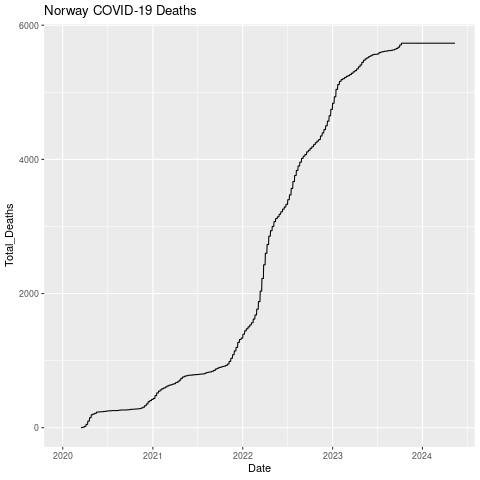

# Our World in Data (plots)

Now let's use the data from "Our World in Data" that you created yesterday. We'll start with the Norway file.

Move into the parse directory.

<details>
  <summary>Click for All Answers</summary>
  
```
cd ~/parse
```
</details>


Open up R.

<details>
  <summary>Click for Answer</summary>
  
```
R
```
</details>

Load ggplot2.

```
library ggplot2
```

Read in "Norwaydata.csv", which you made in the last chapter. It has no header and it is comma separated.

<details>
  <summary>Click for Answer</summary>
```
nor=read.table("Norwaydata.csv", header=FALSE, sep=",")
```
</details>

Add column names: Location, Date, Total_Cases, Total_Deaths, Total_Cases_Per_Million, Total_Deaths_Per_Million,
ICU_Patients, ICU_Patients_Per_Million, Fully_Vaccinated, Fully_Vaccinated_Per_Hundred

<details>
  <summary>Click for Answer</summary>
```
colnames(nor) = c("Location", "Date", "Total_Cases", "Total_Deaths",
"Total_Cases_Per_Million", "Total_Deaths_Per_Million",
"ICU_Patients", "ICU_Patients_Per_Million",
"Fully_Vaccinated", "Fully_Vaccinated_Per_Hundred")
```
</details>


Fix the date field

<details>
  <summary>Click for Answer</summary>
```
nor$Date=as.Date(nor$Date, format="%Y-%m-%d")
```
</details>


## Bar chart

Plot a bar chart of Date x Total_Cases. The "geom_col" layer will make a bar chart.

```
png("datexcases.png")

ggplot(nor, aes(x=Date, y=Total_Cases)) + geom_col()

dev.off()
```
XXX
{width=50%}

Let's add a title.

```
png("datexcases_title.png")

ggplot(nor, aes(x=Date, y=Total_Cases)) +
  geom_col() +
  ggtitle("Norway COVID-19 Cases")

dev.off()
```

{width=50%}

# Line chart

Now let's make a line chart of total deaths.

```
png("datexdeaths.png")

ggplot(nor, aes(x=Date, y=Total_Deaths)) +
  geom_line() +
  ggtitle("Norway COVID-19 Deaths")

dev.off()
```

{width=50%}


Let's put them both on the same chart.

```
png("datexcases+deaths.png")

ggplot(nor, aes(x=Date, y=Total_Cases)) +
geom_col() +
geom_line(aes(y=Total_Deaths)) +
scale_y_continuous(
# Features of the first axis
name = "Total Cases",
# Add a second axis and specify its features
sec.axis = sec_axis(trans=~., name="Total Deaths")
)

dev.off()
```

{width=50%}

The number of deaths is really low compared to the number of cases so let's adjust the axis.

We'll also give it a white background

```
png("datexcases+deaths_adjust.png")

ggplot(nor, aes(x=Date, y=Total_Cases)) +
geom_col() +
geom_line(aes(y=Total_Deaths*50)) +
scale_y_continuous(
# Features of the first axis
name = "Total Cases",
# Add a second axis and specify its features
sec.axis = sec_axis(trans=~./50, name="Total Deaths")
) +
theme_bw()

dev.off()
```

{width=50%}


Try some on your own using some of the other variables.
