<!-- The lineage frequencies have already been done through covariants.org so we won't do them here. -->


# GISAID SARS-CoV-2 Genome Sequences

## GISAID

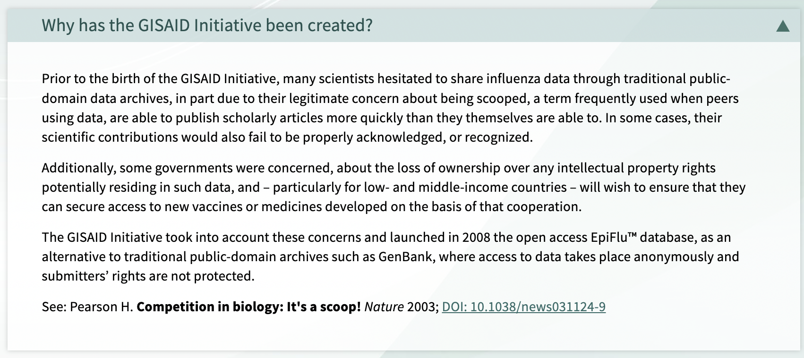{width=50%}

If you haven't already, please sign up for a GISAID account. The account is required to access sequences, though first we will explore one of their web tools in detail. Note that the numbers shown here are from 2023 and may have increased.

## Phylodynamics
Click on hCoV-19 in the Phylodynamics section.

Note that if you logged in it will push you over to epicov.org. You might need to go back to gisaid.org.

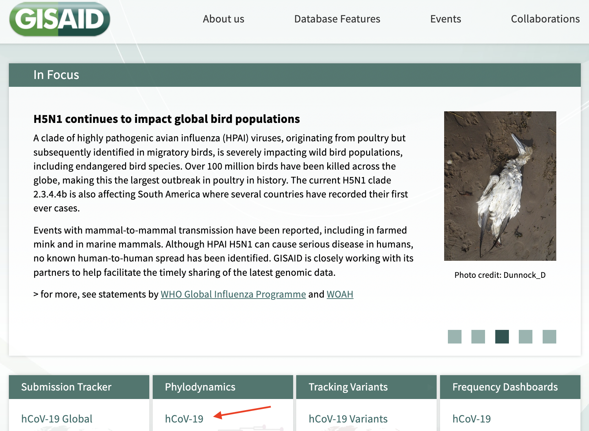{width=50%}

Follow along with one or more of your 3 countries (and get screenshots marked with today's dates into your slides). If none of your 3 countries are availble, choose another country to follow along with for now. I'll be using Denmark (Norway and Sweden are not available).


We can create a transmission map color-coded by time.


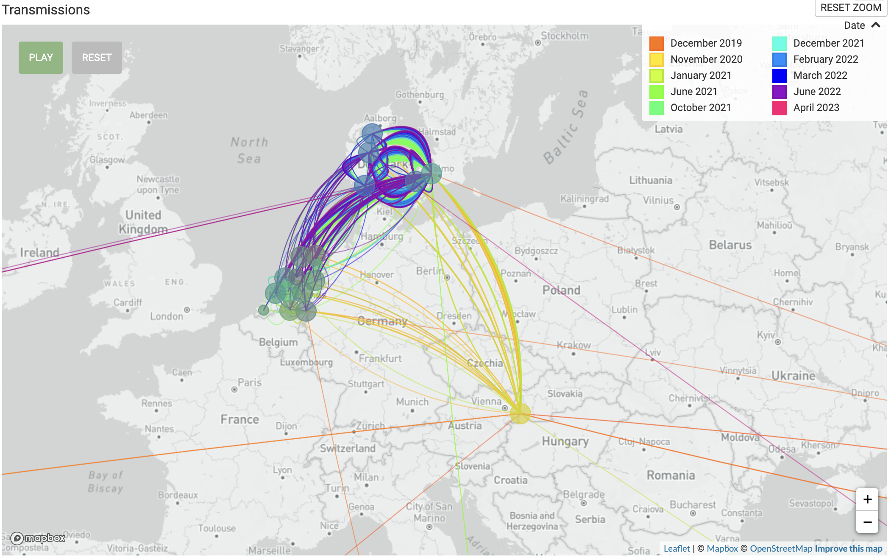{width=50%}

What do you learn from the Denmark graph?

<details>
  <summary>Click for Possible Answer</summary>
  ```
  Many of the earliest transmissions came from a region at the borders of Austria, Hungary, and Slovakia.
  
  Later on, there is a lot of transmission within the country and some also a lot of transmission routes between Denmark and the Netherlands.
  
  Note that the transmission data might be affected by which countries have the most data available.
  ```
</details>
\


We can look at a tree (scroll down) of the different named variants either by time or by divergence. For the divergence, I also added amino acid changes. We talk about subvariants of omicron but notice that there is a lot of genetic variation within each variant. Even two different genomes that are both from the same subvariants of omicron may not be identical, though they will both have the variants that define that subvariant.


{width=70%}

\

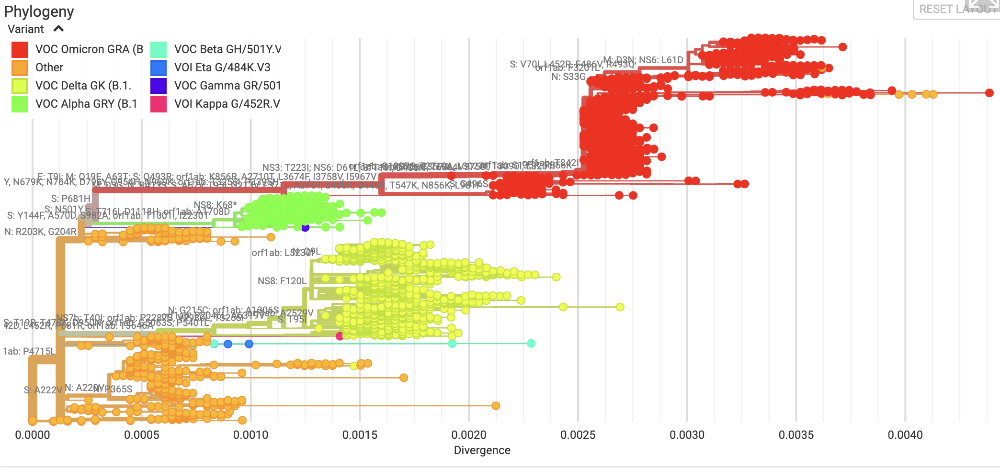{width=70%}

\
What insights can you draw from each of the Denmark graphs and by comparing them together?

<details>
  <summary>Click for Possible Answer</summary>
  ```
  
  You can see a clear progresion from alpha to delta to omicron in the time graph.

  Omicron continues to change over time.
  
  There is some level of overlap between the strains in terms of their divergence from the original strain. There is not as clean of a difference between the strains in the divergence graph as there is in the time graph.
  
  Omicron is diverse in both graphs. In the divergence graph it looks like there are three different subvariants for omicron each with a jump in its divergence level.
  ```
</details>

\
What insights can you add from your country's or countries' graphs?

\

Now change the tree to linear instead of rectangular and color code by variant. Use divergence.

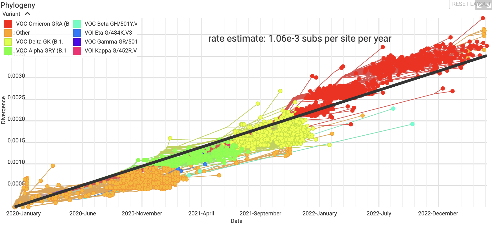{width=70%}

What can you tell about the difference in divergence rates of omicron vs the other variants from the Denmark graph?


<details>
  <summary>Click for Possible Answer</summary>
  ```
  Omicron seems to diverge more rapidly as it is mainly above the average line while the other variants are mostly below it.
  ```
</details>


Do your country's/countries' graphs tell the same story?


Now, explore other parameters with your country/countries.

What did you find that was interesting that you could share with the group?


Now, let's look at radial trees plotted by time and color-coded by variant and also by PANGO lineage.

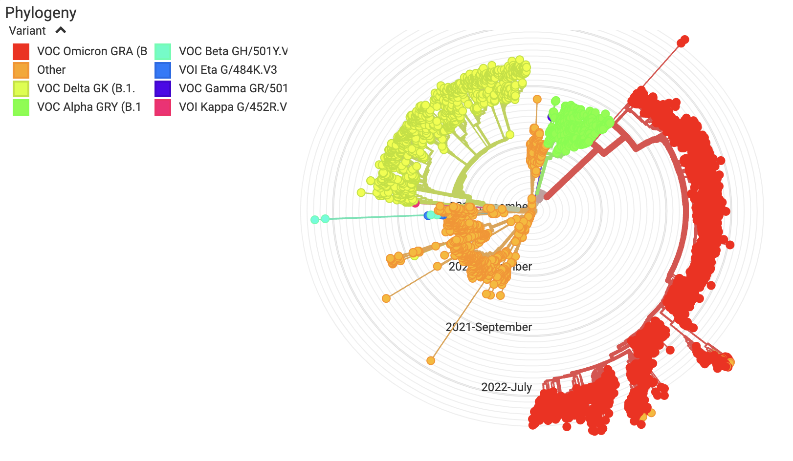{width=70%}

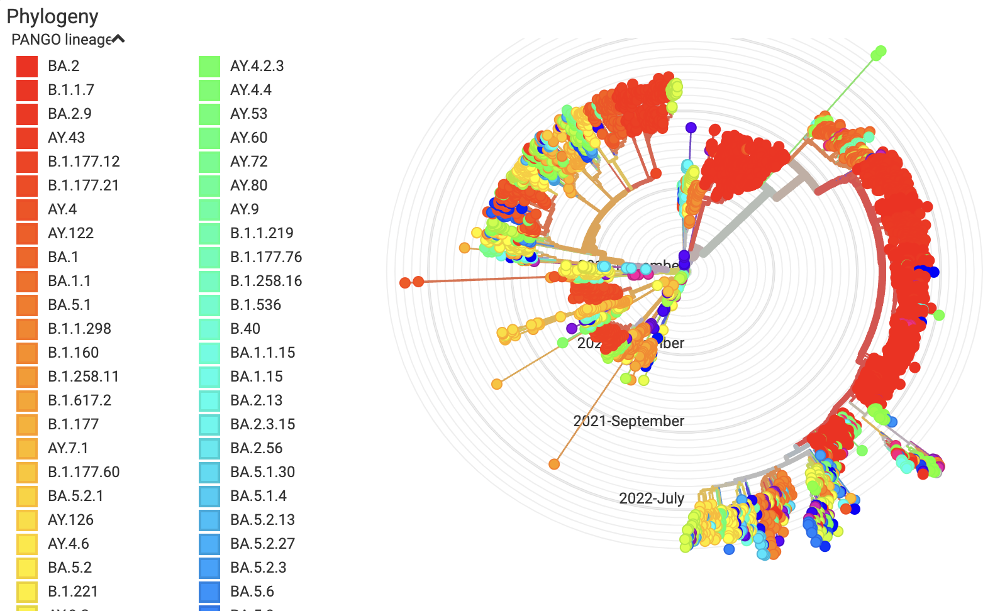{width=70%}
What do you notice about the 2 trees? Is there anything interesting that you can share with the group in your countr/contries tree?


## Genome sequences

Let's grab some sequences from our countries. I'll work through my countries but you can follow along with yours.

A few of my countries had hardly any genome sequences from NCBI.

>Country.  Sequences\
>Denmark   14\
>Norway     5\
>Sweden   616\

Click on "Search".

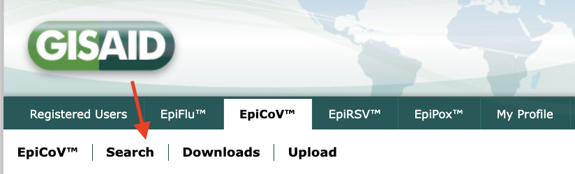{width=50%}

Check the complete box to limit your search to complete genomes. Type your country into the "Location" field and choose the appropriate text that pops up. Or choose the region of your country and click through to your country (ie. Europe, then Denmark).


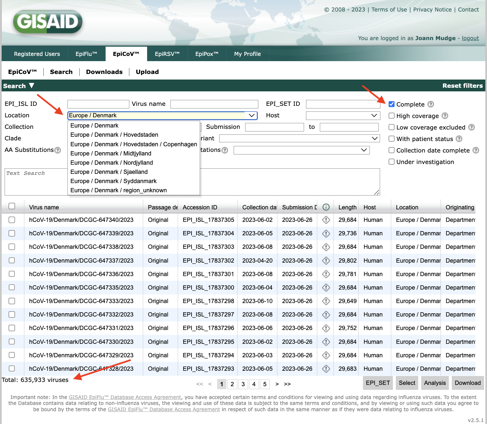{width=70%}

How many complete genome sequences did you find (see bottom left)?

Repeat for your 3 countries. Make sure you record this in your slides, including the date. This is a huge increase for Denmark from 14 in NCBI to 635,933 in GISAID!

>Complete genome sequences (GISAID)
>Denmark 635,933
>Accessed 6/28/23

GISAID limits us to downloading sequences 10,000 at a time. Let's zoom in on a smaller dataset.

In the same search, in the "Variant" field, choose XBB.1.16. This is the Arcturus subvariant.

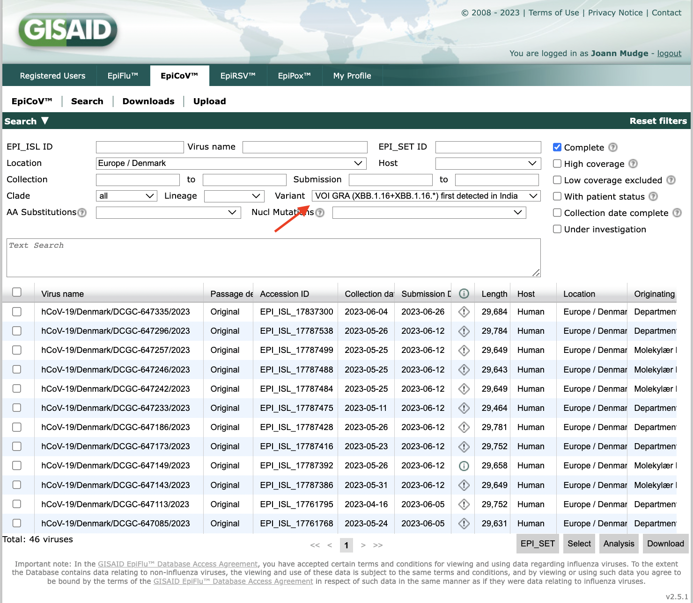{width=70%}
\
I got 46 for Denmark. Before we download these, we need to generate an EPI_SET. GISAID requires you to cite all the people who contributed to any of the sequences that you are using in an analysis. So, any oral or poster presentation, or any manscript needs to acknowledge everyone who contributed genome sequences. This used to be a huge pain to gather all the information into a gigantic list. Now, they have made it easy EPI_SETs, which gather the info for you and publish it to a DOI (a permanent Digital Object Identifier) that you can put on your publication to fulfill the acknowledgement requirements.

Select all sequences by clicking the checkbox near "Virus Name". Then, simply click on the "EPI_SET" button on the bottom right. Then click "Generate".

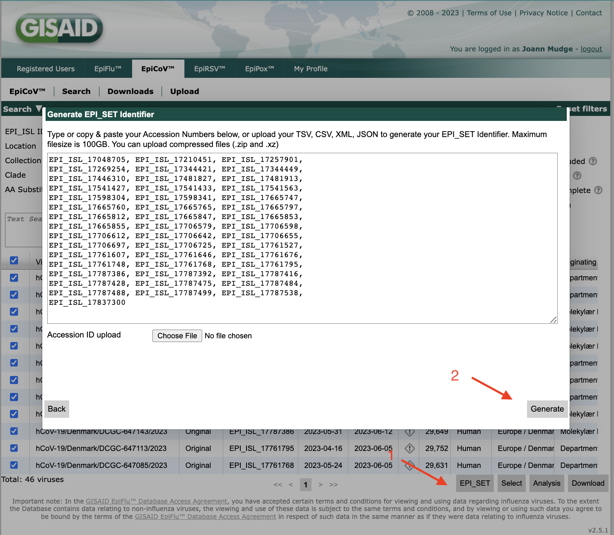{width=70%}

It will email you the EPI_set, with a link to the DOI and an attached supplemental table with text you can use in your publication.


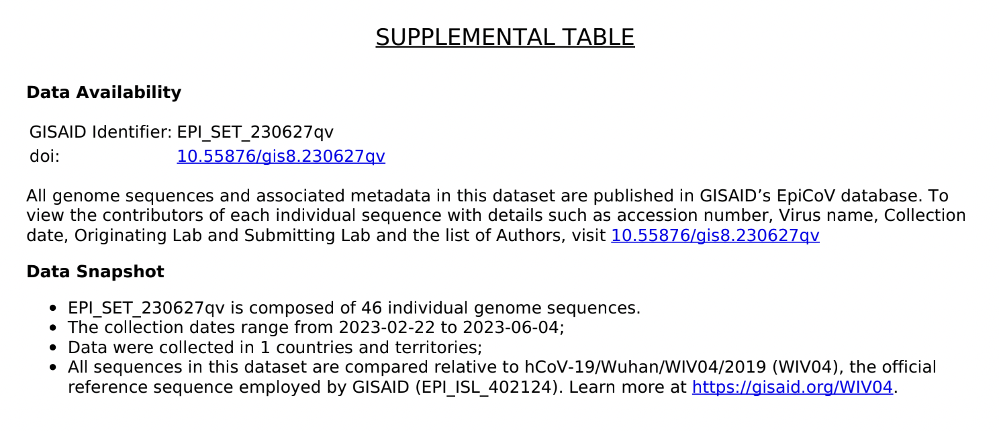{width=70%}

The DOI link will take you to a page that looks like the picture below. Hovering over each EPI number will pop up information about it (I'm hovering over the second to last number in the picture below).

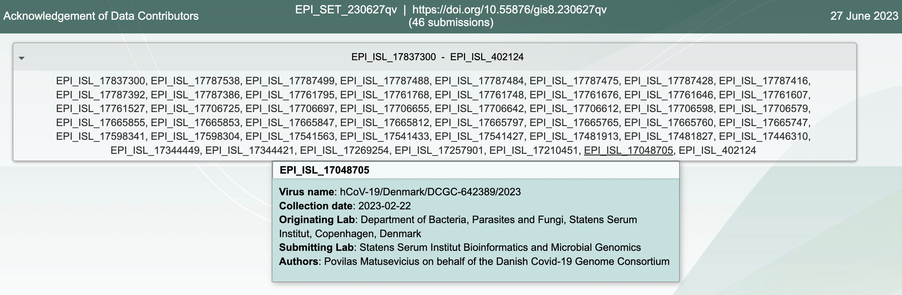{width=70%}

Note that it also included the Wuhan reference.

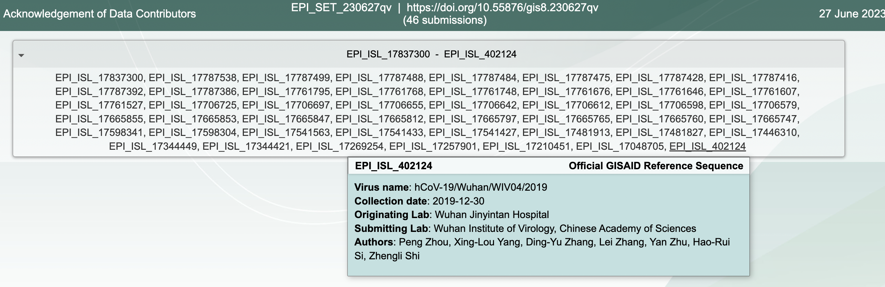{width=70%}

Now click on "Download" to download the sequences.

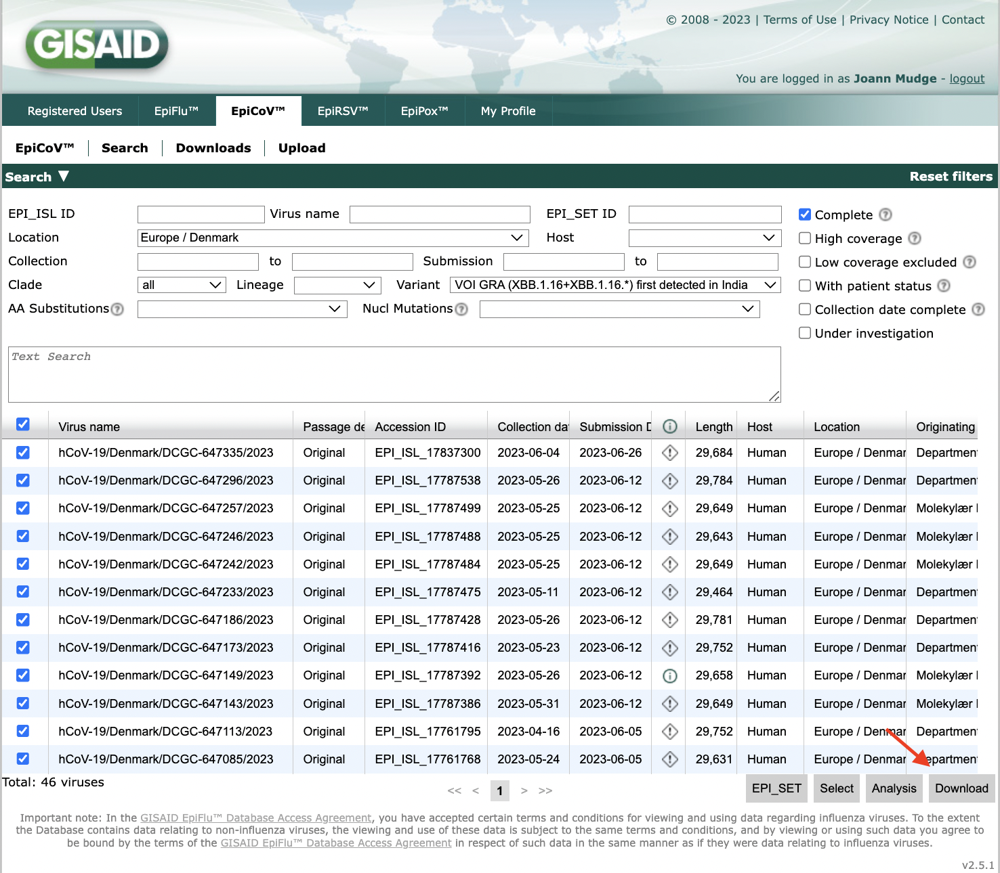{width=70%}

Change the name of the file to something that identifies the country the sequences came from and the fact that we limitted it to the Arcturus subvariant.

Repeat for your other countries.


## Upload sequences

Upload the sequences to the server.

1. Copy your sequence files to the server.
2. Log onto the server (if you aren't alread logged on).
3. Create a new screen or reenter a previous screen.
4. Create a directory in your home directory called "gisaid_genomes".
5. Move your sequence files into the gisaid_genomes directory.
6. Navigate into the gisaid_genomes directory.
7. Combine the Arcturus sequences from your 3 countries into a single fasta file.

<details>
  <summary>Click for Answers</summary>
  ```
  Adjust the commands below to reflect the filenames for your 3 countries and replace "jm" with your username.
  
1. scp -P 44111 *arcturus*fasta "jm@gateway.training.ncgr.org:/home/jm/"
2. ssh -p 44111 jm@gateway.training.ncgr.org
3. screen -S gisaid_genomes
4. mkdir ~/gisaid_genomes
5. mv *arcturus*fasta gisaid_genomes
6. cd gisaid_genomes
7. cat *arcturus*fasta > dns.arcturus.fasta
  
  ```
</details>
\

You should now have 4 fasta files in your tree directory: an arcturus fasta file for each of your 3 countries and the merged fasta file that has all 3 countries. Do an "ls" to doublecheck.

Count the number of sequences in all of your fasta files.

<details>
  <summary>Click for Answers</summary>
  ```
grep -c '>' *fasta

  denmark_arcturus_gisaid_hcov-19_2023_06_27.fasta:46
  dns.arcturus.fasta:475
  norway_arcturus_gisaid_hcov-19_2023_06_27.fasta:34
  sweden_arcturus_gisaid_hcov-19_2023_06_27.fasta:395

  ```
</details>
\

Note: The large number of sequences in Sweden (395) compared to Denmark (46) and Norway (34) may represent more arcturus in Sweden but it might also represent sequencing of a greater fraction of COVID-19 patients in Sweden (a possibility I haven't looked into).

Now go back to GISAID and download another dataset from your 3 countries that you think might be useful in the story that you are putting together. You might limit it to a particular region of one of your countries or a particular time in the pandemic or a particular variant or amino acid change.
