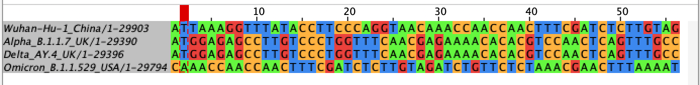
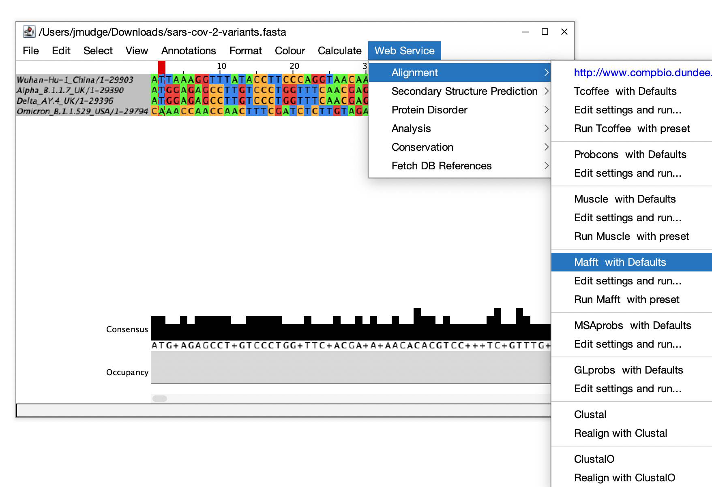
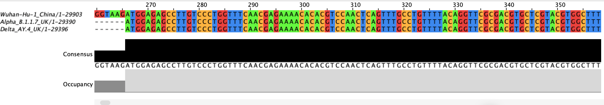
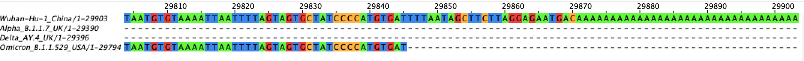
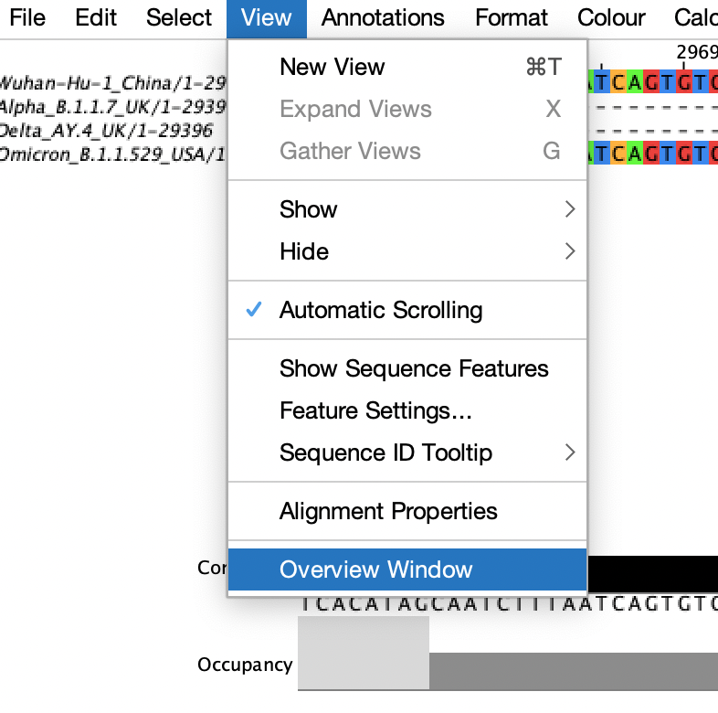
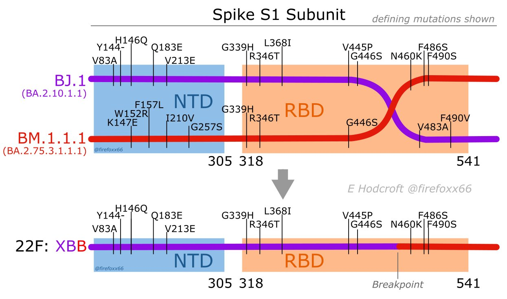

<!-- Could add in beta variant -->
<!-- jalview can also be installed on the command line -->

# Multiple Sequence Alignment

## SARS-Cov-2 variant genomes

We are going to line up some SARS-CoV-2 genomes so that their corresponding nucleotides all match up and their genes start and stop in the same place. This will involve adding in gaps here and there where some sequences have insertions relative to other sequences. We'll start with a file that has genome sequences for some SARS-CoV-2 variants.

Do the following:
On the server, create a directory called sars-variants in your home directory.
Navigate into that directory
Soft link to the file /home/jm/sarsdata/sars-cov-2-variants.fasta

<details>
  <summary>Click for Answers</summary>
  ```
  mkdir ~/sars-variants
  cd ~/sars-variants
  ln -s /home/jm/sarsdata/sars-cov-2-variants.fasta .
  ```
</details>
\

How many sequences are there in the file?
Which SARS-CoV-2 variants are there?

<details>
  <summary>Click for Answers</summary>
  ```
  grep -c '>' sars-cov-2-variants.fasta
  grep '>' sars-cov-2-variants.fasta
  
  > Original variant (Wuhan-Hu-1)
  > Alpha
  > Delta
  > Omicron
  ```
</details>
\


We'll start with a java tool which will allow us to do an alignment and to visualize it.

Dowload the sars-cov-2-variants.fasta file onto your computer.

Install Jalview (https://www.jalview.org/). Click on download and choose the windows or mac version and install it.

Open up Jalview.

Close all the windows except the blank window at the back.

Go to main menu at the very top. Choose File > Input Alignment > From File -
Then choose the sars-cov-2-variants.fasta file.

{width=70%}
It is expecting an aligned fasta file and we are opening up a fasta file that hasn't been aligned yet. Let's take a look at it in its unaligned form, first.

Color the sequences by nucleotide by choosing:
Colour > Nucleotide

{width=70%}

Alpha and Delta line up pretty well but the other two are way off because their sequence is shifted relative to Alpha and Delta.

{width=70%}

So, let's align them now. We'll use the MAFFT (Multiple Alignment using Fast Fourier Transform) aligner, which is a very fast multiple sequence aligner.

Choose:
Web Service > Alignment > Mafft with defaults

{width=70%}

Go ahead and color by nucleotide again.

{width=70%}

Now the original (Wuhan-Hu-1) and the Omicron are lining up. The dashes mean that there is no sequence there. In other words, not all the variant genomes were sequenced and assembled all the way to the ends of the RNA genome molecule. Scroll to the right until you can see sequence in all four variants.

<!-- Should probably add something about how we sequence. -->


{width=70%}


They all start to look identical here. The consensus and occupancy tracks can tell you quickly whether everything has sequence in that region (occupancy) and whether they all have the same nucleotide (consensus).

Scroll all the way to the right to see the end of the chromosome. Did every genome assembly make it to the end?

<details>
  <summary>Click for Answers</summary>
  No, they didn't.
  
{width=70%}
</details>
\

Take a look at the overview window.
View > Overview

{width=40%}

Expand it by hovering over the bottom right-hand corner until the cursor changes, then click and drag to make it bigger.

{width=70%}

This has all four genome one on top of each other across the whole genome sequence (~30kb).

If you click on the overview, it will take you to the corresponding position in the alignment window. Try to find a few regions on the overview that don't look the same in all four variant genomes. Click on them and see what they look like in the alignment window.


Let's look for indels (insertions and deletions), ignoring those on the ends of the chromosome that are likely due to lack of sequence coverage rather than being a true indel event.

Close the overview window. Scroll through the genome looking for indels. These will be marked by dashes and both the consensus and occupancy tracks will not be full height. Note the following for each indel:

```
start position
length
variant(s) that are different from Wuhan-Hu-1
insertion or deletion compared to Wuhan-Hu-1
```

Compare with each other to make sure you got them all. What do you notice? What might be the significance of your observations?

<details>
  <summary>Click for Answers</summary>
  ```
Start   Length    Variant(s) Type
11288   9   Alpha   Deletion
21633   9   Omicron   Deletion
21765   6   Alpha/Omicron   Deletion
21991   3   Alpha   Deletion
22029   6   Delta   Deletion
28248   6   Delta   Deletion
28271   1   Alpha/Delta   Deletion
28362   9   Omicron   Deletion
 ```

Possible answers: 

Lengths
They are all multiples of 3 except for 1. This avoids frameshifts. In other words, if the indel is a multiple of 3, you gain or loss an amino acid or two or three but the downstream amino acids would stay the same.

Positions
They seem to be clustered in a couple of different regions of the genome. It might mean that the indels that have selective advantage are only in a couple of genes.

Type
They are all deletions. There are some insertions seen in other variants but they are much more rare compared to deletions.

</details>
\


Use the coordinates below to figure out what genes the indels are in.

<!-- No gaps in the Wuhan-Hu-1 sequence so its coordinates match the alignment coordinates. -->
<!-- These are from the GISAID reference hCoV-19/Wuhan/WIV04/2019 while I used Wuhan-Hu-1 but the coords match up. -->
<!-- The NSP12 coordinates reflect the stutter. -->
"NSP1","266-805",
"NSP2","806-2719",
"NSP3","2720-8554",
"NSP4","8555-10054",
"NSP5","10055-10972",
"NSP6","10973-11842",
"NSP7","11843-12091",
"NSP8","12092-12685",
"NSP9","12686-13024",
"NSP10","13025-13441",
"NSP11","13442-13480",
"NSP12","13442-13468|13468-16236",
"NSP13","16237-18039",
"NSP14","18040-19620",
"NSP15","19621-20658",
"NSP16","20659-21552",
"Spike","21563-25384",
"NS3","25393-26220",
"E","26245-26472",
"M","26523-27191",
"NS6","27202-27387",
"NS7a","27394-27759",
"NS7b","27756-27887",
"NS8","27894-28259",
"N","28274-29533",
"NS9b","28284-28577",
"NS9c","28734-28955"

<details>
  <summary>Click for Answers</summary>
  ```
Start   Length    Variant(s) Type Gene
11288   9   Alpha   Deletion    NSP6
21633   9   Omicron   Deletion    Spike
21765   6   Alpha/Omicron   Deletion    Spike
21991   3   Alpha   Deletion    Spike
22029   6   Delta   Deletion    Spike
28248   6   Delta   Deletion    NS8
28271   1   Alpha/Delta   Deletion    non-genic
28362   9   Omicron   Deletion    NS9b
 ```
</details>
\


Now let's do a multiple sequence alignment on the server. This will allow us to do much bigger datasets.

Log into the server
Enter a screen
Go into your ~/sars-variants directory

Activate the environment.

```
conda activate mafft_msa
```

mafft sars-cov-2-variants.fasta  > mafft.sars-cov-2-variants.fasta

Take a look at the file and make sure it looks as expected.


You can also do alignments of protein sequences. Working on the protein level shows you missense and nonsense mutations, which are the main drives of phenotypic change. Any silent mutations (mutations that don't change the amino acid sequence) are missed. While silent mutations only affect phenotype very rarely, they are useful to see how closely related organisms are evolving and, in the case of pathogens, how they are can inform modes of transmission. So, working on the protein vs the DNA level each have their advantages.

GISAID pulls out the spike protein sequences from all of the genomes. So we don't all download our own copy of the spike proteins and use up space, I've downloaded a copy (updated 7/2/2023).

Create a soft link to /home/jm/sarsdata/spikeprot0702.fasta.gz
We can continue to work in the sars-variants directory.

<details>
  <summary>Click for Answer</summary>
  ```
  ln -s /home/jm/sarsdata/spikeprot0702.fasta.gz .
  ```
</details>
\


How many sequences are there?

<details>
  <summary>Click for Answer</summary>
  ```
  zgrep -c '>' spikeprot0702.fasta.gz
  ```
</details>
\

Check out the headers to see their format

<details>
  <summary>Click for Answer</summary>
  ```
  zgrep '>' spikeprot0702.fasta.gz | head
  ```
</details>
\

Get the sequences for Denmark, Norway, and Sweden.

Note: Because each sequence has only one sequence line you just need to grep the appropriate headers plus the line that follows each header (grep -A 1). Unfortunately, when grep is skipping lines it adds in an extra line with "--". You'll need to also get rid of those lines after you grep (grep -v '\-\-').

Note: the dashes have to be escaped with backslashes so that grep reads them as literal dashes.

Then gzip the file to compress it and save space.

<details>
  <summary>Click for Answer</summary>
  ```
  zgrep -A 1 -E "Denmark|Norway|Sweden" spikeprot0702.fasta.gz | grep -v '\-\-' > dns.spikeprot0702.fasta
  gzip dns.spikeprot0702.fasta
  
  OR
  
    zgrep -A 1 -E "Denmark|Norway|Sweden" spikeprot0702.fasta.gz | grep -v '\-\-' |gzip > dns.spikeprot0702.fasta.gz
  ```
</details>
\

Let's make an EPI_SET for acknowledgement. See if you can grab all the EPI ids from the headers, put them in a file, and download them to your computer. Then go to GISAID and log in so you can make an EPI_SET. One way to make an EPI_SET is to click on search then EPI_SET (bottom right). Load your file of EPI ids.

<details>
  <summary>Click for Answer</summary>
  ```
  zgrep '>' spikeprot0702.fasta.gz | cut -f 4 -d '|' > dns.epi.txt
  
  Go to GISAID to get your EPI_SET as described above.
  ```
</details>
\


Make a multiple sequence alignment. MAFFT should be able to automatically detect that it is a protein sequence.

Since this is is bigger dataset, let's parallelize it using the --threads parameter. Give it 10 threads, which will split the job up into 10 pieces to be run simultaneously before bringing everything back together.

<details>
  <summary>Click for Answer</summary>
  ```
  mafft --thread 10 dns.spikeprot0702.fasta  > mafft.dns.spikeprot0702.fasta
  ```
</details>
\

Download the multiple sequence alignment and look at it in Jalview.


Now repeat this for your three countries.


## Arcturus Genomes

Finally, we'll make an MSA from the Arcturus genomes. These are whole genome alignments of a lot more genomes so it will take a little longer. Make sure you are in a screen.

Go to this directory: ~/gisaid_genomes
We'll use the dns.arcturus.fasta file that you made earlier.


<details>
  <summary>Click for Answers</summary>
  ```
  mafft --thread 10 dns.arcturus.fasta  > mafft.dns.arcturus.fasta
  ```
</details>
\

Download it and look at it in Jalview.


## Omicron Recombinant Case study
A new omicron subvariant arose from a recombination of two subvariants: BJ.1 (BA.2.10.1.1 in the 21L omicron lineage and BM.1.1.1 (BA.2.75.3.1.1.1) in the 22D omicron lineage (https://covariants.org/variants/22F.Omicron). It likely arose in mid-2022 from a crossover event within a person whose cells were simultaneously infected by BJ.1 and BM.1.1.1. The new variant was named XBB (the "X" stands for the crossover event that occured between the two "B" subvariants; hence, XBB).

Create a soft-link to /home/jm/sarsdata/recombinant.fa which has the two progenitor sequences and the XBB sequence. Or, rather, since the XBB spike protein sequence was hard to find, I grabbed the XBB.1 sequence. Note that the XBB.1 sequence has a G252V (G changed to V at position 252) mutation that XBB doesn't have.

Create and view a multiple sequence alignments (MSA) using MAFFT and Jalview and see if you can narrow down where the crossover occured. You can do the MSA either on the command line or in Jalview.

After you have narrowed it down, click on the answer below and compare what you found to the picture. Note that the numbers in the picture below are based on the coordinates in the original SARS-CoV-2 virus. The three sequences that you are working with all have 3 amino acids that are deleted near the beginning of their sequence, thereby shifting coordinates by 3 (ie. 83 in the picture will show up as position 80 in your alignment).

<details>
  <summary>Click for Answer</summary>
    {width=70%}
 
 
    Notes:
    NTD = N-terminal domain of the Spike protein (the "beginning" of the protein in that it is translated first)
    RBD = Receptor binding domain of the Spike protein, which binds the ACE2 or other receptors
</details>
\


<!-- Add in acknowledgements for GISAID. Probably need to parse out the ids then create an episet from them. -->
