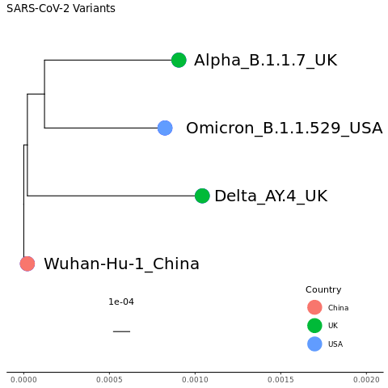
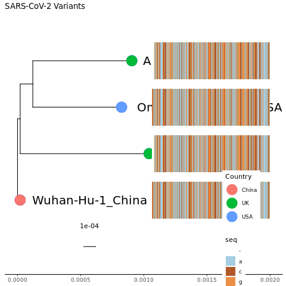

<!-- For next year: Add Wuhan-Hu-1 spike into the file during the previous chapter before you run mafft. -->
<!-- The text quality in a PNG is poor so using PDF. So far I still have pngs as the actual figures. I think that I have to do something different to have bookdown show pdfs. Actually, it just doesn't preview it. It puts it in a frame that you have to scroll through so for now I will just generate pngs on the sides to put in the bookdown doc.-->
<!-- I should put trees in a click menu. -->
<!-- Add in arcturs sequences tree: -->
<!-- raxml-ng --force model_lh_impr --all --msa mafft.dns.arcturus.fasta --model GTR+G --tree pars{10} --bs-trees 100 -->
<!-- Is there a way to bioinformatically pick random genomes or spike proteins for trees? -->
<!-- Sequences <29000 skewed the tree.-->

# Phylogenetic Trees

## SARS-Cov-2 variant genomes

Now let's make a phylogenetic tree. We'll start with a web-based tool that can create phylogenetic trees.

Download mafft.sars-cov-2-variants.fasta file that you already made. It has the genome sequence of the four different SARS-Cov-2 variants in it. If it isn't completed yet, you can download mine at /home/jm/sars-variants/mafft.sars-cov-2-variants.fasta

<!-- Go to http://www.trex.uqam.ca/ -->
<!-- This went down the day we planned to do this so switching to EBI-->

Go to https://www.ebi.ac.uk/Tools/phylogeny/simple_phylogeny/

Upload the file and then click "Submit".

{width=70%}

The tree should pop up. The cladogram just shows the groupings. If you choose real, it will change the branch lengths to the actual branch lengths.

{width=70%}

What do you notice about the tree?

<details>
  <summary>Click for Possible Answers</summary>
  ```
The branch lengths are really small indicating that everything is closely related.

Alpha and Omicron are the most closely related, at least according to this tree.
  ```
</details>
\


The mafft.dns.spikeprot0702.fasta file is too large for this website so we need to learn how to do this on the command line. But we'll start off with the 4 variant sequences first.

Log into logrus and get into a screen. Navigate to your sars-variants folder. Do an ls to see what files are there.

Activate the environment. We'll use RAxML-ng to build the tree using the MAFFT files we already created. We'll use Wuhan-Hu-1 as the outgroup.

```
conda activate raxml-ng
```

Create the tree.

```
raxml-ng --force model_lh_impr --outgroup Wuhan-Hu-1_China --all --msa mafft.sars-cov-2-variants.fasta --model GTR+G --tree pars{10} --bs-trees 100
```

NOTE: The force param (--force model_lh_impr) makes it not quit if an optimized tree is only a smidge better than another tree. This is important for SARS-CoV-2 since we have a lot of similar or identical genome sequences that could be rearranged to give trees that have similar scores.

Take a look at the file that ends in .bestTree. This is a text version of a tree in Newick tree formt. The innermost parentheses show what is most closely related. Branch lengths are incorporated. We'll show you how to visualize this shortly.

Which are the 2 most closely related variants in this tree?

Which is the most distant?

<details>
  <summary>Click for Answers</summary>
The Omicron and Alpha are most closely related.

The Wuhan-Hu-1 is the most distantly related.

((Delta_AY.4_UK:0.001021,(Omicron_B.1.1.529_USA:0.000703,Alpha_B.1.1.7_UK:0.000784):0.000100):0.000021,Wuhan-Hu-1_China:0.000021)

</details>

## Spike Protein

The mafft.dns.spikeprot0702.fasta file has spike protein sequences for Denmark, Norway, and Sweden that are already aligned.

First, we need to add in Wuhan-Hu-1 as our outgroup. We'll use an early isolate from the US that matched the Wuhan-Hu-1 that is present in the spike sequence file. Get isolate EPI_ISL_759860's header and sequence from spikeprot0702.fasta.gz and put it into a file called wuhanhu1.fasta.

Note: There are several accessions that start with EPI_ISL_759860 but we want **EPI_ISL_759860** not **EPI_ISL_759860**7, for instance, so search for 'EPI_ISL_759860|'

<details>
  <summary>Click for Possible Answers</summary>
  ```
zgrep -A1 'EPI_ISL_759860|' spikeprot0702.fasta.gz > wuhanhu1.fasta
  ```
</details>
\

Now combine the dns.spikeprot0702.fasta (Denmark, Norway, Sweden spike sequences) and the wuhanhu1.fasta file you just made using the "cat" command. Put it in a file called dnsw.spikeprot0702.fasta

<details>
  <summary>Click for Possible Answers</summary>
  ```
  cat wuhanhu1.fasta dns.spikeprot0702.fasta > dnsw.spikeprot0702.fasta
  ```
</details>
\

The Wuhan-Hu-1 header is really long and has a lot of special characters. Since we will be feeding that in on the command line, let's make it shorter.

Find the Wuhan-Hu-1 header.

<details>
  <summary>Click for Possible Answers</summary>
  ```
  grep '>' Wuhan dnsw.spikeprot0702.fasta
  ```
</details>
\


Let's replace it so it just says Wuhan-Hu-1. Here is one way to do it.

NOTE: -i.bak tells sed to edit the file in place and make a backup of the original file, ading the .bak suffix.

```
sed -i.bak -e 's/^>.*\(Wuhan-Hu-1\).*/>\1/' dnsw.spikeprot0702.fasta
```

Run a mulitple sequence alignment on the dnsw.spikeprot0702.fasta. This will take a will so if you need to, link to my file at /home/jm/sars-variants/mafft.dnsw.spikeprot0702.fasta (but make sure you name your file something different!). Use 8 threads.

NOTE: The number of threads is
```
--thread
```
in MAFFT and 
```
--threads
```
in raxml-ng.

<details>
  <summary>Click for Answer</summary>
  ```
mafft --thread 100 dnsw.spikeprot0702.fasta > mafft.dnsw.spikeprot0702.fasta
  ```
</details>
\

  
Now, create the tree. Use 8 threads.

<details>
  <summary>Click for Answer</summary>
  ```
raxml-ng  --threads 8 --force model_lh_impr --outgroup Wuhan-Hu-1 --all --msa mafft.dnsw.spikeprot0702.fasta --model GTR+G --tree pars{10} --bs-trees 100
  ```
</details>
\

Now, create a tree for your 3 countries from the MSA you made earlier.


## Visualizing the tree

Make sure you are in the sars-variants directory.
<details>
  <summary>Click for Answer</summary>
```
cd ~/sars-variants
```
</details>
\


Activate the tree environment.


<details>
  <summary>Click for Answer</summary>
```
conda activate tree

If it doesn't recognize the environment, try:
conda activate /home/condasw/miniconda3/envs/tree
```
</details>
\


Open up R.

```
R
```

Load the following libraries. The treeio library is needed to read in the tree that we created. The ggtree library is an extension of ggplot2 for trees.

```
library(treeio)
library(ggtree)
library(ggplot2)
```


Read in the tree for the SARS-CoV-2 variants that you created with RAxML-ng.

```
tr = read.tree("mafft.sars-cov-2-variants.fasta.raxml.bestTree")
```


Create a PDF to put the tree in.

```
pdf("basic.tree.pdf")
```


Now make the tree and release the PNG.

```
ggtree(tr)

dev.off()
```

Use another terminal to download your PDF and look at it.

HINT: We'll be making several PDFs. I find it easier to set up my scp command to download all the PDFs (*pdf) in the sars-variants directory so I don't have to rewrite my command. They are small so redownloading previous PDFs isn't problematic.


{width=70%}


Not much to look at and we definitely need some tip labels and a scale. So let's make some customizations.


Open up a PDF called "labeled.tree.pdf".

<details>
  <summary>Click for Answers</summary>
```
pdf("labeled.tree.pdf")
```
</details>
\


ggtree follows ggplot2 grammar. We'll add some layers to add the tip labels and a scale bar. We'll also add a layer that will give us a theme that has an x axis scale running across the bottom as well, which we'll need in order to adjust the plot later on.

We are also going to put the tree plot into a variable so that we can add more layers to the variable later on, without having to keep adding the tip label, scale, and theme layers. The first command below puts the tree plot into the variable. The second command prints out the variable (and, hence, the tree plot).

```
mytree = ggtree(tr) + geom_tiplab() + geom_treescale() + theme_tree2()

mytree

dev.off()

```

{width=50%}

NOTE: The scale/branch lengths are a nucleotide distance. In other words, 1e-04 means one nucleotide change in every 10,000 nucleotides.

Some of our labels got cut off. We need to change how far the x axis goes. Looking at the plot we just made, the tips of the tree go out to about 0.001. So let's change the x axis to go a little further (0.002), which means the bars won't get quite so far to the right and the text will have more space.

Open up a PDF called "scaled.tree.pdf".

<details>
  <summary>Click for Answers</summary>
```
pdf("scaled.tree.pdf")
```
</details>
\

Create the tree then close the PNG. We can start with the mytree variable that we made above. We'll add on a layer from ggplot2 called xlim, giving it a range from 0 to 0.002. We'll also add a title layer.

```
mytree2 = mytree + ggplot2::xlim(0, 0.002) + ggtitle("SARS-CoV-2 Variants")

mytree2

dev.off()

```

{width=50%}

That's better. Notice that the farthest tips still end around 0.001.


Now, let's make the tip text labels larger and color the tip points.


Open up a PDF called "tip.tree.pdf".

<details>
  <summary>Click for Answer</summary>
```
png("tip.tree.png")
```
</details>
\

We'll start from scratch since the variables we have created already have a geom_tiplab so will end up with 2 different labels of 2 different sizes. As we make the tip point bigger, it will overlap the tip label so we'll shift the tip label to the right using hjust (horizontal justification).


```
mytree3 = ggtree(tr) + geom_treescale() + theme_tree2() + ggplot2::xlim(0, 0.002) + ggtitle("SARS-CoV-2 Variants") + geom_tiplab(size=7, hjust = -0.1) + geom_tippoint(color="blue",size=8)

mytree3

dev.off()

```

{width=35%}


If you wanted to also color the tip label text blue, how do you think you would you do it?


<details>
  <summary>Click for Answer</summary>
```
ggtree(tr) + geom_treescale() + theme_tree2() + ggplot2::xlim(0, 0.002) + ggtitle("SARS-CoV-2 Variants") + geom_tiplab(size=7, hjust = -0.1, color="blue") + geom_tippoint(color="blue",size=8)
```
</details>
\


Note: There is also a geom_nodepoint variable that you can use to put dots or other shapes on the internal nodes to highlight a clade. To find out more about customizing phylogenetic trees, see https://yulab-smu.top/treedata-book/index.html.


We can also color the nodes by another variable. We'll color by country.

We need to make a table linking each sequence name to its country. Go into a different window in your screen (ctrl-a + c : creates a new one; ctrl-a space : moves you through different screen windows). In your sars-variants directory, look at your sars-cov-2-variants.fasta file. We will grab the header lines from the file and parse it into a table with sequence_name and country. See if you can figure out what each piece of the command below does.

```
grep '>' sars-cov-2-variants.fasta | sed 's/>//' | awk '{print $1 "\t" $1}' | sed 's/\t.*_/\t/' > sars-cov-2-variants.countries.txt
```

Take a look at the sars-cov-2-variants.countries.txt file.

<details>
  <summary>Click for Answer</summary>
```
cat sars-cov-2-variants.countries.txt

or 

more sars-cov-2-variants.countries.txt

or

less sars-cov-2-variants.countries.txt

or

head sars-cov-2-variants.countries.txt

etc
```
</details>
\


Now go back to the screen window that has R open.


Read in the sars-cov-2-variants.countries.txt file that we just created and give it some column names. Then take a look at it.

```
countrydf = read.table("sars-cov-2-variants.countries.txt", header=FALSE)

colnames(countrydf) = c("SequenceVariant", "Country")

head(countrydf)
```

Open up a PDF called "country.tree.pdf".

<details>
  <summary>Click for Answer</summary>
```
pdf("country.tree.pdf")
```
</details>
\

We have to append the data frame with the country info to the tree and then we can use the country column to color the tip points. We'll also add a legend layer. Note that you need to put the color in "aes". Otherwise, it can't find the country column.

```

mytree4 = mytree3 %<+% countrydf + geom_tippoint(aes(color=Country), size=8) + theme(legend.position=c(0.85,0.15))

mytree4

dev.off()

```

{width=35%}

We can also add in the multiple sequence alignment next to the tree. Read in the mafft multiple sequence alignment file.

```
msafa = treeio::read.fasta("mafft.sars-cov-2-variants.fasta", type="NT")
```

Now, we'll use msaplot from ggtree to add the msa.

```
pdf("msa.tree.pdf")

msaplot(mytree4, fasta=msafa, width=2)

dev.off()
```

{width=35%}

OK, cool! We have just squeezed the nearly 30,000 nucleotide genome onto the plot. Obviously, there are a few problems. We have overwritten our labels and the sequence in the MSA is so squeezed that it is hard to see it in general or to pick out any differences. We now have a second legend that tells the colors of the nucleotides and neither legend is in a good place.

We need to shift the MSA seqence to the right (hjust isn't recognized by msaplot but there is an "offset" command).

We should tell msaplot the relative width of the MSA compared to the tree ("width" command).

We need to make the PDF wider. We'll change it from its default of 8.5 inches to 85 inches.

We need to make room for the legends and adjust where they are. To do this last one, we'll need to remake our plot in mytree4. To keep things seperate, we'll put it into mytree5 rather than overwriting mytree4.

Let's also get rid of the scale across the x axis, now that it has served its purpose. That will require starting from scratch. We also need to expand the x axis coordinates to be able to fit the MSA.


```
mytree5 = ggtree(tr)  %<+% countrydf + geom_treescale() + ggplot2::xlim(0, 0.02) + ggtitle("SARS-CoV-2 Variants") + geom_tiplab(size=7, hjust = -0.1) + geom_tippoint(aes(color=Country), size=8) + theme(legend.position=c(0.02,0.6)) + ggplot2::xlim(0, 0.02) + ggplot2::ylim(-2, 5)

pdf("msa.big.tree.pdf", width=85)

msaplot(mytree5, fasta=msafa, width=15, offset=0.0008)

dev.off()
```

{width=100%}

Looks great! Might need to zoom in too look at it more closely.

But that's a lot of sequence to squeeze onto there. Let's just show the spike nucleotide sequence. We can still use the mytree5 variable since the change in the MSA will happen in msaplot. Remember that the spike protein coordinates in Wuhan are 21563-25384.

NOTE: Even though we will just be showing the spike sequence in the MSA, the tree itself was built considering the entire SARS-CoV-2 genome.

```
pdf("msa.spike.msa.tree.pdf", width=85)

msaplot(mytree5, fasta=msafa, width=15, offset=0.0008, window=c(21563,25384))

dev.off()
```

{width=100%}

As we have already learned there are no insertions in these variants relative to Wuhan (thought there are in other variants). If there were, the coordinates in the MSA for spike would shift slightly. Let's double-check that there is a start codon at the beginning and a stop codon at the end. Zoom in to see the first and last 3 nucleotides. The link below takes you to a codon wheel so you can see what the codons you find code for.

https://www.sigmaaldrich.com/US/en/technical-documents/technical-article/genomics/sequencing/amino-acid-codon-wheel


<details>
  <summary>Click for Answer</summary>
```
The starting codon is ATG which is the start codon.
The ending codon is TAA which is a stop codon.
```
</details>
\

How many deletions relative to Wuhan do you see for Alpha, Delta, and Omicron?


<details>
  <summary>Click for Answer</summary>
```
Deletions
Alpha   2
Delta   1
Omicron   2
```
</details>
\


Let's make a tree for the Denmark, Norway, Sweden Arcturus sequences color coded by country. We'll rely on the color for country and not worry about the tip labels. We'll just focus on the tree and not worry about the MSA. Try it yourself before looking at the answer.

If you don't have a tree made, link to mine (/home/jm/gisaid_genomes/mafft.dns.arcturus.fasta).

These are the steps you'll need to take:

1. Switch to the gisaid_genome directory in R.
2. Create a file that links each sequence to the country it came from in linux.

HINT: You can use sed as we did for the SARS-CoV-2 variants, but here is an easier way. The "paste" command pastes columns from different files together.

```
# Example header
# >hCoV-19/Sweden/AB-502030/2023|EPI_ISL_17850020|2023-06-16

grep '>' mafft.dns.arcturus.fasta | sed 's/>//' > temp1.txt
cut -f 2 -d '/' temp1.txt > temp2.txt
paste temp1.txt temp2.txt > dns.arc.country.txt
rm temp*
```

3. Create a tree in linux.

The rest of the steps are in R.

4. Read in the country file and column headers.

5. Read in the tree file.

6. Plot your tree.


<details>
  <summary>Click for Answers</summary>
```
1. setwd("/home/jm/gisaid_genomes/")

2. grep '>' mafft.dns.arcturus.fasta | sed 's/>//' > temp1.txt
cut -f 2 -d '/' temp1.txt > temp2.txt
paste temp1.txt temp2.txt > dns.arc.country.txt
rm temp*

3. raxml-ng --force model_lh_impr --all --msa mafft.dns.arcturus.fasta --model GTR+G --tree pars{10} --bs-trees 100

4. dnscountrydf = read.table("dns.arc.country.txt", header=FALSE)

colnames(dnscountrydf) = c("SequenceVariant", "Country")

5. dnsarctr = read.tree("mafft.dns.arcturus.fasta.raxml.bestTree")

6. pdf("dns.arc.pdf", height=15, width=10)

dnsarc = ggtree(dnsarctr)  %<+% dnscountrydf + geom_treescale() + ggtitle("Denmark, Norway, and Sweden Arcturus Sequences") + geom_tippoint(aes(color=Country), size=1) + theme(legend.position=c(0.04,0.9))

dnsarc

dev.off()

```
</details>
\

{width=50%}

Now try to create a phylogenetic tree with your arcturus 3 country data. Think about these questions before we share the plots with each other.

Do the sequences from each country form their own clade?

Does it look like the sequences are evolving separately within each country?

Are any clades specific to one country or absent from one country?

Keep in mind that it is hard to compare numbers directly across countries because each country sequenced a different number/percentage of cases. But do you see any interesting patterns such as a high percentage of a country's sequences being in the beginning or later in the pandemic, and do these patterns match what you know about the course of the pandemic in these countries?


