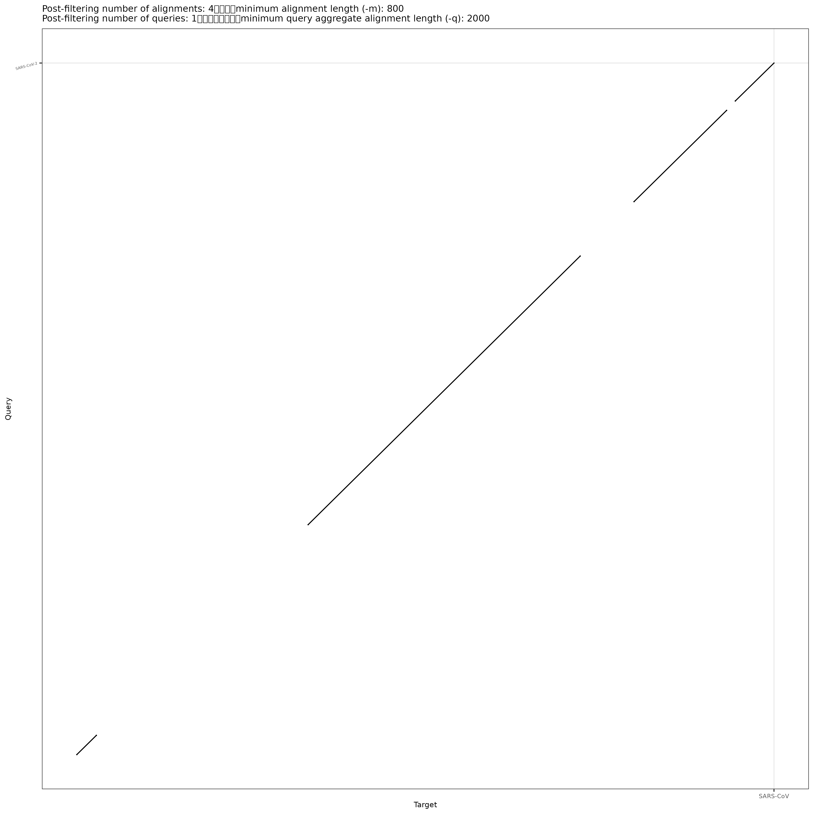

<!-- No alignments between SARS-CoV-2 and MERS-CoV at asm20. -->
<!-- Get an explanation of what various SVs look like in dotplots. -->
<!-- Move data from sarsdata to nise-data. -->

# Dotplots

We are going to make dotplots, which is a way to line up two genomes and see high level structural differences between them (large insertions and deletions, translocations, inversions, etc). Single nucleotide changes (SNPs) and small indels are ignored at this level.

## SARS-CoV-2

We'll start with SARS-CoV-2.

Make a directory called "dotplots" and navigate into it.

Soft-link to the data (/home/data/nise/dotplotgenomes/*.fa).

Activate the mm2 environment. This will allow us to run minimap2, an aligner (like BLAST) that will very quickly give us approximate genome-wide alignments.

<details>
  <summary>Click for Possible Answers</summary>
  ```
mkdir ~/dotplots

cd dotplots

ln -s /home/data/nise/dotplotgenomes/*.fa .

conda activate mm2
```
</details>
\


Look at the man page to figure out what the following parameters mean:
-x asm20
-o
-c (we'll use this in a bit)


Run minimap2 putting it into an out put file called SARS-CoV-2xSARS-CoV.paf.

```
minimap2 -x asm20 -o SARS-CoV-2xSARS-CoV.paf SARS-CoV.fa SARS-CoV-2.fa
```

Take a look at the file. Go to the following website to learn about PAF (Pairwise mApping Format) format (click on "Output Format"). Work through the documentation on the website as a group to figure out what each part of it means.

https://lh3.github.io/minimap2/minimap2.html

How many alignments did we get across the genome?

<details>
  <summary>Click for Possible Answers</summary>
  ```
Only 1.

It's easy to open the file and count the 1 alignment but if we had a lot of alignments, we would want a better way to do that:

wc -l SARS-CoV-2xSARS-CoV.paf
```
</details>
\

There are parameters that will allow minimap2 to convert those approximate alignments to nucleotide-level alignments but it doesn't often change anything on dotplot level. But let's run it and see. It prints out a CIGAR string, which is something that you'll see a lot in alignment files and is good to unerstand. We'll use the -c parameter.

```
minimap2 -c -x asm20 -o SARS-CoV-2xSARS-CoV.cigar.paf SARS-CoV.fa SARS-CoV-2.fa
```

Many alignments are printed out in SAM format or the compressed version of SAM called BAM. Go to the sam documentation:
https://samtools.github.io/hts-specs/SAMv1.pdf #6

How is SAM different than PAF? This document also has information on the CIGAR string. See if you can figure out what the CIGAR string in our PAF file is telling us.


OK. Now let's plot it.

Go to another window in your screen and activate the visualization environment.

```
ctrl-a+c to create a new screen or ctrl-a+space to navigate to the next screen

conda activate visualization
```

We'll use dotplotly which uses R and the ggplot2 and plotly libraries to make both static and interactive dotplots.

Find out what the parameters for dotplotly are. There is no help function so just google dotplotly. Pay attention especially to:
-i
-o
-m
-q
-l
-p


We need to change the -q parameter from the default. Why?

Run dotplotly.

```
/home/jm/sw/dotPlotly-master/pafCoordsDotPlotly.R -i SARS-CoV-2xSARS-CoV.paf -o SARS-CoV-2xSARS-CoV -m 1000 -q 2000 -l -p 12
```

Ignore the "Error in htmlwidgets::saveWidget". We don't have that library installed so our html isn't all in one document but requires us to copy over the folder. Copy over the png, html and the folder to your desktop computer using scp. When you copy over the folder, you need to use the -r (recursive) parameter.

{width=70%}

Open the PNG file. The single diagonal line means that they line up across there genomes (expect a bit at the beginning in the bottom left). At a high level structural view, SARs-CoV (the original SARS) and SARs-CoV-2 are very similar.

Now open the HTML file (make sure the folder is in the same directory). Play around with the controls on the top right and figure out what they do. Did you find how to activate the labels upon hovering?

Now run it on the PAF file with the CIGAR string and see if you get anything different.

<details>
```
/home/jm/sw/dotPlotly-master/pafCoordsDotPlotly.R -i SARS-CoV-2xSARS-CoV.cigar.paf -o SARS-CoV-2xSARS-CoV.cigar -m 1000 -q 2000 -l -p 12
```
</details>
\

How many alignments did it filter out?

<details>
It filtered out 1 alignment to keep 3 of the 4 alignments
</details>
\

The filtered alignment was probably too short. How long are each of the alignments?

Hint: You can use the start and end of the alignments in the query that are in columns 3 and 4. Use awk and subtract those columns.

<details>
awk '{print $4-$3+1}' SARS-CoV-2xSARS-CoV.cigar.paf

Alignment lengths:
11596
1639
3940
832
</details>
\

Since we set the minimum query length at 1000 (-m 1000), the shortest alignment got filtered out).

Rerun the dotplot to keep that alignment.

<details>
```
/home/jm/sw/dotPlotly-master/pafCoordsDotPlotly.R -i SARS-CoV-2xSARS-CoV.cigar.paf -o SARS-CoV-2xSARS-CoV.cigar -m 800 -q 2000 -l -p 12
```
</details>
\

Download your files and take a look at the plot.

{width=45%}

That is probably a more realistic representation of the relationship between the SARS-CoV-2 and SARS-CoV genomes.


## Yersinia

Let's look at Yersinia. We'll compare Yersinia pestis to Yesinia enterocolitica. They are both pathogens. Look up what diseases/symptoms both of them cause.

How many sequences do each have? You linked to the files earlier. Do an "ls" to figure out the file names.

<details>
  <summary>Click for Possible Answers</summary>
  ```
grep -c '>' Y*.fa
```
</details>
\

Plasmids often have virulence factors on them (the genes that make them pathogenic). Plasmids can be passed between bacteria of different species and so are often less related than the genomic chromosome is. In this case the genomic chromosome is circular.

Here are the lengths of each oof the chromosomes.

Y. enterocolitica
chr	4540172 \
plasmid1	5350 \
plasmid2	3300

Y. pestis
chr 4553770 \
plasmid1	96210 \
plasmid2	8431

Go back to your screen window with the mm2 environment.

Run minimap2 using nucleotide-level alignment to produce CIGAR strings.

```
minimap2 -c -x asm20 -o YexYp.cigar.paf Ypestis.fa Yenterocolitica.fa
```

Run dotplotly with a minimum alignment length of 1000

```
/home/jm/sw/dotPlotly-master/pafCoordsDotPlotly.R -i YexYp.cigar.paf -o YexYp -m 1000 -q 2000 -l -p 12
```

How many alignments did it filter out?

<details>
It filtered out 46 alignment to keep 428 of the 474 alignments
</details>
\

Go ahead and download it and take a look.

This is much more rearranged than the SARS plots. See if you can see any patterns. Do the 2 genomes share any sequence in common? What about the ordering? Is anything inverted between the two genomes? Is anything duplicated? What can you tell about the plasmids?

{width=45%}

