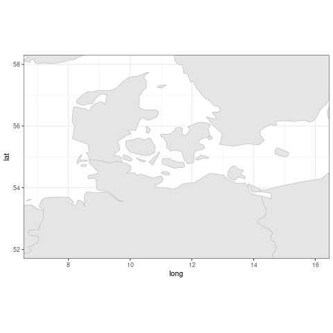
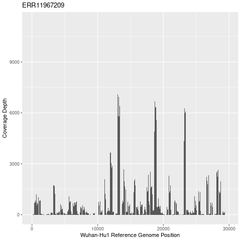

# Wastewater

## Wastewater data

We are going to work with some wastewater samples. These samples, like most wastewater samples that are taken to look for SARS-CoV-2, were amplified with primers specific to SARS-CoV-2. They used RT-PCR (Reverse Transcription Polymerase Chain Reaction) to make DNA copies of the RNA nucleotides that are between the forward and reverse primer in each primer set. To copy from RNA to DNA you need to use the Reverse Transcriptase enzyme. For these samples, they used the Arctic v5.3.2 primers, which provide several primer sets that, together, cover the SARS-CoV-2 genomes and will work on any of the variants. You still get some host (human) DNA coming through from the sample but the samples we are working with already have the human DNA removed and have already had primers and low quality sequence trimmed. There were some reads that were removed all together so I re-sync the read1 and read2 files so they match up again using bbmap.

Note that these are not quantitative PCR samples so we can't tell how much SARS-CoV-2 there is in each sample relative to the others, but we can look at which variants are there.

These samples are from various locations in Denmark and are part of BioProject PRJEB65603. First, let's plot where the samples came from in Denmark.

Within your home directory, make a directory called "wastewater" and go into it.

<details>
  <summary>Click for Answer</summary>
```{R, eval=FALSE}
mkdir ~/wastewater
cd ~/wastewater
```
</details>
\


Link to the metadata file at: /home/data/nise/wastewater/wastewater.txt

<details>
  <summary>Click for Answer</summary>
```{R, eval=FALSE}
ln -s /home/data/nise/wastewater/wastewater.txt .
```
</details>
\

We'll used the first date (8/8/23). Create a file named Aug_wastewater.txt that has only that date.

<details>
  <summary>Click for Answer</summary>
```{R, eval=FALSE}
grep '8/8/23' wastewater.txt > Aug_wastewater.txt
```
</details>
\

## Map of wastewater sites

Now let's create a map of Denmark. We'll use ggplot2 and some other libraries. Open up R.

Load the libraries.

```{R, eval=FALSE}
library(ggplot2)
library(maps)
library(sf)
```

Now let's get the coordinates for Denmark.

```{R, eval=FALSE}
map("world", "Denmark", plot=FALSE)$range
```

It gives you the two longitude coordinates that contain the country and then the two latitude coordinates that contain the country.

Your output should look like this:
```{R, eval=FALSE}
[1]  8.121484 15.137110 54.628857 57.736916
```

We can plot the world map that corresponds to those coordinates. Let's give a little cushion to our coordinates, though, by expanding them slightly.

```{R, eval=FALSE}
png("denmark_ww.png")

p = ggplot() + borders("world", colour="gray80", fill="gray90") + coord_fixed(xlim=c(7, 16), ylim=c(52, 58)) + theme_bw()

p

dev.off()
```

Pull it onto your computer and see what it looks like. Adjust if necessary.


<details>
  <summary>Click for Plot</summary>
{width=85%}
</details>
\


Now let's plot the places where the wastewater was collected. Read in the file.

```{R, eval=FALSE}
ww = read.table("Aug_wastewater.txt", header=FALSE)
```

Add some columns.

```{R, eval=FALSE}
colnames(ww) = c("Sample","Date","Latitude","Longitude")
```

Plot the points based on their latitude and longitude by adding a layer to the map plot we already made.

```{R, eval=FALSE}
p + geom_point(data=ww,aes(x=Longitude,y=Latitude))
```

## Read alignments

First, we'll align reads to the Wuhan-Hu1 reference genome, a genome sequence from very early in the pandemic. Since we are working with several samples let's use some subdirectories to keep things organized. First, a fastq directory. We'll make it, go into it, link to the fastq files, then come back up to the wastewater directory. These are Illumina paired end reads (DNA is broken up into short sequences and then you sequence in from either end to get to read pairs that are near each other in the genome).

```{R, eval=FALSE}
mkdir fastq
cd fastq
ln -s /home/data/nise/wastewater/*fastq .
cd ..
```

Now make an alignments directory.

```{R, eval=FALSE}
mkdir alignments
```

Activate the minimap2 environment.

```{R, eval=FALSE}
conda activate mm2
```

Link to the Wuhan-Hu1 SARS-CoV-2 reference genome.

```{R, eval=FALSE}
ln -s /home/data/nise/wuhanhu1_genome.fasta .
```

Align our samples to the reference genome using the short read preset. First, let's make an index for the reference genome.

```{R, eval=FALSE}
minimap2 -x sr -d wuhanhu1_genome.mmi wuhanhu1_genome.fasta
```

Let's loop through each fastq, aligning it to the reference, converting the sam output (uncompressed) to bam (compressed) and then sorting the bam file based on the reference position.

Note: We could do a single for loop for all of the work we are doing that spans multiple files but we will break things out so we can explain steps as we go and check them.

```{R, eval=FALSE}
for i in fastq/*_1.fastq; do
  bn=`basename $i _1.fastq`
  minimap2 -ax sr -o alignments/${bn}.sam wuhanhu1_genome.mmi fastq/${bn}_1.fastq fastq/${bn}_2.fastq
  samtools view -b -o alignments/${bn}.bam alignments/${bn}.sam
  samtools sort -o alignments/${bn}.sort.bam alignments/${bn}.bam
done
```

Note: many of these reads won't align because they are too short or they don't match well. We could try to alter the minimap2 parameters so that more of them will align to SARS-CoV-2 but we won't worry about that for now.

Let's switch to the iVar environment.

```{R, eval=FALSE}
conda deactivate
conda activate ivar
```

We'll use iVar's trim function to soft clip the alignments to remove any remaining Arctic primers. It will also apply minimum read length and quality cutoffs. We'll also sort and index the bam file.


-m = minimum read length \
-q = minimum read quality \
-e = retain reads with no primers \
  Note: this is important since a primer trimming step was already done \
-p = output prefix
-b = file with primer sequences

```{R, eval=FALSE}
for i in fastq/*_1.fastq; do
  bn=`basename $i _1.fastq`
  ivar trim -i alignments/${bn}.sort.bam -b /home/data/nise/SARs-CoV-2_v5.3.2_400.primer.bed \
    -m 50 -q 20 -e -p alignments/ivar.${bn}
  samtools sort -o alignments/ivar.${bn}.sort.bam alignments/ivar.${bn}.bam
  samtools index alignments/ivar.${bn}.sort.bam
done
```

Let's figure out how many reads and read pairs are mapped.

Note: "reads mapped and paired" means that each read in a pair aligned close to each other in the reference genome and in the expected orientation relative to one another. Technically, all the reads are part of a read pair.

```{R, eval=FALSE}
for i in alignments/ivar.*.sort.bam; do
  echo $i
  samtools stats $i|grep "reads mapped"
done > stats.txt
```

Note: Some of the samples have zero reads aligned. Remember the caveat noted above that some of their reads might be too short or too diverged to align with the minimap2 parameters we used. Without knowing more about these samples, it is hard to know whether these samples just didn't sequence well (something wrong with the DNA extraction, the library prep, or the sequencing) or if there just wasn't much virus in the sample. If we had some quantitative PCR (qPCR) for these samples, it would be more clear. We'll assume they are low viral samples and move forward.

Let's take a look at the sequencing coverage for one of these samples. Because we are using tiled PCR approach to generate PCR amplicons across the genome, we won't have an even coverage. Let's just do one of the samples with a high number of reads aligned. We'll use "samtools depth". The -a option gets the sequencing depth at all reference positions, even if it is zero.

```{R, eval=FALSE}
samtools depth -a alignments/ivar.ERR11967209.sort.bam > ERR11967209.depth.txt
```

See if you can plot this in ggplot2 using a bar chart. The second column is the position on the Wuhan-Hu1 reference (put this on the x axis) and the third column is the coverage depth at that position (put that on the y axis).

<details>
  <summary>Click for answer</summary>
```{R, eval=FALSE}
# Do this in R

library(ggplot2)

data=read.table("ERR11967209.depth.txt", header=FALSE)

colnames(data)=c("Reference","Position","Coverage")

png("ERR11967209.coverage.png")

ggplot(data, aes(x=Position, y=Coverage)) +
  geom_col(width=1) +
  ggtitle("ERR11967209") +
  xlab("Wuhan-Hu1 Reference Genome Position") +
  ylab("Coverage Depth")

dev.off()

```
</details>
\


<details>
  <summary>Click for Plot</summary>
{width=85%}
</details>
\

Not very even coverage! In general, tiled PCR has more choppy coverage than shotgun sequencing (breaking up the genome into small pieces and sequencing it) but this is much more variable than I am used to seeing. Part of that might be that this is a mixed wastewater sample.

## Identify SARS-CoV-2 variants

Now let's use Freyja to figure out what SARS-CoV-2 variants are present and what their relative proportions are. 

Change environments.

```{R, eval=FALSE}
conda deactivate
conda activate freyja
```

Make some subdirectories within your wastewater directory.

```{R, eval=FALSE}
mkdir variants_files depth_files demix_files
```

Next, we'll identify nucleotide changes (single nucleotide variants or SNVs) and get their frequency.

```{R, eval=FALSE}
for i in alignments/ivar.*.sort.bam; do
  bn=`basename $i .sort.bam`
  freyja variants $i \
    --variants variants_files/${bn}.variants.tsv \
    --depths depth_files/${bn}.depth \
    --ref wuhanhu1_genome.fasta
done
```

The depth folder has the same depth files that we ran with samtools depth. Claim one of the other samples and create a coverage plot. Then we can compare plots.

We need to update the lineage barcodes and their metadata (Note: this can change daily). Since you don't have permissions to write in the correct folder, we'll do this for you.

```{R, eval=FALSE}
# We will run this for you.
sudo /opt/anaconda3/envs/freyja/bin/freyja update
```
<<!-- I tried to do the update to a local file so the interns can do it. The update worked but then I get an error when I point the demix to it. Didn't have time to troubleshoot. -->>

Next is the demix step which disentangles and identifies the SARS-CoV-2 variants that are in the sample.

```{R, eval=FALSE}
for i in variants_files/ivar.*.variants.tsv; do
  bn=`basename $i .variants.tsv`
  freyja demix $i \
    depth_files/${bn}.depth \
    --output demix_files/${bn}.output.txt \
    --confirmedonly
done
```

Note: the warnings are telling us that they are not very confident in the variant assignments they are making. I haven't had a chance to look into this in detail but I assume this is because we don't have a lot of reads and they are not very evenly distributed across the SARS-CoV-2 genome. We'll move forward with these SARS-CoV-2 assignments. The demix step failed for the 2 samples without any aligned reads, as expected.

Let's look at the percent of the genome that was covered for each sample. The higher the percentage of the SARS-CoV-2 genome we saw in the sample, the more confident we can be in the results.

```{R, eval=FALSE}
grep coverage demix_files/*
```

Now, let's merge the output for each sample together.

```{R, eval=FALSE}
freyja aggregate demix_files/ --output allsamples.demux.tsv
```

Look at allsamples.demux.tsv. The columns are: \
sampleID (no column header) \
summarized -- this merges closely related variant lineages and gives frequencies \
lineages -- this give the variant lineages \
abundances -- this gives the abundances for these lineages \
resid -- "the residual of the weighted least absolute deviation problem used to estimate lineage abundances." \
coverage -- percent of the SARS-CoV-2 genome covered with at least 10 reads.

## SARS-CoV-2 variant piecharts

Now, let's add piecharts of the SARS-CoV-2 variants onto our map. We'll stick with the summarized variant data, which collapse the number of variants by merging closely related variants.

Each of the columns in allsamples.demux.tsv has several fields, which makes it tricky to work with. Let's munge the data into a form that we can import into R using the ridiculous one-liner below. You should recognize most of the individual pieces (note that the perl substitutions are very similar to sed but some of the substitutions of special characters won't work in sed). The one-liner will grab the sampleID and summarized columns, gets rid of samples that don't have any reads (and, therefore, no SARS-CoV-2 variant calls), merges the 3 sub-fields that contain info on the SARS-CoV-2 variants, removes special characters, strips extra text from around the sampleID, and removes the header.

```{R, eval=FALSE}
cut -f 1-2 allsamples.demux.tsv | grep -v "\[\]" | perl -pe 's/, /\t/g' | perl -pe 's/ /_/g' | perl -pe "s/[\(\)\[\]\']//g" | perl -pe 's/ivar.(\S+).variants.tsv/\1/g' | grep -v summarized > allsamples.summary.demux.tsv
```

Take a look at the resulting file (allsamples.summary.demux.tsv). It still isn't in a form that can be easily plottable but we'll do the rest of the munging in R. I am loosing follwing code from https://andersen-lab.github.io/Freyja/src/wiki/custom-plots-with-R.html, which, in turn, includes some code from https://github.com/a-rog.

Go into R and load the scatterpie library.

```{R, eval=FALSE}
R
library(scatterpie)
```

Read in the data. h=F is shorthand for header=FALSE. We are going to name the columns up front with the number 1-15. R doesn't allow column names to start with a number so it will add an X in front and we'll end up with columns X1-X15. The reason we have to do this is that each row has a different number of fields and because read.table only looks at the first 5 rows to determine the number of columns, it thinks there should only be 13 columns which messes up the resulting data frame. So, setting up 15 column names up front allows us to force it to have 15 columns. The fill=TRUE adds in NAs to fill in rows that don't have all columns.

```{R, eval=FALSE}
summarized<-read.table("allsamples.summary.demux.tsv", fill = TRUE, sep = "\t", h=F, col.names=c(1:15))
```

This R code munges things into three columns (Sample, Lineage, Abundance). The lineage is the SARS-CoV-2 variant lineage.

```{R, eval=FALSE}
for(i in 1:((ncol(results)-1)/2)){
  if(i==1){
    summarized.final<-summarized[,1:3]
  } else {
    start=i*2; end=i*2+1
    summarized.final<-rbind(summarized.final, setNames(summarized[,c(1,start:end)], names(summarized.final)))
  }
}

colnames(summarized.final) = c("Sample","Lineage","Abundance")
```

Now get rid of lines that have NA in the Abundance column. These lines also have no SARS-CoV-2 variant in the Lineage column.

```{R, eval=FALSE}
summarized.final = summarized.final[!is.na(summarized.final$Abundance),]
```

Take a look at the summarized.final data frame using the head command.

Now we'll convert our data frame with the Sample, Lineage, and Abundance columns from 3 long column to a shorter, wider format that has one row for every sample, and create one column per SARS-CoV-2 variant that contains the Abundance for that variant and the corresponding sample. Because we are using a function from the tidyr library it will put it into a tibble, which is a version of a data frame that is intended to reveal problems sooner (https://tibble.tidyverse.org/#:~:text=Tibbles%20are%20data.,to%20cleaner%2C%20more%20expressive%20code.). We'll convert it back to a data frame since you are used to using them and so we can easily merge it to another data frame.

```{R, eval=FALSE}
summ_wide <- summarized.final %>% 
  pivot_wider(names_from=Lineage, values_from=Abundance, values_fill=0)

summ_wide=as.data.frame(summ_wide)
```

Take a look at summ_wide using the head command.

Now we'll merge the data frame with the info on the variants to the data frame with the info on the longitude and latitude that we made earlier. Because we took out a few samples that didn't have reads from the summ_wide data frame, we will do a right join to bring in rows from the ww data frame that match a sample in the summ_wide data frame. In other words, it won't bring in data from the ww data from the samples that are no longer in summ_wide.

```{R, eval=FALSE}
ww_variants = right_join(ww, summ_wide, by="Sample")
```

Finally, time to plot! Earlier, we made a map of Denamrk and put it into the p variable. We could build off of this but we need to rearrange the layers so we'll start from scratch. We'll be using a PDF because, for some reason, the output is really fuzzy in a PNG. We'll increase the width of the PDF to make room for a legend.

In the geom_scatterpie layer, we plot the data in each of our variant columns on their corresponding latitude and longitude. The coord_equal makes sure our piecharts are circles (equal coordinates in the x and y directions). We'll move the coord_fixed layer to the end so that it overwrites much narrower coordinates that the geom_scatterpie layer imposes.

```{R, eval=FALSE}
pdf("VariantPiecharts.pdf", width=15)
ggplot() + borders("world", colour="gray80", fill="gray90")  + 
	geom_scatterpie(data=ww_variants,aes(x=Longitude, y=Latitude),
	cols=c("EG.5*_Omicron_EG.5.X", "XBB*_XBB.X", 
		"XBB.1.9.2*_Omicron_XBB.1.9.2.X", "Other", 
		"XBB.1.16*_Omicron_XBB.1.16.X" , "XBB.1.9.1*_Omicron_XBB.1.9.1.X", 
		"XBB.1.5*_Omicron_XBB.1.5.X", "XBB.2.3*_XBB.2.3X", "Omicron")) + 
	coord_equal() + 
	coord_fixed(xlim=c(7, 16), ylim=c(52, 58)) + 
	theme_bw()
dev.off()
```

Download it to your computer and take a look.

<details>
  <summary>Click for Plot</summary>
{width=85%}
</details>
\


BONUS:

Try to plot maps of each of your three countries.

See if you can rerun the analysis using the most recent date (11/23/23).

See if you can find some wastewater data for one of your countries at NCBI and try to analyze it.
