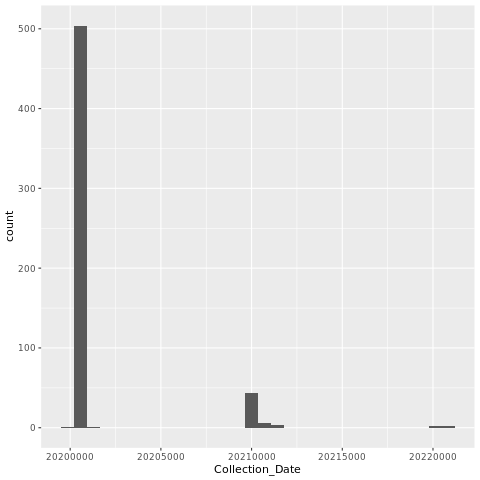
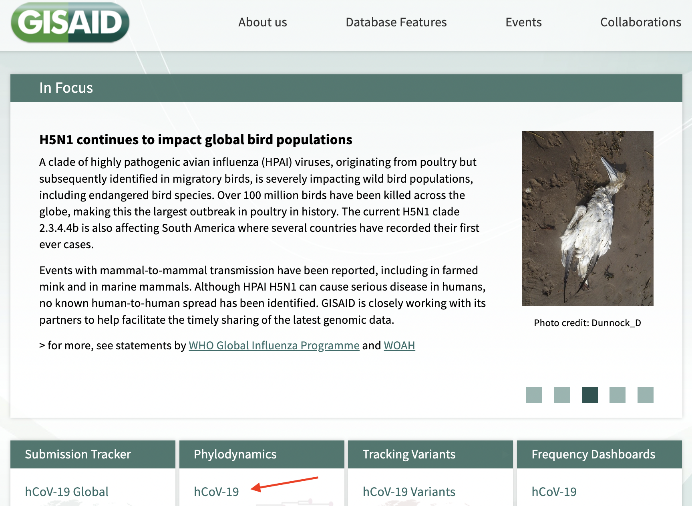
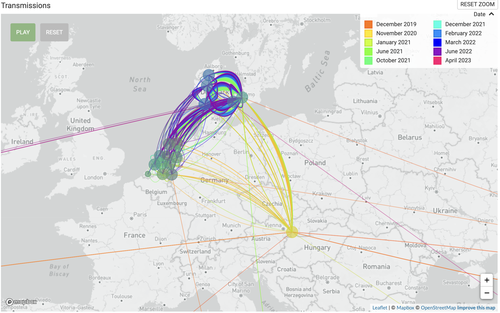
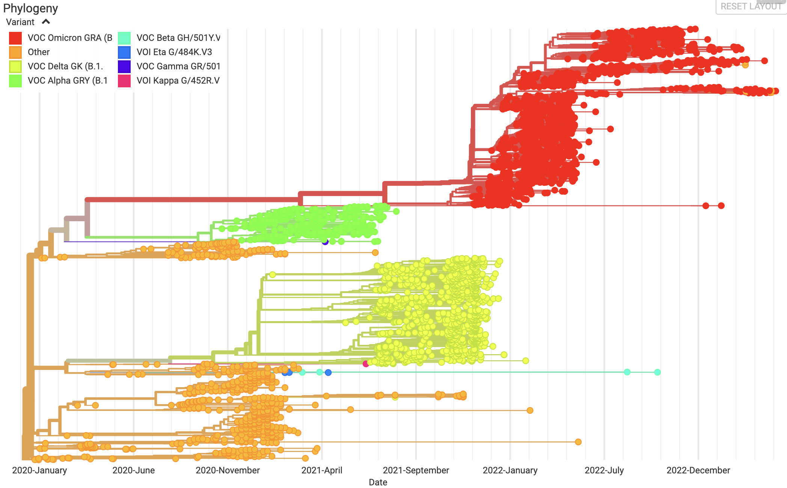
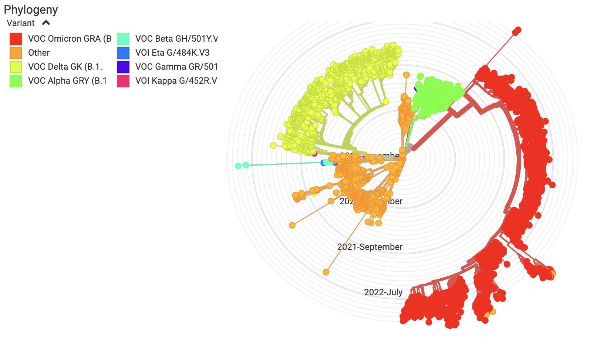
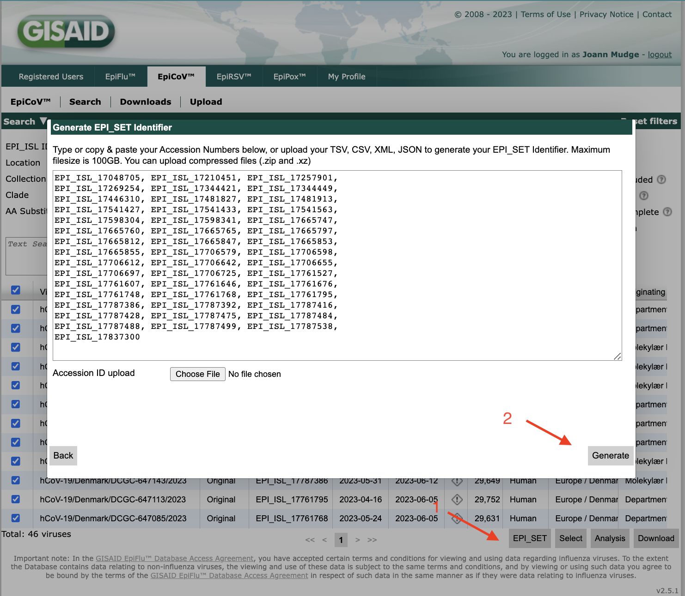
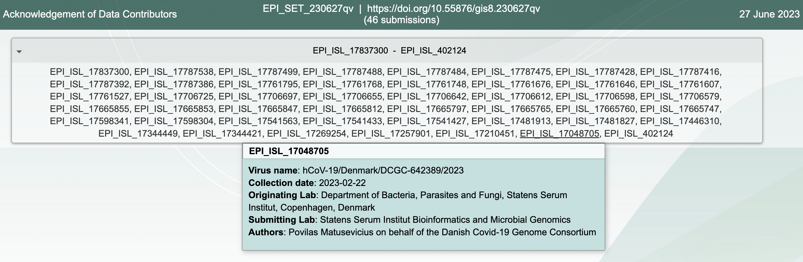

---
title: "NCGR NISE-Bioinformatics"
site: bookdown::bookdown_site
documentclass: book
bibliography: [book.bib, packages.bib]
# url: your book url like https://bookdown.org/yihui/bookdown
# cover-image: path to the social sharing image like images/cover.jpg
description: |
  This is the material for the NISE Bioinformatics Experience offered by NCGR in collaboration with NM-INBRE.
link-citations: yes
github-repo: ncgr/NISE-Bioinformatics

---

# License and Copyright{-}

License:
Creative Commons Attribution-NonCommercial-NoDerivatives 4.0
https://creativecommons.org/licenses/by-nc-nd/4.0/

© 2023-2024 National Center for Genome Resources

{width=30%} 


<br>

This publication was supported by an Institutional Development Award (IDeA) from the National Institute of General Medical Sciences of the National Institutes of Health under grant number P20GM103451. 


{width=20%} 

<br>


# Instructors

{width=42%}

{width=80%}

This document is available at https://inbre.ncgr.org/nise-bioinformatics


# Getting Started

Welcome to the Virtual Bioinformatics New Mexico INBRE Summer Experience (NISE)! We look forward to working with you this summer to dig into recent and ancient pandemics. We'll explore pandemics at different levels, looking at pathogens (genetics, evolution, transmission), disease (testing, outcomes, interventions, vaccination and immunity, risk factors), and societal factors (equity, policies, economy, mental health). You will each complete a 3 country research project and present it during the final week. We will help and support you along the way.

## Computer requirements

You will need to meet or exceed the following computer requirements: Windows 7, Mac (High Sierra or later), or Linux CPU 1 Ghz; 8G RAM or More; Mic and Camera. You should also have access to stable internet. Please make sure you have Zoom, Discord (you will need a free account), a browser, and access to microsoft word and powerpoint or google docs and slides. You will also need a terminal app to connect to our server (which one you will use will depend on what platform you are working on; we can help you with this once the internship is underway). If you have any concerns, please reach out to us.

You will need to install the following software on your local computer.

1. [Zoom](https://zoom.us/download)

Install the correct version for your OS. Don't plan to use the web version, as this does not have enough features. 

2. [MobaXterm](https://mobaxterm.mobatek.net/download.html) (Windows Users Only. Mac or Linux users will use their native terminal)

* Download the "Home" "Installer" edition.  Be careful not to install the portable or professional editions.  

* Before installing, extract the installer zip folder to any location on your computer.  

* Now run the installer and follow the prompts.

4. [Filezilla](https://filezilla-project.org/)

5. [Jalview](https://www.jalview.org/)


## Connecting to the linux server

1. Open your terminal.

2. Type the following on your command line, substituting in your username for <username>.

```
ssh -p2406 <username>@inbre.ncgr.org
```

3. Enter your password.

If you have trouble connecting, please contact Ethan Price at inbre@ncgr.org.


```{r include=FALSE}
# automatically create a bib database for R packages
knitr::write_bib(c(
  .packages(), 'bookdown', 'knitr', 'rmarkdown'
), 'packages.bib')
```


<!--chapter:end:index.Rmd-->

# Linux

<!--
Name: nise-2406.training.ncgr.org
IP: 172.19.59.20
External ssh: ssh -p2406 user@inbre.ncgr.org
-->


**Linux operating system (OS) and Bourne-Again SHell (bash) command-language basics**

## A little shell... aka the $ prompt is the command line interface

+ A shell is a user interface to the operating system.
    + CLI (Command Line Interface)
    + GUI (Graphical User Interface)
+ Bourne-Again SHell (bash) is a Unix shell and command language
+ Each command drives a program or script by talking to the Operating System
(Linux)

## Directory Structure

{width=100%}

In a Finder window, you would see this:

{width=60%}

## Find the shell in system you’ll use to log into the NCGR’s server

+ For **Windows**: search for MobaXterm from the start menu.
    + It may be useful to drag the terminal icon to the **desktop** for easier access in the future.

+ For **Mac**: search for "terminal" in the bar located in the Launchpad (rocket icon in the taskbar).
    + It may be useful to drag the terminal icon into the **Dock** for easier access in the future.

## Log on to logrus server 

Enter the following command to log on to logrus:

+ substitute **your** personal username in for "user"

```
ssh -p2406 user@inbre.ncgr.org
```

Notes:

+ Because we’re logging in remotely, the -p option is required to specify port 44111. 
+ If you’re prompted to confirm the connection, say "yes", then enter your password.

## Now that I logged on, where am I?

You’re at the command line interface of the logrus analysis server!

To the left of the command prompt, you should see something like this: 

+ [eprice@logrus ~]$

Command **output** is shown after the "##" in this document.

## Part I: Basic Topics

### Understanding Directories

print working directory (pwd), mkdir (make directory), and list contents (ls)

```
pwd
```

```
## /home/eprice
```

+ This is your "home" directory.

Now, create a dir under your home directory for this linux class:

```
mkdir linuxc

ls
```

```
## linuxc
```

### Listing options

using the ls command

+ **l**ong list:

```
ls -l
```

```
## total 4
## drwxrwxr-x 2 eprice eprice 4096 Aug 17 22:50 linuxc
```

+ **l**ong list, by **t**ime, **r**everse order -old to new:

```
ls -ltr
```
    
```
## total 4
## drwxrwxr-x 2 eprice eprice 4096 Aug 17 22:50 linuxc
```

### Navigation

1) "**c**hange **d**irectory" to the directory you made
+ where ~ is shorthand for your home directory

```
cd ~/linuxc

pwd
```

```
## /home/eprice/linuxc
```

### Files: creating with touch command

1) Create a file

```
touch newfile.txt

ls -l
```

```
## total 0
## -rw-rw-r-- 1 eprice eprice 0 Aug 17 22:50 newfile.txt
```

2) Change to your home dir

```
cd ~ 

pwd
```

```
## /home/eprice
```

### History command

lists the commands you have entered

```
history
```

```
## 17 ls -ltr
## 18 cd ../linuxc
## 19 ls -ltr
## 20 history
```

Scroll through recent commands with the up and down arrows.

To perform a command from the list by number:

```
!17
```

To perform the last command you made:

```
!!
```

### Files: creating by redirecting standard out

redirect operator **>**

To send output to a file instead of standard out:

+ standard out is just the terminal
   
    
```
history > history.txt

ls -l
```

```
## total 4
## -rw-rw-r-- 1 eprice eprice 0    Aug 17 22:50 history.txt
## drwxrwxr-x 2 eprice eprice 4096 Aug 17 22:50 linuxc
```

```
cat history.txt
```

```
## 17 ls -ltr
## 18 cd ../linuxc
## 19 ls -ltr
## 20 history
## 21 ls -ltr
## 20 history > history
```

Now you have a file with your commands!

### File name completion with tab

To autocomplete remainder of file name instead of typing it all in:

+ cat h...(press tab)
    + cat history
+ prevents typos and saves time

### Files: moving files from one filename to another

**m**o**v**ing "mv" command

#### Syntax: mv sourcefilename destinationfilename{-}

```
mv history.txt history_file.txt

ls -l
```

```
## total 4
## -rw-rw-r-- 1 eprice eprice 0    Aug 17 22:50 history_file.txt 
## drwxrwxr-x 2 eprice eprice 4096 Aug 17 22:50 linuxc
```

### Files: copying files from one filename to another

**c**o**p**ying "cp" command

#### Syntax: cp sourcefilename destinationfilename{-}

1) Change back to the linuxc directory:

```
cd ~/linuxc
```

2) Make a "back up" copy of a file in your working directory:

```
cp ~/linuxc/newfile.txt newfile_bu.txt
```

3) Check if the newly copied file is there:

```
ls
```

```
## newfile_bu.txt
## newfile.txt
```

### Files: securely copying files between your laptop and logrus 

**s**ecure **c**o**p**y "scp" command

+ a secure way to copy files to/from a server while you're working on an outside network
    + like from your home or starbucks to logrus and vice versa

#### Syntax: scp [options] sourcepath destinationpath{-}

1) Create a file to copy

```
touch scp_test.txt
```

2) 
+ **Mac** users
    + open a **local** terminal
    + do **not** connect it to logrus
+ **Windows** users
    + open a new MobaXterm session (shell)
    
3) Run the scp command from your **local** terminal window:
+ to **download** the file **to your computer** from logrus
+ the last period means that the destination is your working directory

```
scp -P 2406 <user>@inbre.ncgr.org:~/linuxc/scp_test.txt .
```

Note: When you designate a port with secure copy (scp), you use a capital P.

You will be prompted for your logrus password if not using MobaXterm.

4) Check to see if the file you copied from logrus is on **your** computer!

5) Now **upload** a file **to logrus** from your computer
+ Again, run the scp command from your **local** terminal window:

```
scp -P 2406 scp_test.txt <user>@inbre.ncgr.org:~/linuxc
```

6) Check to see if the file you copied from your computer is on **logrus**!

### Files and directories: removing files is deleting files

**r**e**m**oving "rm" command

#### Syntax: rm [options] filename{-}

```
rm -i newfile_bu.txt
```

```
## rm: remove regular empty file newfile_bu.txt?
```

Enter "yes" or "y" in response to the question:

```
yes

ls -l
```

```
## total 0
## -rw-rw-r-- 1 eprice eprice 0 Aug 17 22:50 newfile.txt
```

At this point everyone should have the above in their linuxc class directory.

### Tool box: How to abort a command/process

Hold "control" key then hit "c" key, then release. 

+ Control-key often referred to as CTRL. 

Let’s say you type a command and nothing happens; it hangs.
This can happen when the syntax doesn’t make sense. 
Good time for CTRL c

```
cat
```

If you can't execute commands, then CTRL c

```
## ^C
```

You should be returned to your prompt: [username@logrus linuxc]$


## PART II: Advanced Topics

### Files: Symbolic links and the soft link (-s)

#### Syntax: ln -s FileYouWantToLink/PointTo NameYouWantToGiveIt{-}

```
ln -s /home/eprice/covid.fasta covid.fasta

ls -l
```

```
## total 0
## lrwxrwxrwx 1 eprice eprice 26 Aug 17 22:50 covid.fasta -> /home/eprice/covid.fasta 
## -rw-rw-r-- 1 eprice Aug 17 22:50 newfile.txt
```

### Understanding a fasta file format

Fasta files (.fasta or .fa) contain one or more sequences, each preceded by a **header** starting with ">".

Show only the **first 10 lines** of a file with "head" command:

```
head covid.fasta
```

```
## >NC_045512.2 |Severe acute respiratory syndrome coronavirus 2 isolate Wuhan-Hu-1, co
## ATTAAAGGTTTATACCTTCCCAGGTAACAAACCAACCAACTTTCGATCTCTTGTAGATCT
## GTTCTCTAAACGAACTTTAAAATCTGTGTGGCTGTCACTCGGCTGCATGCTTAGTGCACT
## CACGCAGTATAATTAATAACTAATTACTGTCGTTGACAGGACACGAGTAACTCGTCTATC
## TTCTGCAGGCTGCTTACGGTTTCGTCCGTGTTGCAGCCGATCATCAGCACATCTAGGTTT
## CGTCCGGGTGTGACCGAAAGGTAAGATGGAGAGCCTTGTCCCTGGTTTCAACGAGAAAAC
## ACACGTCCAACTCAGTTTGCCTGTTTTACAGGTTCGCGACGTGCTCGTACGTGGCTTTGG
## AGACTCCGTGGAGGAGGTCTTATCAGAGGCACGTCAACATCTTAAAGATGGCACTTGTGG
## CTTAGTAGAAGTTGAAAAAGGCGTTTTGCCTCAACTTGAACAGCCCTATGTGTTCATCAA
## ACGTTCGGATGCTCGAACTGCACCTCATGGTCATGTTATGGTTGAGCTGGTAGCAGAACT
```

Now show only the **last 10 lines** of a file using the "tail" command:

```
tail covid.fasta
```

```
## TATTGACGCATACAAAACATTCCCACCAACAGAGCCTAAAAAGGACAAAAAGAAGAAGGC
## TGATGAAACTCAAGCCTTACCGCAGAGACAGAAGAAACAGCAAACTGTGACTCTTCTTCC
## TGCTGCAGATTTGGATGATTTCTCCAAACAATTGCAACAATCCATGAGCAGTGCTGACTC
## AACTCAGGCCTAAACTCATGCAGACCACACAAGGCAGATGGGCTATATAAACGTTTTCGC
## TTTTCCGTTTACGATATATAGTCTACTCTTGTGCAGAATGAATTCTCGTAACTACATAGC
## ACAAGTAGATGTAGTTAACTTTAATCTCACATAGCAATCTTTAATCAGTGTGTAACATTA
## GGGAGGACTTGAAAGAGCCACCACATTTTCACCGAGGCCACGCGGAGTACGATCGAGTGT
## ACAGTGAACAATGCTAGGGAGAGCTGCCTATATGGAAGAGCCCTAATGTGTAAAATTAAT
## TTTAGTAGTGCTATCCCCATGTGATTTTAATAGCTTCTTAGGAGAATGACAAAAAAAAAA
## AAAAAAAAAAAAAAAAAAAAAAA
```

#### The pipe operator will redirect output of a command to another command.{-}

Use the pipe operator to redirect "cat" output to "head":

+ The symbol "|" denotes a pipe

```
cat covid.fasta | head
```

```
## >NC_045512.2 |Severe acute respiratory syndrome coronavirus 2 isolate Wuhan-Hu-1, co
## ATTAAAGGTTTATACCTTCCCAGGTAACAAACCAACCAACTTTCGATCTCTTGTAGATCT
## GTTCTCTAAACGAACTTTAAAATCTGTGTGGCTGTCACTCGGCTGCATGCTTAGTGCACT
## CACGCAGTATAATTAATAACTAATTACTGTCGTTGACAGGACACGAGTAACTCGTCTATC
## TTCTGCAGGCTGCTTACGGTTTCGTCCGTGTTGCAGCCGATCATCAGCACATCTAGGTTT
## CGTCCGGGTGTGACCGAAAGGTAAGATGGAGAGCCTTGTCCCTGGTTTCAACGAGAAAAC
## ACACGTCCAACTCAGTTTGCCTGTTTTACAGGTTCGCGACGTGCTCGTACGTGGCTTTGG
## AGACTCCGTGGAGGAGGTCTTATCAGAGGCACGTCAACATCTTAAAGATGGCACTTGTGG
## CTTAGTAGAAGTTGAAAAAGGCGTTTTGCCTCAACTTGAACAGCCCTATGTGTTCATCAA
## ACGTTCGGATGCTCGAACTGCACCTCATGGTCATGTTATGGTTGAGCTGGTAGCAGAACT
```

```
cat covid.fasta | tail
```

```
## TATTGACGCATACAAAACATTCCCACCAACAGAGCCTAAAAAGGACAAAAAGAAGAAGGC
## TGATGAAACTCAAGCCTTACCGCAGAGACAGAAGAAACAGCAAACTGTGACTCTTCTTCC
## TGCTGCAGATTTGGATGATTTCTCCAAACAATTGCAACAATCCATGAGCAGTGCTGACTC
## AACTCAGGCCTAAACTCATGCAGACCACACAAGGCAGATGGGCTATATAAACGTTTTCGC
## TTTTCCGTTTACGATATATAGTCTACTCTTGTGCAGAATGAATTCTCGTAACTACATAGC
## ACAAGTAGATGTAGTTAACTTTAATCTCACATAGCAATCTTTAATCAGTGTGTAACATTA
## GGGAGGACTTGAAAGAGCCACCACATTTTCACCGAGGCCACGCGGAGTACGATCGAGTGT
## ACAGTGAACAATGCTAGGGAGAGCTGCCTATATGGAAGAGCCCTAATGTGTAAAATTAAT
## TTTAGTAGTGCTATCCCCATGTGATTTTAATAGCTTCTTAGGAGAATGACAAAAAAAAAA
## AAAAAAAAAAAAAAAAAAAAAAA
```

### Understanding fastq (fq) file format

Fastq files contain sequence reads and associated **meta data**.

```
ln -s /home/fds/unix_basics/SP1.fq SP1.fq

ls -ltr
```

```
## total 0
## -rw-rw-r-- 1 eprice eprice 0 Aug 17 22:50 newfile.txt
## lrwxrwxrwx 1 eprice eprice 26 Aug 17 22:50 covid.fasta -> /home/eprice/covid.fasta 
## lrwxrwxrwx 1 eprice eprice Aug 17 22:50 SP1.fq -> /home/fds/unix_basics/SP1.fq
```

Tail the last 4 lines:

```
tail -n 4 SP1.fq
```

```
## @cluster_834:UMI_TTAAGG
## AGGGTGGGGGATCACATTTATTGTATTGAGG 
## +
## =A=@AB===>4?A=??EEB?EB@C?ECB=A?
```

A fastq file has 4 lines per record:

+ The header; starts with "@"
+ The sequence
+ Throwaway line; begins with "+" 
+ Phred-scaled quality scores

##### What is the difference between this and a fasta file?{-}

### Using grep (global regular expression print) to extract metrics

Grep will output the lines containing a provided expression.

#### Syntax: grep [options] "expression" filename{-}

```
grep ">" covid.fasta
```

```
## >NC_045512.2 |Severe acute respiratory syndrome coronavirus 2 isolate Wuhan-Hu-1, co
## >MT627325.1 |Severe acute respiratory syndrome coronavirus 2 isolate SARS-CoV-2/huma
## >MT622319.1 |Severe acute respiratory syndrome coronavirus 2 isolate SARS-CoV-2/huma
## >MT568634.1 |Severe acute respiratory syndrome coronavirus 2 isolate SARS-CoV-2/huma
## >MT568635.1 |Severe acute respiratory syndrome coronavirus 2 isolate SARS-CoV-2/huma
## >MT568636.1 |Severe acute respiratory syndrome coronavirus 2 isolate SARS-CoV-2/huma
## >MT568637.1 |Severe acute respiratory syndrome coronavirus 2 isolate SARS-CoV-2/huma
## >MT568638.1 |Severe acute respiratory syndrome coronavirus 2 isolate SARS-CoV-2/huma
## >MT568639.1 |Severe acute respiratory syndrome coronavirus 2 isolate SARS-CoV-2/huma
## >MT568640.1 |Severe acute respiratory syndrome coronavirus 2 isolate SARS-CoV-2/huma
## >MT568641.1 |Severe acute respiratory syndrome coronavirus 2 isolate SARS-CoV-2/huma
## >MT407649.1 |Severe acute respiratory syndrome coronavirus 2 isolate SARS-CoV-2/huma
## >MT407650.1 |Severe acute respiratory syndrome coronavirus 2 isolate SARS-CoV-2/huma
## >MT407651.1 |Severe acute respiratory syndrome coronavirus 2 isolate SARS-CoV-2/huma
## >MT407652.1 |Severe acute respiratory syndrome coronavirus 2 isolate SARS-CoV-2/huma
## >MT407653.1 |Severe acute respiratory syndrome coronavirus 2 isolate SARS-CoV-2/huma
## >MT407654.1 |Severe acute respiratory syndrome coronavirus 2 isolate SARS-CoV-2/huma
## >MT407655.1 |Severe acute respiratory syndrome coronavirus 2 isolate SARS-CoV-2/huma
## >MT407656.1 |Severe acute respiratory syndrome coronavirus 2 isolate SARS-CoV-2/huma
## >MT407657.1 |Severe acute respiratory syndrome coronavirus 2 isolate SARS-CoV-2/huma
## >MT407658.1 |Severe acute respiratory syndrome coronavirus 2 isolate SARS-CoV-2/huma
## >MT407659.1 |Severe acute respiratory syndrome coronavirus 2 isolate SARS-CoV-2/huma
## >MT534630.1 |Severe acute respiratory syndrome coronavirus 2 isolate SARS-CoV-2/huma
## >MT510727.1 |Severe acute respiratory syndrome coronavirus 2 isolate SARS-CoV-2/huma
## >MT510728.1 |Severe acute respiratory syndrome coronavirus 2 isolate SARS-CoV-2/huma
## >MT079843.1 |Severe acute respiratory syndrome coronavirus 2 isolate SARS-CoV-2/huma
## >MT079844.1 |Severe acute respiratory syndrome coronavirus 2 isolate SARS-CoV-2/huma
## >MT079845.1 |Severe acute respiratory syndrome coronavirus 2 isolate SARS-CoV-2/huma
## >MT079846.1 |Severe acute respiratory syndrome coronavirus 2 isolate SARS-CoV-2/huma
## >MT079847.1 |Severe acute respiratory syndrome coronavirus 2 isolate SARS-CoV-2/huma
## >MT079848.1 |Severe acute respiratory syndrome coronavirus 2 isolate SARS-CoV-2/huma
## >MT079849.1 |Severe acute respiratory syndrome coronavirus 2 isolate SARS-CoV-2/huma
## >MT079850.1 |Severe acute respiratory syndrome coronavirus 2 isolate SARS-CoV-2/huma
## >MT079851.1 |Severe acute respiratory syndrome coronavirus 2 isolate SARS-CoV-2/huma
## >MT079852.1 |Severe acute respiratory syndrome coronavirus 2 isolate SARS-CoV-2/huma
## >MT079853.1 |Severe acute respiratory syndrome coronavirus 2 isolate SARS-CoV-2/huma
## >MT079854.1 |Severe acute respiratory syndrome coronavirus 2 isolate SARS-CoV-2/huma
## >MT446312.1 |Severe acute respiratory syndrome coronavirus 2 isolate SARS-CoV-2/huma
## >MT412134.1 |Severe acute respiratory syndrome coronavirus 2 isolate SARS-CoV-2/huma
## >MT396241.1 |Severe acute respiratory syndrome coronavirus 2 isolate SARS-CoV-2/huma
## >MT039874.1 |Severe acute respiratory syndrome coronavirus 2 isolate SARS-CoV-2/huma
## >MT281577.1 |Severe acute respiratory syndrome coronavirus 2 isolate SARS-CoV-2/huma
## >MT291826.1 |Severe acute respiratory syndrome coronavirus 2 isolate SARS-CoV-2/huma
## >MT291827.1 |Severe acute respiratory syndrome coronavirus 2 isolate SARS-CoV-2/huma
## >MT291828.1 |Severe acute respiratory syndrome coronavirus 2 isolate SARS-CoV-2/huma
## >MT291829.1 |Severe acute respiratory syndrome coronavirus 2 isolate SARS-CoV-2/huma
## >MT291830.1 |Severe acute respiratory syndrome coronavirus 2 isolate SARS-CoV-2/huma
## >MT291831.1 |Severe acute respiratory syndrome coronavirus 2 isolate SARS-CoV-2/huma
## >MT291832.1 |Severe acute respiratory syndrome coronavirus 2 isolate SARS-CoV-2/huma
## >MT291833.1 |Severe acute respiratory syndrome coronavirus 2 isolate SARS-CoV-2/huma
## >MT291834.1 |Severe acute respiratory syndrome coronavirus 2 isolate SARS-CoV-2/huma
## >MT291835.2 |Severe acute respiratory syndrome coronavirus 2 isolate SARS-CoV-2/huma
## >MT291836.1 |Severe acute respiratory syndrome coronavirus 2 isolate SARS-CoV-2/huma
## >MT259226.1 |Severe acute respiratory syndrome coronavirus 2 isolate SARS-CoV-2/huma
## >MT259227.1 |Severe acute respiratory syndrome coronavirus 2 isolate SARS-CoV-2/huma
## >MT259228.1 |Severe acute respiratory syndrome coronavirus 2 isolate SARS-CoV-2/huma
## >MT259229.1 |Severe acute respiratory syndrome coronavirus 2 isolate SARS-CoV-2/huma
## >MT259230.1 |Severe acute respiratory syndrome coronavirus 2 isolate SARS-CoV-2/huma
## >MT259231.1 |Severe acute respiratory syndrome coronavirus 2 isolate SARS-CoV-2/huma
## >MT253696.1 |Severe acute respiratory syndrome coronavirus 2 isolate SARS-CoV-2/huma
## >MT253697.1 |Severe acute respiratory syndrome coronavirus 2 isolate SARS-CoV-2/huma
## >MT253698.1 |Severe acute respiratory syndrome coronavirus 2 isolate SARS-CoV-2/huma
## >MT253699.1 |Severe acute respiratory syndrome coronavirus 2 isolate SARS-CoV-2/huma
## >MT253700.1 |Severe acute respiratory syndrome coronavirus 2 isolate SARS-CoV-2/huma
## >MT253701.1 |Severe acute respiratory syndrome coronavirus 2 isolate SARS-CoV-2/huma
## >MT253702.1 |Severe acute respiratory syndrome coronavirus 2 isolate SARS-CoV-2/huma
## >MT253703.1 |Severe acute respiratory syndrome coronavirus 2 isolate SARS-CoV-2/huma
## >MT253704.1 |Severe acute respiratory syndrome coronavirus 2 isolate SARS-CoV-2/huma
## >MT253705.1 |Severe acute respiratory syndrome coronavirus 2 isolate SARS-CoV-2/huma
## >MT253706.1 |Severe acute respiratory syndrome coronavirus 2 isolate SARS-CoV-2/huma
## >MT253707.1 |Severe acute respiratory syndrome coronavirus 2 isolate SARS-CoV-2/huma
## >MT253708.1 |Severe acute respiratory syndrome coronavirus 2 isolate SARS-CoV-2/huma
## >MT253709.1 |Severe acute respiratory syndrome coronavirus 2 isolate SARS-CoV-2/huma
## >MT253710.1 |Severe acute respiratory syndrome coronavirus 2 isolate SARS-CoV-2/huma
## >MT226610.1 |Severe acute respiratory syndrome coronavirus 2 isolate SARS-CoV-2/huma
## >MT121215.1 |Severe acute respiratory syndrome coronavirus 2 isolate SARS-CoV-2/huma
## >MT135041.1 |Severe acute respiratory syndrome coronavirus 2 isolate SARS-CoV-2/huma
## >MT135042.1 |Severe acute respiratory syndrome coronavirus 2 isolate SARS-CoV-2/huma
## >MT135043.1 |Severe acute respiratory syndrome coronavirus 2 isolate SARS-CoV-2/huma
## >MT135044.1 |Severe acute respiratory syndrome coronavirus 2 isolate SARS-CoV-2/huma
## >MT123290.1 |Severe acute respiratory syndrome coronavirus 2 isolate SARS-CoV-2/huma
## >MT123291.2 |Severe acute respiratory syndrome coronavirus 2 isolate SARS-CoV-2/huma
## >MT123292.2 |Severe acute respiratory syndrome coronavirus 2 isolate SARS-CoV-2/huma
## >MT123293.2 |Severe acute respiratory syndrome coronavirus 2 isolate SARS-CoV-2/huma
## >MT093631.2 |Severe acute respiratory syndrome coronavirus 2 isolate SARS-CoV-2/huma
## >MT049951.1 |Severe acute respiratory syndrome coronavirus 2 isolate SARS-CoV-2/huma
## >MT039873.1 |Severe acute respiratory syndrome coronavirus 2 isolate HZ-1, complete
## >MT019529.1 |Severe acute respiratory syndrome coronavirus 2 isolate BetaCoV/Wuhan/I
## >MT019530.1 |Severe acute respiratory syndrome coronavirus 2 isolate BetaCoV/Wuhan/I
## >MT019531.1 |Severe acute respiratory syndrome coronavirus 2 isolate BetaCoV/Wuhan/I
## >MT019532.1 |Severe acute respiratory syndrome coronavirus 2 isolate BetaCoV/Wuhan/I
## >MT019533.1 |Severe acute respiratory syndrome coronavirus 2 isolate BetaCoV/Wuhan/I
## >MN996527.1 |Severe acute respiratory syndrome coronavirus 2 isolate WIV02, complete
## >MN996528.1 |Severe acute respiratory syndrome coronavirus 2 isolate WIV04, complete
## >MN996529.1 |Severe acute respiratory syndrome coronavirus 2 isolate WIV05, complete
## >MN996530.1 |Severe acute respiratory syndrome coronavirus 2 isolate WIV06, complete
## >MN996531.1 |Severe acute respiratory syndrome coronavirus 2 isolate WIV07, complete
## >MN988668.1 |Severe acute respiratory syndrome coronavirus 2 isolate 2019-nCoV WHU01
## >MN988669.1 |Severe acute respiratory syndrome coronavirus 2 isolate 2019-nCoV WHU02
## >MN938384.1 |Severe acute respiratory syndrome coronavirus 2 isolate 2019-nCoV_HKU-S
## >MN975262.1 |Severe acute respiratory syndrome coronavirus 2 isolate 2019-nCoV_HKU-S
## >MN908947.3 |Severe acute respiratory syndrome coronavirus 2 isolate Wuhan-Hu-1, com
```

Adding the "-c" option counts the number of lines containing a match 

+ **not** the number of matches!

```
grep -c ">" covid.fasta
```

```
## 102
```

The "-v" option reverses the grep search, which is the first step towards finding the total length of sequences

```
grep -v ">" covid.fasta
```

Use <CTRL> c to halt the overflow of output.

We can add in the pipe operator to redirect our output to the "wc" command. 

The output shows the number of newline characters, followed by line count and total character count.

```
grep -v ">" covid.fasta | wc
```

wc: prints newline, word, and byte counts for each file:

```
## 50812 50812 3096018
```

Let’s trim out the newline characters with "tr -d" before doing the word count:

```
grep -v ">" covid.fasta | tr -d ’\n’ | wc
```

```
##       0       1 3045206
```

### Working with compressed files

Powerful Z commands (zcat) 

+ p. 1 of 2

Let’s copy another file:

```
cp /home/fds/unix_basics/table1.txt.gz /home/<user>/linuxczcat table1.txt.gz
```

```
## 1, Justin Timberlake, Title 545, Price $7.30
## 2, Taylor Swift, Title 723, Price $7.90
## 3, Mick Jagger, Title 610, Price $7.90
## 4, Lady Gaga, Title 118, Price $7.30
## 5, Johnny Cash, Title 482, Price $6.50
## 6, Elvis Presley, Title 335, Price $7.30
## 7, John Lennon, Title 271, Price $7.90
## 8, Michael Jackson, Title 373, Price $5.50
```

```
zgrep "Jagger" table1.txt.gz
```

```
## 3, Mick Jagger, Title 610, Price $7.90
```

!! = last command

:s = substitute /word1/with word2

```
!!:s/Jagger/John
```

```
## 5, Johnny Cash, Title 482, Price $6.50
## 7, John Lennon, Title 271, Price $7.90
```

### Start ^ and end $ symbols

Powerful Z commands (zgrep) 

+ p. 2 of 2

Display all the lines that start with 8:

```
zgrep "^8" table1.txt.gz
```

```
## 8, Michael Jackson, Title 373, Price $5.50
```

Display all the lines that end with 50:

```
zgrep "50$" table1.txt.gz
```

```
## 5, Johnny Cash, Title 482, Price $6.50
## 8, Michael Jackson, Title 373, Price $5.50
```

### Files: parsing and creating data-subsets

p.1 of 5

Be sure you are in linuxc directory (as usual)


AWK command

+ **A**ho, **W**einberger and **K**ernighan 
    + the authors of the language

General syntax:

+ awk ’pattern {action}’ input-file
    + output goes to standard out=terminal
+ awk ’pattern {action}’ input-file > output-file
    + or send to an output file

#### Exercise:{-}

How many fields does the 1st row of table1.txt have?

Let’s look at the 1st row of table1.txt:

1, Justin Timberlake, Title 545, Price $7.30

How many fields does it have?

### Files: parsing and creating data-subsets 

p. 2 of 5

```
gunzip table1.txt.gz

cat table1.txt
```

```
## 1, Justin Timberlake, Title 545, Price $7.30
## 2, Taylor Swift, Title 723, Price $7.90
## 3, Mick Jagger, Title 610, Price $7.90
## 4, Lady Gaga, Title 118, Price $7.30
## 5, Johnny Cash, Title 482, Price $6.50
## 6, Elvis Presley, Title 335, Price $7.30
## 7, John Lennon, Title 271, Price $7.90
## 8, Michael Jackson, Title 373, Price $5.50
```

```
awk '{print $1 $3 $5}' table1.txt
```

```
## 1,Timberlake,545,
## 2,Swift,723,
## 3,Jagger,610,
## 4,Gaga,118,
## 5,Cash,482,
## 6,Presley,335,
## 7,Lennon,271,
## 8,Jackson,373,
```

### Files: parsing and creating data-subsets 

p. 3 of 5

Using field separator command -F

```
cat table1.txt
```

```
## 1, Justin Timberlake, Title 545, Price $7.30
## 2, Taylor Swift, Title 723, Price $7.90
## 3, Mick Jagger, Title 610, Price $7.90
## 4, Lady Gaga, Title 118, Price $7.30
## 5, Johnny Cash, Title 482, Price $6.50
## 6, Elvis Presley, Title 335, Price $7.30
## 7, John Lennon, Title 271, Price $7.90
## 8, Michael Jackson, Title 373, Price $5.50
```

```
awk -F, '{print $3}' table1.txt
```

```
##  Title 545
##  Title 723
##  Title 610
##  Title 118
##  Title 482
##  Title 335
##  Title 271
##  Title 373
```

### Files: parsing and creating data-subsets 

p. 4 of 5: Conditional awk 

Time to really watch for syntax errors!

1) Statements inside the curly brackets {statement} are called a block.

2) If you put a conditional expression in front of a block with with ==, the statement inside the block will be executed **only if** the condition is **true**.

3) The whole awk command is inside ' '. 
+ For example: 
    + awk '$7=="$7.30"{print $3}' table1.txt
+ The condition is: 
    + if $7=="$7.30"
    + meaning if the element at column 7 is equal to "$7.30", then execute statement(s) in the block {print $3}.

### Revisiting table1 and *previous* awk command 

p. 5 of 5

```
awk '$7=="$7.30" {print $3}' table1.txt
```

```
## Timberlake,
## Gaga,
## Presley,
```

{width=60%}

### Files: **S**tream **ED**itor (sed)

text substitution

#### Syntax: sed s/pattern/replacement{-}

Examples:

```
echo "it’s a trap" | sed s/ra/ar/
```

```
## it’s a tarp
```

Say you want to change all price occurrences of $7.90 to $8.90 from table1.txt, and save the changes to a new file. 

You can do this with sed.

```
sed 's/7.90/8.90/' table1.txt > table2.txt
```

Use cat to display the contens of the new file:

```
cat table2.txt
```

```
## 1, Justin Timberlake, Title 545, Price $7.30
## 2, Taylor Swift, Title 723, Price $8.90
## 3, Mick Jagger, Title 610, Price $8.90
## 4, Lady Gaga, Title 118, Price $7.30
## 5, Johnny Cash, Title 482, Price $6.50
## 6, Elvis Presley, Title 335, Price $7.30
## 7, John Lennon, Title 271, Price $8.90
## 8, Michael Jackson, Title 373, Price $5.50
```

### The Bash "for" Loop

Suppose we want to run a command for a **group of files** in a directory. We can use a for loop to target all of them at once.

#### Syntax: for variablename in filenameexpression; do command ${variablename}; done {-}

```
for file in *; do echo ${file}; done
```

```
## covid.fasta
## newfile.txt
## SP1.fq
## table1.txt
## table2.txt
```

+ The part up to the first semicolon targets every file in the working directory with the "*" wildcard
+ The second part will sequentially echo each file in the working directory 
+ The third part is required to terminate the loop

### Help with command syntax

If you forget details of a certain command, documentation can easily be found with a web search.

There is also cheat sheet on the weebly site under Supplemental Documents.

## Exercises

1. Using awk, print to output the first names of artists with album prices over $7.50 from ta- ble1.txt. Then redirect this output to a file named homework_1.txt

2. Using sed, replace all commas with semicolons in table1.txt. Save this to a file named home- work_2.txt

3. Piping history to grep, show all commands you’ve used with the expression "ls". Save this to a file named homework_3.txt

4. Piping cat to wc -l on the history text file made during the tutorial, count the number of lines in it.

5. Using scp, download table1.txt to your own machine. Check it’s there, then upload it back to logrus.

## PART III

1) Log on to logrus server

2) Enter the following command to log on to the server: 


```
ssh -p2406 user@inbre.ncgr.org
```

+ Don't forget to substitute **your** personal username in

3) Make a new directory under **your home directory**:

```
mkdir fastq_files
```

4) Enter into the new directory:

```
cd fastq_files
```

5) Move the fastq file from yesterday to the present working directory:

```
mv ~/linuxc/SP1.fq .

ls -ltr
```

```
## total 0
## lrwxrwxrwx 1 elavelle elavelle 28 Aug 17 22:50 SP1.fq -> /home/fds/unix_basics/SP1.f
```

6) How can we count the number of records in a fastq file?

```
grep -c "@cluster" SP1.fq
```

```
## 250
```

7) If you want to determine the number of lines in a file, you can use the "wc" command.

```
cat SP1.fq | wc -l
```

```
## 1000
```


8) Why does the first command output 250 and the second 1000?


## More Exercises
1. With one command, send a copy of table1.txt in the linuxc directory to your home directory with the name table1_bu.txt

2. Print to standard output the last line of table1.txt

3. Use a loop to count the number of lines in all files in the linuxc directory.

4. Print to standard output the last names of music artists with album prices less than or equal to $7.30

5. Create a file with only the accession numbers of the sequences contained in the covid.fasta file (with no additional spaces or symbols).


## Jeopardy

https://jeopardylabs.com/play/linux-commands-how-to


<!--chapter:end:02-linux.Rmd-->

# Our World in Data (parsing)

## Practice parsing

Let's practice with a small file. Make sure you are in a **screen**.

1. Make a directory under your home directory called "parse".

2. Go into that directory.

3. Copy the file "pandemics.csv" from this directory: "/home/data/nise" to the directory you just made.

4. Take a look at the file.

5. Sort by year an put it into a new file called "sort.pandemic.csv"
		Note that you will need to change the delimiter to a comma (-t), tell it to sort numerically (-n), and tell it which column to sort (-k) sort -t, -n -k3 pandemics.csv > sort.pandemics.csv

6. Pull out all the instances that mention plague
		Note that grep is case sensitive by default so you might want to use the -i flag to make it case insensitive in case the is inconsistent

7. Pull out all the instance of the flu

8. Let's count the number of each type of pathogen (column 2). You could do this with a series of grep commands but with a big file you might not know all the possible pathogens and it would get tedious. So let's do this in a step-wise fashion and make sure each piece is as expected, then pipe it into the next step.\
		a. First pull out column 2 using awk or cut\
		b. Get the unique values (make sure you "sort" before you "uniq" or you will only deredundify adjacent identical values).\
		c. Get the count (hint: add -c to the uniq step)

9. Grab and count the organisms for the instances that mention plague

Hint: It is the same as #8 except you need to grab the plague lines first. When you put a command after the pipe it will read in the output of the previous command so only use the file name on the first command.

<details>
  <summary>Click for All Answers</summary>
  
Note that there are often several ways to do things in linux and not all methods are shown.
```
1. mkdir ~/parse

2. cd ~/parse

3. cp /home/data/nise/pandemics.csv . [Don't forget the space and period at the end; the period says to name it the same thing.]

4. cat pandemics.csv [you could also use more, less, head, tail, or other commands]

5. sort -t, -nk 3 pandemics.csv > sort.pandemics.csv

6. grep -i plague sort.pandemics.csv

7. grep -i flu sort.pandemics.csv

8. awk -F, '{print $2}' sort.pandemics.csv | sort | uniq -c
     [Note that you can also use: "cut -d, -f2 pandemics.csv" for the first step]

9. grep -i plague sort.pandemics.csv | awk -F, '{print $2}' | sort | uniq -c
```
</details> 


## Our World in Data

Now let's use the data from "Our World In Data". For things that are new, we have added some in-line answers but before you reveal the answer, try it yourself first using the hints provided.

10. Make sure you are still in the parse directory.

11. Link to the file "owid-covid-data.csv". It is in this directory: "/home/data/nise/".

<details>
  <summary>Click for Answer</summary>
```
		ln -s /home/data/nise/owid-covid-data.csv .
```
</details>
\

12. How many rows are in the file? Use wc -l (wc = word count, -l = lines)

<details>
  <summary>Click for Answer</summary>
```
wc -l owid-covid-data.csv
```
</details>
\

13. How many columns? There is a special variable, NF, in awk, which prints the number of fields

Note: this will print the number of fields in each row. You can hit ctrl-c if you don't want to go through the whole file

<details>
  <summary>Click for Answer</summary>
```
awk -F, '{print NF}' owid-covid-data.csv
```
</details>
\

14. Let's look at hospital_beds_per_thousand (column 60). We also need to get the location (country) from column 3 and the date from column 4. We'll pipe it into less so that we can scroll through it (to get out of less, hit "q").

<details>
  <summary>Click for Answer</summary>
```
cut -d, -f 3,4,60 owid-covid-data.csv | less
```
</details>
\

15. There are lots of dates for each country. Let's do the same search but limit it to early in the pandemic (2020-03-11), which is the day that the World Health Organization declared COVID-19 to be pandemic. Put it into a file called "beds.2020-03-11.csv" so we don't have to keep generating it.

16. What country had the least beds per thousand on 2020-01-03 and which has the most? Hint: Sort by the number of beds and pipe it into less.

Note: Some lines have missing data and will sort at the top of the file so you will have to scroll down.
		
17. How many beds were there in the United States on 2020-01-03?

Hint: There is a "United States" and a "United States Virgin Islands". To avoid getting the latter, have the match end with a comma. Also, require grep to start the match at the beginning of the line (^). It is good practice to be specific when using grep.

<details>
  <summary>Click for Answer</summary>
```
grep "^United States," beds.2020-03-11.csv
```
</details>
\

18. How many beds were there in your three countries on 2020-01-03?

If your countries don't have data on that date, go back to the original file and see if you can find data for any date.

Hint: we'll use the extended version of grep which will allow us to search all 3 at once. Use the -E flag and put the things you are searching for in double quotes, seperated by pipes.

<details>
  <summary>Click for Answer</summary>
```
grep -E "^Sweden,|^Norway,|^Denmark," beds.2020-03-11.csv
```
</details>
\

19. Create a file that has only the United States data for beds with the same three columns we have been using. Call it usbeds.csv. We'll use this file for the questions below.

20. Get the number of beds in the United States for each day in 2020. Note: Since these numbers don't change, this is kind of silly but it will give you the skills to grab other variables across a date range.

21. Get the number of beds in the United States for the first COVID wave (March through September 2020).

Hint: Use sed to remove the dashes then awk with $2>=20200301&&$2<=20200930.

<details>
  <summary>Click for Answer</summary>
```
sed 's/-//g' usbeds.csv | awk '$2>=20200301&&$2<=20200930{print}'
```
</details>
\

22. BONUS: Get the average number of beds in the United States for the first COVID wave (March through September 2020). This is a tough one. See if you can understand the code.


<details>
  <summary>Click for Answer</summary>
```
sed 's/-//g' usbeds.csv | sed 's/-//g' |awk -F, '$2>=20200301&&$2<=20200930{SUM+=$3;CNT+=1}END{print SUM/CNT}'
```
</details>
\
		
<details>
  <summary>Click for All Answers</summary>
```
11. pwd [If you aren't in that directory you can: "cd ~/parse"]

10. ln -s /home/data/nise/owid-covid-data.csv . 

12. wc -l owid-covid-data.csv

13. awk -F, '{print NF}' owid-covid-data.csv

14. cut -d, -f 3,4,60 owid-covid-data.csv | less

15. cut -d, -f 3,4,60 owid-covid-data.csv | grep 2020-03-11 > beds.2020-03-11.csv

16. sort -t, -n -k3 beds.2020-03-11.csv | less

	Least: Mali,2020-03-11,0.1
	
	Most: Monaco,2020-03-11,13.8

17. grep "^United States," beds.2020-03-11.csv

  United States,2020-03-11,2.77

18. grep -E "^Sweden,|^Norway,|^Denmark," beds.2020-03-11.csv

  Denmark,2020-03-11,2.5
  Norway,2020-03-11,3.6
  Sweden,2020-03-11,2.22

19. cut -d, -f 3,4,60 owid-covid-data.csv | grep "^United States," > usbeds.csv

20. grep 2020 usbeds.csv

21. sed 's/-//g' usbeds.csv | sed 's/-//g' |awk -F, '$2>=20200301&&$2<=20200930{print}'

22. sed 's/-//g' usbeds.csv | sed 's/-//g' |awk -F, '$2>=20200301&&$2<=20200930{SUM+=$3;CNT+=1}END{print SUM/CNT}'


```
</details>

## Practice with your 3 countries

Now practice on your own. Choose another variable and see if there are any interesting differences between your 3 countries. Explore at least 3 other variables.
	
Hint: You can look at the variables by heading the first line of the file. Here is some code that will give you column numbers. The sed command replaces commas with hard returns so each column name is on its own row. The "NR" variable in awk will give you the row number.

head -1 owid-covid-data.csv | sed 's/,/\n/g' | awk '{print NR "\t" $1}'

```
head -1 owid-covid-data.csv
```

Hint: If you prefer to have them each on their own line you can use sed to replace the commas with hard returns. Make sure to use the global "g" at the end so that every comma is replaced and not just the first one on each line.

```
head -1 owid-covid-data.csv | sed 's/,/\n/g'
```	

Hint: awk will also print out the row number for you (which corresponds to the column number for that variable in the original file). The NR variable is a special awk variable that will print the row.

```
head -1 owid-covid-data.csv | sed 's/,/\n/g' |awk '{print NR "\t" $1}'
```		

## Country files

Make one file each for Denmark, Norway, and Sweden that we'll use in future chapters. We'll get the following columns:
location (column 3)
date (column 4)
total_cases (column 5)
total_deaths (column 8)
total_cases_per_million (column 11)
total_deaths_per_million (column 14)
icu_patients (column 18)
icu_patients_per_million (column 19)
people_fully_vaccinated (column 37)
people_fully_vaccinated_per_hundred (column 43)

An example is below.

```
grep "Norway" /home/data/nise/owid-covid-data.csv | cut -d, -f 3,4,5,8,11,14,18,19,37,43 > Norwaydata.csv
```

Make a similar file for each of your three countries.


## Jeopardy

https://jeopardylabs.com/play/linux-practicum

<!--chapter:end:03-parsing.Rmd-->

<!-- Add in pictures of the plots. -->

# NCBI SARS-CoV-2 Genome Sequences

## Getting Sequences from NCBI

See pdf.

Change the name of the sequence file with Denmark, Norway, and Sweden to DNS.sequences.fasta

<details>
  <summary>Click for Answer</summary>
  mv sequences.fasta DNS.sequences.fasta
</details>
\

Change the name of your three countries file to something that identifies the countries.

## Exploring Sequence Files

Let's start with the Denmark, Norway, Sweden files. Make sure you are in the NCBIdata directory.

1. Grab just the sequence header lines.

2. How many sequences are there for Denmark?

3. Grab just the country out of the fasta headers

Your headers should have these fields, delimitted by a pipe (make sure you put the pipes in quotes so it doesn't interpret it):

```
  1) Accession
  2) Genbank Title
  3) Collection Date
  4) Country
  5) GEO Location
  6) Length
  7) Pangolin (variant)
  8) SRA Accession
  9) Sequence Type
```

4. How many sequences are there for each country?

Hint: Use sort then uniq -c (the latter gets counts of all the unique values).

5. How many sequences are there for each Geo Location? Some will just have the country there but others will have more granular information.

6. How many sequences are there for each pangolin variant? What is the dominant one? Look up more information for the dominant lineage at this site: https://cov-lineages.org/lineage_list.html

7. Haw many sequences are there for each pangolin variant in each country?

8. How many sequences are not blank in the collection data field?

```
Hint: Use "^$" in grep to find lines that have nothing between the start "^" and end "$" of the line.
```

9. What is the first and last date in your sequence file?

Hint: There are lots of different ways to do this, some of which involve more scrolling than others. Here is one strategy that just gets the earliest dates. Do each step and check it then pipe it into the next step. Repeat and get the latest date.

```
  a) Get the header lines
  b) Grab the collection data column (#3)
  c) Remove blanks
  d) Sort numerically: sort -n
  e) grab the last line
```

10. Find the first and last collection date in your sequence file for each country. Try to use a for loop. Since we haven't used these much I'll put an answer here for you.


<details>
  <summary>Click for Answer</summary>
  
  ```
    for i in 'Denmark' 'Norway' 'Sweden'; do
      echo $i
      grep $i sequences.fasta | cut -f 3 -d '|' | grep -v "^$" | sort -n | head -1
  done
  ```
  
</details>
\

<details>
  <summary>Click for All Answers</summary>
  
Note that there are often several ways to do things in linux and not all methods are shown.

Since the number of sequences in NCBI changes, the numbers given below might have changed.
```
1. grep '>' sequences.fasta

2. grep -c 'Denmark' sequences.fasta

14 sequences for Denmark

3. grep '>' sequences.fasta | cut -f 4 -d '|'

4. grep '>' sequences.fasta | cut -f 4 -d '|' | sort |uniq -c

     14 Denmark
     
      5 Norway
      
    616 Sweden

5. grep '>' sequences.fasta | cut -f 5 -d '|' | sort |uniq -c

     14 Denmark
     
      2 Norway
      
      3 Norway: Bergen
      
    566 Sweden
    
      1 Sweden:Goteborg
      
     44 Sweden: Orebro
     
      5 Sweden:Stockholm, Sweden

6. grep '>' sequences.fasta | cut -f 7 -d '|' | sort |uniq -c

The dominant pangolin variant is B.1 which occurs 429 times.

7. grep '>' sequences.fasta | cut -f 4,7 -d '|' | sort |uniq -c

8. grep '>' sequences.fasta | cut -f 3 -d '|' |grep -c "^$"

9. grep '>' sequences.fasta | cut -f 3 -d '|' | grep -v "^$" | sort -n | (head -1; tail -1)

10. The first is for the earliest date and the second for the latest date.

for i in 'Denmark' 'Norway' 'Sweden'; do
  echo $i
  grep $i sequences.fasta | cut -f 3 -d '|' | grep -v "^$" | sort -n | head -1
done

for i in 'Denmark' 'Norway' 'Sweden'; do
  echo $i
  grep $i sequences.fasta | cut -f 3 -d '|' | grep -v "^$" | sort -n | tail -1
done

```
</details> 

## Practice with your 3 countries

Run through these exercises again with your 3 countries and record the answers in your project powerpoint or elsewhere. We'll talk about what you found.

## Plotting

We'll plot some of the information about our sequences using R on the command line and the ggplot2 library. Get into a screen if you aren't already in one (screen -dr will reconnect you to a previous screen). Navigate to your NCBIdata directory.

Note that your plots might be slightly different than those shown below because more sequences may have been added to the database.

## R

The R Project for Statistical Computing

https://www.r-project.org/

R studio (Integrated Development Environment)

https://posit.co/download/rstudio-desktop/

## ggplot2

Handy gglot2 references:

ggplot2 gallery

http://www.r-graph-gallery.com/portfolio/ggplot2-package/

ggplot2 cheatsheets

http://ggplot2.tidyverse.org/reference/

ggplot2 documentation

https://cran.r-project.org/web/packages/ggplot2/ggplot2.pdf


11. Make a tab-delimitted text file with the information from your sequence headers.

```
1) Grab the sequence headers
2) Remove the greater than sign at the beginning of the header line
3) Replace the pipes with tabs (Hint: In sed use \t to represent a tab)
4) Put it into a file called Denmark_Norway_Sweden_seq_info.txt
```

Open up R.

```
R
```

<!-- using the default R: /usr/bin/R -->

Now we are in R. The R command line is similar to linux but the commands are a little bit different as you will notice as we walk through it. Note that you can use the up arrow to get back previous commands as in linux. ctrl-c works the same as well.

Load the ggplot2 library.

```
library(ggplot2)
```

See what your working directory is (it should be the directory you were in when you entered R). Note that you can change your working directory with the setwd() command, putting the path to the new directory in the parentheses.

```
getwd()
```

Let's read in the tab-delimitted file we created. We'll use the read.table command. To find out more, let's look at the help for that command using a question mark before the command (equivalent to the man command in linux).

```
?read.table
```

It prints out a lot of documentation including commands that are similar. The first part is below. The help documentation describes the command and gives you all the arguments you can use along with their defaults. Arguments go in the parentheses. Some are required but others are optional.

12. The two arguments that I use the most are "header" and "sep". Look at the usage section of the help below or in your terminal. What are the defaults for these two arguments?

13. Scroll down in the help (the up and down arrows go up or down line by line; the space bar jumps you down a page at a time) to the arguments section. Read about header and sep. What do these arguments do? What do the defaults mean?

Note: To get out of help, hit "q".

Read in our data file and put it into a variable. We'll name our variable dns for Denmark, Norway, Sweden.

```
dns = read.table("Denmark_Norway_Sweden_seq_info.txt", header=FALSE, sep="\t")
```

Let's take a look at the variable with our data. The head command in R has 6 rows by default and it wraps lines as a group if they are too long for the screen.

```
head(dns)
```

14. Take a look at the help for the head command and see if you can figure out how to show 10 lines.

15. How do you think you could look at the end of the dns variable?

When you look at the dns variable, it shows column and row names. Since we didn't have a header line in our tab-delimitted file, it just defaults to V1, V2 (V stands for vector). Since we didn't have row names, it defaults to numbers. Let's fix the column names. The "c" concatenates a list of things together to be fed in as a group.

```
colnames(dns) = c("Accession", "Genbank_Title", "Collection_Date", "Country", "GEO_Location", "Length", "Pangolin_Variant", "SRA_Accession", "Sequence_Type")
```

Then check it with the head command.

```
    Accession
1 OR079912.1
2 OQ843561.1
3 OQ816151.1
4 OQ816152.1
5 OQ816154.1
6 OQ816156.1
                                                                                                           Genbank Title
1                  Severe acute respiratory syndrome coronavirus 2 isolate SARS-CoV-2/human/NOR/P9/2020, complete genome
2             Severe acute respiratory syndrome coronavirus 2 isolate SARS-CoV-2/human/DNK/DK-AHH8/2022, complete genome
3 Severe acute respiratory syndrome coronavirus 2 isolate SARS-CoV-2/human/SWE/01_SE100_21CS503718/2020, complete genome
4 Severe acute respiratory syndrome coronavirus 2 isolate SARS-CoV-2/human/SWE/01_SE100_21CS504474/2020, complete genome
5 Severe acute respiratory syndrome coronavirus 2 isolate SARS-CoV-2/human/SWE/01_SE100_21CS503085/2020, complete genome
6 Severe acute respiratory syndrome coronavirus 2 isolate SARS-CoV-2/human/SWE/01_SE100_21CS502014/2020, complete genome
  Collection Date Country GEO Location Length Pangolin Variant SRA Accession
1      2020-10-14  Norway       Norway  29825          B.1.258
2      2022-12-01 Denmark      Denmark  29752        BQ.1.1.20
3      2020-03-03  Sweden       Sweden  29736              B.1
4      2020-03-10  Sweden       Sweden  29736              B.1
5      2020-03-11  Sweden       Sweden  29736              B.1
6      2020-03-13  Sweden       Sweden  29736              B.1
  Sequence Type
1       GenBank
2       GenBank
3       GenBank
4       GenBank
5       GenBank
6       GenBank
```
\


The Collection Date wasn't recognized as a date so let's fix that. The $ after the dns refers to a column. We will just overwrite it in the same column.

```
dns$Collection_Date = as.Date(myTable$Collection_Date, format="%Y-%m-%d")
```

Time to plot!

The gglot2 library allows you to have a large amount of control over nearly all aspects of the plot. It also allows you to plot in layers, getting a base plot and then adding colors, lines, text, etc on top of it. It is part of the tidyverse universe and uses a Layered Grammar of Graphics (https://towardsdatascience.com/a-comprehensive-guide-to-the-grammar-of-graphics-for-effective-visualization-of-multi-dimensional-1f92b4ed4149 and https://www.jstor.org/stable/pdf/25651297.pdf?casa_token=KAMBWbsPZdwAAAAA:VHQTVEC762l7U6s6GWzRlYJNz5JaqfduQy1S04_LF6f3PUZjAh71Bva7WEIpROPBUx2BF9GL5bM0HOtDH_Zft81ycAcJ0971YeHDfrfHKBrgyw6G6fAG) to concisely describe graphical components that are shared across different graphs. In other words, it gives you tools to add and manipulate specific pieces of graphical output.


We will put each plot into a png file. Note that we can also put it into a pdf file by changing the code below to pdf. The pdf has the advantage of being able to put in multiple plots on separate pages. After plotting we need to use dev.off() so that R closes the file it is printing to.

### Histogram of Collection Dates

```
png("dates_histogram.png")

ggplot(dns, aes(x=Collection_Date)) + geom_histogram()

dev.off()
```

{width=50%}


### Plot Length x Variants

Let's plot the genome length by the variant to see if there are any patterns. Some variants have insertions or deletions compared to others, for instance. On the other hand, not all genome assemblies make it to the ends of the viral RNA genome so this will add some noise. 

We'll use a scatter plot. First we identify the data frame (dns) that we want to use. Then we assign fields to the x and y axis. After that we'll add the scatter plot layer (geom_point). We'll add another layer to limit the x axis.

```
png("lengthxvariants.png")

ggplot(dns, aes(x=Length,y=Pangolin_Variant)) + geom_point() + xlim(29500,30000)

dev.off()
```

{width=50%}


Now, let's color the points by Country.

```
png("lengthxvariants.color.png")

ggplot(dns, aes(x=Length,y=Pangolin_Variant,color=Country)) + geom_point() + xlim(29500,30000)

dev.off()
```

{width=50%}


### Plot Collection Date x Variants

16. Now try to plot the collection date (x axis) by the variants (y axis), coloring by the country.

### Plot Collection Date x Variants for your 3 countries

Now make a plot of Collection Date x Variants for your 3 countries and add it to your powerpoint.

Go to https://covariants.org/ to scroll down to the table and the phylogenetic tree to put some context around the variants.

At that same site, explore the "per country" and "cases" buttons for your 3 countries. Note that the graphs are interactive so you can hover over specific dates where you might have a lot of NCBI genome sequences. Grab screenshots to put into your powerpoint (be sure to record the date you grabbed the screenshot on the slide). How representative are the NCBI genome sequences?

Note: we'll be getting sequences from another source as well so don't worry if they aren't too representative.

<details>
  <summary>Click for All Answers</summary>
  
```
11. grep '>' sequences.fasta | sed 's/>//'|sed 's/|/\t/g' > Denmark_Norway_Sweden_seq_info.txt

12. header = FALSE and sep = ""

13. The header arguement determines whether you have a header line in your file with the names of variables.

While the header default is false, if you don't explicitly put in header=FALSE, it might decide that there is a header line if the first row has one fewer field than the rest. I like to explicitly tell read.table whether there is a header row or not.

The sep variable determines the field separator character.

The sep default is blank ("") and means white space. In other words, read.table will split the file up on one or more spaces, tabs, etc. With tab-delimitted files, you don't normally have to specify the tab variable but since we also have spaces in some of our fields, if we keep sep as whitespace, it will separate on all the spaces as well. So we will need to specify it.

14. head(dns, n=10) or head(dns, n=10L)

15. tail(dns)

16.

png("datexvariants.color.png")

ggplot(dns, aes(x=Collection_Date,y=Pangolin_Variant,color=Country)) + geom_point()

dev.off()

```
</details>

<!--chapter:end:04-NCBIsequences.Rmd-->

<!-- Could add in plotly; already installed as is htmlwidgets -->

# Our World in Data (plots)

Now let's use the data from "Our World in Data" that you created yesterday. We'll start with the Norway file.

Move into the parse directory.

<details>
  <summary>Click for Answer</summary>
  
```
cd ~/parse
```
</details>

&nbsp;

Open up R.

<details>
  <summary>Click for Answer</summary>
  
```
R
```
</details>

&nbsp;

Load ggplot2.

```
library ggplot2
```

Read in "Norwaydata.csv", which you made in the last chapter. It has no header and it is comma separated.

<details>
  <summary>Click for Answer</summary>
```
nor=read.table("Norwaydata.csv", header=FALSE, sep=",")
```
</details>

&nbsp;

Add column names: Location, Date, Total_Cases, Total_Deaths, Total_Cases_Per_Million, Total_Deaths_Per_Million,
ICU_Patients, ICU_Patients_Per_Million, Fully_Vaccinated, Fully_Vaccinated_Per_Hundred

<details>
  <summary>Click for Answer</summary>
```
colnames(nor) = c("Location", "Date", "Total_Cases", "Total_Deaths",
"Total_Cases_Per_Million", "Total_Deaths_Per_Million",
"ICU_Patients", "ICU_Patients_Per_Million",
"Fully_Vaccinated", "Fully_Vaccinated_Per_Hundred")
```
</details>

&nbsp;

Fix the date field

<details>
  <summary>Click for Answer</summary>
```
nor$Date=as.Date(nor$Date, format="%Y-%m-%d")
```
</details>


## Bar chart

Plot a bar chart of Date x Total_Cases. The "geom_col" layer will make a bar chart.

We'll use the width parameter to make the width 100% (no space between bars).

```
png("datexcases.png")

ggplot(nor, aes(x=Date, y=Total_Cases)) + geom_col(width=1)

dev.off()
```

{width=50%}

Let's add a title.

```
png("datexcases_title.png")

ggplot(nor, aes(x=Date, y=Total_Cases)) +
  geom_col(width=1) +
  ggtitle("Norway COVID-19 Cases")

dev.off()
```

{width=50%}

## Line chart

Now let's make a line chart of total deaths.

```
png("datexdeaths.png")

ggplot(nor, aes(x=Date, y=Total_Deaths)) +
  geom_line() +
  ggtitle("Norway COVID-19 Deaths")

dev.off()
```

{width=50%}


Let's put them both on the same chart. We'll make the bar chart (cases) gray and the line (deaths) blue so it shows up better.

```
png("datexcases_deaths.png")

ggplot(nor, aes(x=Date, y=Total_Cases)) +
geom_col(width=1,color="darkgray") +
geom_line(aes(y=Total_Deaths),color="blue") +
scale_y_continuous(
# Features of the first axis
name = "Total Cases",
# Add a second axis and specify its features
sec.axis = sec_axis(trans=~., name="Total Deaths")
)

dev.off()
```

{width=50%}

The number of deaths is really low compared to the number of cases (thankfully!) so the blue line is right at the bottom. Let's adjust the axis (multiple by 100).

We'll also give it a white background by changing to the black and white theme, color the right axis label blue, and add a title.

```
png("datexcases_deaths_adjust.png")

ggplot(nor, aes(x=Date, y=Total_Cases)) +
geom_col(width=1,color="darkgray") +
geom_line(aes(y=Total_Deaths*100),color="blue") +
scale_y_continuous(
# Features of the first axis
name = "Total Cases",
# Add a second axis and specify its features
sec.axis = sec_axis(trans=~./100, name="Total Deaths")
) +
theme_bw() +
ggtitle("Norway COVID-19 Cases and Deaths") +
theme(axis.title.y.right = element_text(color = "blue"))

dev.off()
```

{width=50%}


Try some on your own using some of the other variables, scales, and/or plot types.


BONUS: Interactive plots

Turning ggplot2 plots into interactive html plots is straightforward with the plotly library. Let's do the last one we did.

You should still be in R.

Make sure the following libraries are loaded.

```
library(ggplot2)
library(plotly)
library(htmlwidgets)
```

Put the plot into a variable. We'll call it myplot.

```
myplot = ggplot(nor, aes(x=Date, y=Total_Cases)) +
geom_col(width=1,color="darkgray") +
geom_line(aes(y=Total_Deaths*100),color="blue") +
scale_y_continuous(
# Features of the first axis
name = "Total Cases",
# Add a second axis and specify its features
sec.axis = sec_axis(transform=~./100, name="Total Deaths")
) +
theme_bw() +
ggtitle("Norway COVID-19 Cases and Deaths") +
theme(axis.title.y.right = element_text(color = "blue"))
```

Make an interactive version of myplot.
```
myplotint = ggplotly(myplot)
```

Save it as an HTML file with an accompanying library folder (“lib”)
```
saveWidget(myplotint, "datexcases_deaths_adjust.html", selfcontained = F, libdir = "lib")
```

Use scp to copy both the html file and the library file to your computer (use -r for recursive to get the lib folder plus everything in it). The lib folder has to be in the same folder as the html file.

Open up the html file.

<!--chapter:end:05-OWIDplot.Rmd-->

<!-- The lineage frequencies have already been done through covariants.org so we won't do them here. -->


# GISAID SARS-CoV-2 Genome Sequences

## GISAID

{width=50%}

If you haven't already, please sign up for a GISAID account. The account is required to access sequences, though first we will explore one of their web tools in detail. Note that the numbers shown here are from 2023 and may have increased.

## Phylodynamics
Click on hCoV-19 in the Phylodynamics section.

Note that if you logged in it will push you over to epicov.org. You might need to go back to gisaid.org.

{width=50%}

Follow along with one or more of your 3 countries (and get screenshots marked with today's dates into your slides). If none of your 3 countries are availble, choose another country to follow along with for now. I'll be using Denmark (Norway and Sweden are not available).


We can create a transmission map color-coded by time.


{width=50%}

What do you learn from the Denmark graph?

<details>
  <summary>Click for Possible Answer</summary>
  ```
  Many of the earliest transmissions came from a region at the borders of Austria, Hungary, and Slovakia.
  
  Later on, there is a lot of transmission within the country and some also a lot of transmission routes between Denmark and the Netherlands.
  
  Note that the transmission data might be affected by which countries have the most data available.
  ```
</details>
\


We can look at a tree (scroll down) of the different named variants either by time or by divergence. For the divergence, I also added amino acid changes. We talk about subvariants of omicron but notice that there is a lot of genetic variation within each variant. Even two different genomes that are both from the same subvariants of omicron may not be identical, though they will both have the variants that define that subvariant.


{width=70%}

\

{width=70%}

\
What insights can you draw from each of the Denmark graphs and by comparing them together?

<details>
  <summary>Click for Possible Answer</summary>
  ```
  
  You can see a clear progresion from alpha to delta to omicron in the time graph.

  Omicron continues to change over time.
  
  There is some level of overlap between the strains in terms of their divergence from the original strain. There is not as clean of a difference between the strains in the divergence graph as there is in the time graph.
  
  Omicron is diverse in both graphs. In the divergence graph it looks like there are three different subvariants for omicron each with a jump in its divergence level.
  ```
</details>

\
What insights can you add from your country's or countries' graphs?

\

Now change the tree to linear instead of rectangular and color code by variant. Use divergence.

{width=70%}

What can you tell about the difference in divergence rates of omicron vs the other variants from the Denmark graph?


<details>
  <summary>Click for Possible Answer</summary>
  ```
  Omicron seems to diverge more rapidly as it is mainly above the average line while the other variants are mostly below it.
  ```
</details>


Do your country's/countries' graphs tell the same story?


Now, explore other parameters with your country/countries.

What did you find that was interesting that you could share with the group?


Now, let's look at radial trees plotted by time and color-coded by variant and also by PANGO lineage.

{width=70%}

{width=70%}
What do you notice about the 2 trees? Is there anything interesting that you can share with the group in your countr/contries tree?


## Genome sequences

Let's grab some sequences from our countries. I'll work through my countries but you can follow along with yours.

A few of my countries had hardly any genome sequences from NCBI.

>Country.  Sequences\
>Denmark   14\
>Norway     5\
>Sweden   616\

Click on "Search".

{width=50%}

Check the complete box to limit your search to complete genomes. Type your country into the "Location" field and choose the appropriate text that pops up. Or choose the region of your country and click through to your country (ie. Europe, then Denmark).


{width=70%}

How many complete genome sequences did you find (see bottom left)?

Repeat for your 3 countries. Make sure you record this in your slides, including the date. This is a huge increase for Denmark from 14 in NCBI to 635,933 in GISAID!

>Complete genome sequences (GISAID)
>Denmark 635,933
>Accessed 6/28/23

GISAID limits us to downloading sequences 10,000 at a time. Let's zoom in on a smaller dataset.

In the same search, in the "Variant" field, choose XBB.1.16. This is the Arcturus subvariant.

{width=70%}
\
I got 46 for Denmark. Before we download these, we need to generate an EPI_SET. GISAID requires you to cite all the people who contributed to any of the sequences that you are using in an analysis. So, any oral or poster presentation, or any manscript needs to acknowledge everyone who contributed genome sequences. This used to be a huge pain to gather all the information into a gigantic list. Now, they have made it easy EPI_SETs, which gather the info for you and publish it to a DOI (a permanent Digital Object Identifier) that you can put on your publication to fulfill the acknowledgement requirements.

Select all sequences by clicking the checkbox near "Virus Name". Then, simply click on the "EPI_SET" button on the bottom right. Then click "Generate".

{width=70%}

It will email you the EPI_set, with a link to the DOI and an attached supplemental table with text you can use in your publication.


{width=70%}

The DOI link will take you to a page that looks like the picture below. Hovering over each EPI number will pop up information about it (I'm hovering over the second to last number in the picture below).

{width=70%}

Note that it also included the Wuhan reference.

{width=70%}

Now click on "Download" to download the sequences.

{width=70%}

Change the name of the file to something that identifies the country the sequences came from and the fact that we limitted it to the Arcturus subvariant.

Repeat for your other countries.


## Upload sequences

Upload the sequences to the server.

1. Copy your sequence files to the server.
2. Log onto the server (if you aren't alread logged on).
3. Create a new screen or reenter a previous screen.
4. Create a directory in your home directory called "gisaid_genomes".
5. Move your sequence files into the gisaid_genomes directory.
6. Navigate into the gisaid_genomes directory.
7. Combine the Arcturus sequences from your 3 countries into a single fasta file.

<details>
  <summary>Click for Answers</summary>
  ```
  Adjust the commands below to reflect the filenames for your 3 countries and replace "jm" with your username.
  
1. scp -P 2406 *arcturus*fasta "jm@inbre.ncgr.org:/home/jm/"
2. ssh -p 2406 jm@inbre.ncgr.org
3. screen -S gisaid_genomes
4. mkdir ~/gisaid_genomes
5. mv *arcturus*fasta gisaid_genomes
6. cd gisaid_genomes
7. cat *arcturus*fasta > dns.arcturus.fasta
  
  ```
</details>
\

You should now have 4 fasta files in your tree directory: an arcturus fasta file for each of your 3 countries and the merged fasta file that has all 3 countries. Do an "ls" to doublecheck.

Count the number of sequences in all of your fasta files.

<details>
  <summary>Click for Answers</summary>
  ```
grep -c '>' *fasta

  denmark_arcturus_gisaid_hcov-19_2023_06_27.fasta:46
  dns.arcturus.fasta:475
  norway_arcturus_gisaid_hcov-19_2023_06_27.fasta:34
  sweden_arcturus_gisaid_hcov-19_2023_06_27.fasta:395

  ```
</details>
\

Note: The large number of sequences in Sweden (395) compared to Denmark (46) and Norway (34) may represent more arcturus in Sweden but it might also represent sequencing of a greater fraction of COVID-19 patients in Sweden (a possibility I haven't looked into).

Now go back to GISAID and download another dataset from your 3 countries that you think might be useful in the story that you are putting together. You might limit it to a particular region of one of your countries or a particular time in the pandemic or a particular variant or amino acid change.

<!--chapter:end:06-GISAIDsequences.Rmd-->

<!-- Could add in beta variant -->
<!-- jalview can also be installed on the command line but it is probably more complicated to get it running for everyone. -->

# Multiple Sequence Alignment

## SARS-Cov-2 variant genomes

We are going to line up some SARS-CoV-2 genomes so that their corresponding nucleotides all match up and their genes start and stop in the same place. This will involve adding in gaps here and there where some sequences have insertions relative to other sequences. We'll start with a file that has genome sequences for some SARS-CoV-2 variants.

Do the following:
On the server, create a directory called sars-variants in your home directory.
Navigate into that directory
Soft link to the file /home/data/nise/sars-cov-2-variants.fasta

<details>
  <summary>Click for Answers</summary>
  ```
  mkdir ~/sars-variants
  cd ~/sars-variants
  ln -s /home/data/nise/sars-cov-2-variants.fasta .
  ```
</details>
\

How many sequences are there in the file?
Which SARS-CoV-2 variants are there?

<details>
  <summary>Click for Answers</summary>
  ```
  grep -c '>' sars-cov-2-variants.fasta
  grep '>' sars-cov-2-variants.fasta
  
  > Original variant (Wuhan-Hu-1)
  > Alpha
  > Delta
  > Omicron
  ```
</details>
\


We'll start with a java tool which will allow us to do an alignment and to visualize it.

Dowload the sars-cov-2-variants.fasta file onto your computer.

Install Jalview (https://www.jalview.org/). Click on download and choose the windows or mac version and install it.

Open up Jalview.

Close all the windows except the blank window at the back.

Go to main menu at the very top. Choose File > Input Alignment > From File -
Then choose the sars-cov-2-variants.fasta file.

{width=70%}
\
It is expecting an aligned fasta file and we are opening up a fasta file that hasn't been aligned yet. Let's take a look at it in its unaligned form, first.

Color the sequences by nucleotide by choosing:
Colour > Nucleotide

{width=70%}

Alpha and Delta line up pretty well but the other two are way off because their sequence is shifted relative to Alpha and Delta.

{width=70%}

So, let's align them now. We'll use the MAFFT (Multiple Alignment using Fast Fourier Transform) aligner, which is a very fast multiple sequence aligner.

Choose:
Web Service > Alignment > Mafft with defaults

{width=70%}

Go ahead and color by nucleotide again.

{width=70%}

Now the original (Wuhan-Hu-1) and the Omicron are lining up. The dashes mean that there is no sequence there. In other words, not all the variant genomes were sequenced and assembled all the way to the ends of the RNA genome molecule. Scroll to the right until you can see sequence in all four variants.

<!-- Should probably add something about how we sequence. -->


{width=70%}


They all start to look identical here. The consensus and occupancy tracks can tell you quickly whether everything has sequence in that region (occupancy) and whether they all have the same nucleotide (consensus).

Scroll all the way to the right to see the end of the chromosome. Did every genome assembly make it to the end?

<details>
  <summary>Click for Answers</summary>
  No, they didn't.
  
{width=70%}
</details>
\

Take a look at the overview window.
View > Overview

{width=40%}

Expand it by hovering over the bottom right-hand corner until the cursor changes, then click and drag to make it bigger.

{width=70%}

This has all four genomes one on top of each other across the whole genome sequence (~30kb).

If you click on the overview, it will take you to the corresponding position in the alignment window. Try to find a few regions on the overview that don't look the same in all four variant genomes. Click on them and see what they look like in the alignment window.


Let's look for indels (insertions and deletions), ignoring those on the ends of the chromosome that are likely due to lack of sequence coverage rather than being a true indel event.

Close the overview window. Scroll through the genome looking for indels. These will be marked by dashes and both the consensus and occupancy tracks will not be full height. Note the following for each indel:

```
start position
length
variant(s) that are different from Wuhan-Hu-1
insertion or deletion compared to Wuhan-Hu-1
```

Compare with each other to make sure you got them all. What do you notice? What might be the significance of your observations?

<details>
  <summary>Click for Answers</summary>
  ```
Start   Length    Variant(s) Type
11288   9   Alpha   Deletion
21633   9   Omicron   Deletion
21765   6   Alpha/Omicron   Deletion
21991   3   Alpha   Deletion
22029   6   Delta   Deletion
28248   6   Delta   Deletion
28271   1   Alpha/Delta   Deletion
28362   9   Omicron   Deletion
 ```

Possible answers: 

Lengths
They are all multiples of 3 except for 1. This avoids frameshifts. In other words, if the indel is a multiple of 3, you gain or loss an amino acid or two or three but the downstream amino acids would stay the same.

Positions
They seem to be clustered in a couple of different regions of the genome. It might mean that the indels that have selective advantage are only in a couple of genes.

Type
They are all deletions. There are some insertions seen in other variants but they are much more rare compared to deletions.

</details>
\


Use the coordinates below to figure out what genes the indels are in.

<!-- No gaps in the Wuhan-Hu-1 sequence so its coordinates match the alignment coordinates. -->
<!-- These are from the GISAID reference hCoV-19/Wuhan/WIV04/2019 while I used Wuhan-Hu-1 but the coords match up. -->
<!-- The NSP12 coordinates reflect the stutter. -->
"NSP1","266-805",
"NSP2","806-2719",
"NSP3","2720-8554",
"NSP4","8555-10054",
"NSP5","10055-10972",
"NSP6","10973-11842",
"NSP7","11843-12091",
"NSP8","12092-12685",
"NSP9","12686-13024",
"NSP10","13025-13441",
"NSP11","13442-13480",
"NSP12","13442-13468|13468-16236",
"NSP13","16237-18039",
"NSP14","18040-19620",
"NSP15","19621-20658",
"NSP16","20659-21552",
"Spike","21563-25384",
"NS3","25393-26220",
"E","26245-26472",
"M","26523-27191",
"NS6","27202-27387",
"NS7a","27394-27759",
"NS7b","27756-27887",
"NS8","27894-28259",
"N","28274-29533",
"NS9b","28284-28577",
"NS9c","28734-28955"

<details>
  <summary>Click for Answers</summary>
  ```
Start   Length    Variant(s) Type Gene
11288   9   Alpha   Deletion    NSP6
21633   9   Omicron   Deletion    Spike
21765   6   Alpha/Omicron   Deletion    Spike
21991   3   Alpha   Deletion    Spike
22029   6   Delta   Deletion    Spike
28248   6   Delta   Deletion    NS8
28271   1   Alpha/Delta   Deletion    non-genic
28362   9   Omicron   Deletion    NS9b
 ```
</details>
\


Now let's do a multiple sequence alignment on the server. This will allow us to do much bigger datasets.

Log into the server
Enter a screen
Go into your ~/sars-variants directory

Activate the environment.

```
conda activate msa-tree
```

mafft sars-cov-2-variants.fasta  > mafft.sars-cov-2-variants.fasta

Take a look at the file and make sure it looks as expected.

## Spike protein

You can also do alignments of protein sequences. Working on the protein level shows you missense and nonsense mutations, which are the main drives of phenotypic change. Any silent mutations (mutations that don't change the amino acid sequence) are missed. While silent mutations only affect phenotype very rarely, they are useful to see how closely related organisms are evolving and, in the case of pathogens, they can inform modes of transmission. So, working on the protein vs the DNA level each have their advantages.

GISAID pulls out the spike protein sequences from all of the genomes. So we don't all download our own copy of the spike proteins and use up space, I've downloaded a copy (updated 7/2/2023).

Create a soft link to /home/data/nise/spikeprot230702.fasta.gz
We can continue to work in the sars-variants directory.

<details>
  <summary>Click for Answer</summary>
  ```
  ln -s /home/data/nise/spikeprot230702.fasta.gz .
  ```
</details>
\


How many sequences are there?

<details>
  <summary>Click for Answer</summary>
  ```
  zgrep -c '>' spikeprot230702.fasta.gz
  ```
</details>
\

Check out the headers to see their format

<details>
  <summary>Click for Answer</summary>
  ```
  zgrep '>' spikeprot230702.fasta.gz | head
  ```
</details>
\

Get the sequences for Denmark, Norway, and Sweden.

Note: Because each sequence has only one sequence line you just need to grep the appropriate headers plus the line that follows each header (grep -A 1). Unfortunately, when grep is skipping lines it adds in an extra line with "--". You'll need to also get rid of those lines after you grep (grep -v '\-\-').

Note: the dashes have to be escaped with backslashes so that grep reads them as literal dashes.

Then gzip the file to compress it and save space.

<details>
  <summary>Click for Answer</summary>
  ```
  zgrep -A 1 -E "Denmark|Norway|Sweden" spikeprot230702.fasta.gz | grep -v '\-\-' > dns.spikeprot230702.fasta
  gzip dns.spikeprot230702.fasta
  
  OR
  
    zgrep -A 1 -E "Denmark|Norway|Sweden" spikeprot230702.fasta.gz | grep -v '\-\-' |gzip > dns.spikeprot230702.fasta.gz
  ```
</details>
\


We need to add in Wuhan-Hu-1 as our outgroup. We'll use an early isolate from the US that matched the Wuhan-Hu-1 that is present in the spike sequence file. Get isolate EPI_ISL_759860's header and sequence from spikeprot230702.fasta.gz and put it into a file called wuhanhu1.fasta.

Note: There are several accessions that start with EPI_ISL_759860 but we want **EPI_ISL_759860** not **EPI_ISL_759860**7, for instance, so search for 'EPI_ISL_759860|'

<details>
  <summary>Click for Possible Answers</summary>
  ```
zgrep -A1 'EPI_ISL_759860|' spikeprot230702.fasta.gz > wuhanhu1.fasta
  ```
</details>
\

Now combine the dns.spikeprot230702.fasta (Denmark, Norway, Sweden spike sequences) and the wuhanhu1.fasta file you just made using the "cat" command. Put it in a file called dnsw.spikeprot230702.fasta

<details>
  <summary>Click for Possible Answers</summary>
  ```
  cat wuhanhu1.fasta dns.spikeprot230702.fasta > dnsw.spikeprot230702.fasta
  ```
</details>
\


Let's make an EPI_SET for acknowledgement. See if you can grab all the EPI ids from the headers, put them in a file, and download them to your computer. Then go to GISAID and log in so you can make an EPI_SET. One way to make an EPI_SET is to click on search then EPI_SET (bottom right). Load your file of EPI ids.

<details>
  <summary>Click for Answer</summary>
  ```
  zgrep '>' dnsw.spikeprot230702.fasta | cut -f 4 -d '|' > dnsw.epi.txt
  
  Go to GISAID to get your EPI_SET as described above.
  ```
</details>
\


The Wuhan-Hu-1 header is really long and has a lot of special characters. Since we will be feeding that in on the command line as the outgroup, let's make it shorter.

Find the Wuhan-Hu-1 header.

<details>
  <summary>Click for Possible Answers</summary>
  ```
  grep '>' Wuhan dnsw.spikeprot230702.fasta
  ```
</details>
\


Let's replace it so it just says Wuhan-Hu-1. Here is one way to do it.

NOTE: -i.bak tells sed to edit the file in place and make a backup of the original file, adding the .bak suffix.

```
sed -i.bak -e 's/^>.*\(Wuhan-Hu-1\).*/>\1/' dnsw.spikeprot230702.fasta
```


Make a multiple sequence alignment. MAFFT should be able to automatically detect that it is a protein sequence.

Since this is is bigger dataset, let's parallelize it using the --threads parameter. Give it 10 threads, which will split the job up into 10 pieces to be run simultaneously before bringing everything back together.

<details>
  <summary>Click for Answer</summary>
  ```
  mafft --thread 10 dnsw.spikeprot230702.fasta  > mafft.dnsw.spikeprot230702.fasta
  ```
</details>
\

Download the multiple sequence alignment and look at it in Jalview.


Now repeat this for your three countries.


## Arcturus Genomes

Finally, we'll make an MSA from the Arcturus genomes. These are whole genome alignments of a lot more genomes so it will take a little longer. Make sure you are in a screen.

Go to this directory: ~/gisaid_genomes
We'll use the dns.arcturus.fasta file that you made earlier.


<details>
  <summary>Click for Answers</summary>
  ```
  mafft --thread 10 dns.arcturus.fasta  > mafft.dns.arcturus.fasta
  ```
</details>
\

Download it and look at it in Jalview.


## Omicron Recombinant Case study
A new omicron subvariant arose from a recombination of two subvariants: BJ.1 (BA.2.10.1.1 in the 21L omicron lineage and BM.1.1.1 (BA.2.75.3.1.1.1) in the 22D omicron lineage (https://covariants.org/variants/22F.Omicron). It likely arose in mid-2022 from a crossover event within a person whose cells were simultaneously infected by BJ.1 and BM.1.1.1. The new variant was named XBB (the "X" stands for the crossover event that occured between the two "B" subvariants; hence, XBB).

Create a soft-link to /home/data/nise/recombinant.fa which has the two progenitor sequences and the XBB sequence. Or, rather, since the XBB spike protein sequence was hard to find, I grabbed the XBB.1 sequence. Note that the XBB.1 sequence has a G252V (G changed to V at position 252) mutation that XBB doesn't have.

Create and view a multiple sequence alignments (MSA) using MAFFT and Jalview and see if you can narrow down where the crossover occured. You can do the MSA either on the command line or in Jalview.

After you have narrowed it down, click on the answer below and compare what you found to the picture. Note that the numbers in the picture below are based on the coordinates in the original SARS-CoV-2 virus. The three sequences that you are working with all have 3 amino acids that are deleted near the beginning of their sequence, thereby shifting coordinates by 3 (ie. 83 in the picture will show up as position 80 in your alignment).

<details>
  <summary>Click for Answer</summary>
    {width=70%}
 
 
    Notes:
    NTD = N-terminal domain of the Spike protein (the "beginning" of the protein in that it is translated first)
    RBD = Receptor binding domain of the Spike protein, which binds the ACE2 or other receptors
</details>
\


<!-- Add in acknowledgements for GISAID. Probably need to parse out the ids then create an episet from them. -->

<!--chapter:end:07-msa.Rmd-->

<!-- The text quality in a PNG is poor so using PDF. So far I still have pngs as the actual figures. I think that I have to do something different to have bookdown show pdfs. Actually, it just doesn't preview it. It puts it in a frame that you have to scroll through so for now I will just generate pngs on the sides to put in the bookdown doc.-->
<!-- Sequences <29000 skewed the tree. [This should be >?]-->

<!-- Is there a way to bioinformatically pick random genomes or spike proteins for trees? seqtk -->

# Phylogenetic Trees

## SARS-Cov-2 variant genomes

Now let's make a phylogenetic tree. We'll start with a web-based tool that can create phylogenetic trees.

Download mafft.sars-cov-2-variants.fasta file that you already made. It has the genome sequence of the four different SARS-Cov-2 variants in it.

<!-- Go to http://www.trex.uqam.ca/ -->
<!-- This went down the day we planned to do this so switching to EBI-->

Go to https://www.ebi.ac.uk/Tools/phylogeny/simple_phylogeny/

Upload the file and then click "Submit".

{width=70%}

The tree should pop up. The cladogram just shows the groupings. If you choose real, it will change the branch lengths to the actual branch lengths.

<details>
  <summary>Click for Answer</summary>

{width=70%}

</details>
\

What do you notice about the tree?

<details>
  <summary>Click for Possible Answers</summary>
  ```
The branch lengths are really small indicating that everything is closely related.

Alpha and Omicron are the most closely related, at least according to this tree.
  ```
</details>
\


The mafft.dnsw.spikeprot230702.fasta file is too large for this website so we need to learn how to do this on the command line. But we'll start off with the 4 variant sequences first.

Log into logrus and get into a screen. Navigate to your sars-variants folder. Do an ls to see what files are there.

Activate the environment. We'll use RAxML-ng to build the tree using the MAFFT files we already created. We'll use Wuhan-Hu-1 as the outgroup.

```
conda activate msa-tree
```

Create the tree.

```
raxml-ng --force model_lh_impr --outgroup Wuhan-Hu-1_China --all --msa mafft.sars-cov-2-variants.fasta --model GTR+G --tree pars{10} --bs-trees 100
```

NOTE: The force param (--force model_lh_impr) makes it not quit if an optimized tree is only a smidge better than another tree. This is important for SARS-CoV-2 since we have a lot of similar or identical genome sequences that could be rearranged to give trees that have similar scores.

Take a look at the file that ends in .bestTree. This is a text version of a tree in Newick tree formt. The innermost parentheses show what is most closely related. Branch lengths are incorporated. We'll show you how to visualize this shortly.

Which are the 2 most closely related variants in this tree?

Which is the most distant?

<details>
  <summary>Click for Answers</summary>
((Delta_AY.4_UK:0.001021,(Omicron_B.1.1.529_USA:0.000703,Alpha_B.1.1.7_UK:0.000784):0.000100):0.000021,Wuhan-Hu-1_China:0.000021)

The Omicron and Alpha are most closely related.

The Wuhan-Hu-1 is the most distantly related.

</details>

## Visualizing the tree

We'll start with the small tree that we worked with online.

Make sure you are in the sars-variants directory.
<details>
  <summary>Click for Answer</summary>
```
cd ~/sars-variants
```
</details>
\


Activate the tree environment if you haven't already.


<details>
  <summary>Click for Answer</summary>
```
conda activate msa-tree
```
</details>
\


Open up R.

```
R
```

Load the following libraries. The treeio library is needed to read in the tree that we created. The ggtree library is an extension of ggplot2 for trees.

```
library(treeio)
library(ggtree)
library(ggplot2)
```


Read in the tree for the SARS-CoV-2 variants that you created with RAxML-ng.

```
tr = read.tree("mafft.sars-cov-2-variants.fasta.raxml.bestTree")
```


Create a PDF to put the tree in.

```
pdf("basic.tree.pdf")
```


Now make the tree and release the PDf.

```
ggtree(tr)

dev.off()
```

Use another terminal to download your PDF and look at it.

HINT: We'll be making several PDFs. I find it easier to set up my scp command to download all the PDFs (*pdf) in the sars-variants directory so I don't have to rewrite my command. They are small so redownloading previous PDFs isn't problematic.

<details>
  <summary>Click for Answer</summary>

{width=70%}

</details>
\

Not much to look at and we definitely need some tip labels and a scale. So let's make some customizations.


Open up a PDF called "labeled.tree.pdf".

<details>
  <summary>Click for Answers</summary>
```
pdf("labeled.tree.pdf")
```
</details>
\


ggtree follows ggplot2 grammar. We'll add some layers to add the tip labels and a scale bar. We'll also add a layer that will give us a theme that has an x axis scale running across the bottom as well, which we'll need in order to adjust the plot later on.

We are also going to put the tree plot into a variable so that we can add more layers to the variable later on, without having to keep adding the tip label, scale, and theme layers. The first command below puts the tree plot into the variable. The second command prints out the variable (and, hence, the tree plot).

```
mytree = ggtree(tr) + geom_tiplab() + geom_treescale() + theme_tree2()

mytree

dev.off()

```


<details>
  <summary>Click for Answer</summary>

{width=50%}

</details>
\

NOTE: The scale/branch lengths are a nucleotide distance. In other words, 1e-04 means one nucleotide change in every 10,000 nucleotides.

Some of our labels got cut off. We need to change how far the x axis goes. Looking at the plot we just made, the tips of the tree go out to about 0.001. So let's change the x axis to go a little further (0.002), which means the bars won't get quite so far to the right and the text will have more space.

Open up a PDF called "scaled.tree.pdf".

<details>
  <summary>Click for Answers</summary>
```
pdf("scaled.tree.pdf")
```
</details>
\

Create the tree then close the PDF. We can start with the mytree variable that we made above. We'll add on a layer from ggplot2 called xlim, giving it a range from 0 to 0.002. We'll also add a title layer.

```
mytree2 = mytree + ggplot2::xlim(0, 0.002) + ggtitle("SARS-CoV-2 Variants")

mytree2

dev.off()

```

<details>
  <summary>Click for Answer</summary>

{width=50%}

</details>
\

That's better. Notice that the farthest tips still end around 0.001.


Now, let's make the tip text labels larger and color the tip points.


Open up a PDF called "tip.tree.pdf".

<details>
  <summary>Click for Answer</summary>
```
pdf("tip.tree.pdf")
```
</details>
\

We'll start from scratch since the variables we have created already have a geom_tiplab so will end up with 2 different labels of 2 different sizes. As we make the tip point bigger, it will overlap the tip label so we'll shift the tip label to the right using hjust (horizontal justification).


```
mytree3 = ggtree(tr) + geom_treescale() + theme_tree2() + ggplot2::xlim(0, 0.002) + ggtitle("SARS-CoV-2 Variants") + geom_tiplab(size=7, hjust = -0.1) + geom_tippoint(color="blue",size=8)

mytree3

dev.off()

```

<details>
  <summary>Click for Answer</summary>

{width=35%}

</details>
\

If you wanted to also color the tip label text blue, how do you think you would you do it?


<details>
  <summary>Click for Answer</summary>
```
ggtree(tr) + geom_treescale() + theme_tree2() + ggplot2::xlim(0, 0.002) + ggtitle("SARS-CoV-2 Variants") + geom_tiplab(size=7, hjust = -0.1, color="blue") + geom_tippoint(color="blue",size=8)
```
</details>
\


Note: There is also a geom_nodepoint variable that you can use to put dots or other shapes on the internal nodes to highlight a clade. To find out more about customizing phylogenetic trees, see https://yulab-smu.top/treedata-book/index.html.


We can also color the nodes by another variable. We'll color by country.

We need to make a table linking each sequence name to its country. Go into a different window in your screen (ctrl-a + c : creates a new one; ctrl-a space : moves you through different screen windows). In your sars-variants directory, look at your sars-cov-2-variants.fasta file. We will grab the header lines from the file and parse it into a table with sequence_name and country. See if you can figure out what each piece of the command below does.

```
grep '>' sars-cov-2-variants.fasta | sed 's/>//' | awk '{print $1 "\t" $1}' | sed 's/\t.*_/\t/' > sars-cov-2-variants.countries.txt
```

Take a look at the sars-cov-2-variants.countries.txt file.

<details>
  <summary>Click for Answer</summary>
```
cat sars-cov-2-variants.countries.txt

or 

more sars-cov-2-variants.countries.txt

or

less sars-cov-2-variants.countries.txt

or

head sars-cov-2-variants.countries.txt

etc
```
</details>
\


Now go back to the screen window that has R open.


Read in the sars-cov-2-variants.countries.txt file that we just created and give it some column names. Then take a look at it.

```
countrydf = read.table("sars-cov-2-variants.countries.txt", header=FALSE)

colnames(countrydf) = c("SequenceVariant", "Country")

head(countrydf)
```

Open up a PDF called "country.tree.pdf".

<details>
  <summary>Click for Answer</summary>
```
pdf("country.tree.pdf")
```
</details>
\

We have to append the data frame with the country info to the tree and then we can use the country column to color the tip points. We'll also add a legend layer. Note that you need to put the color in "aes". Otherwise, it can't find the country column.

```

mytree4 = mytree3 %<+% countrydf + geom_tippoint(aes(color=Country), size=8) + theme(legend.position=c(0.85,0.15))

mytree4

dev.off()

```

<details>
  <summary>Click for Answer</summary>

{width=35%}

</details>
\

We can also add in the multiple sequence alignment next to the tree. Read in the mafft multiple sequence alignment file.

```
msafa = treeio::read.fasta("mafft.sars-cov-2-variants.fasta", type="NT")
```

Now, we'll use msaplot from ggtree to add the msa.

```
pdf("msa.tree.pdf")

msaplot(mytree4, fasta=msafa, width=2)

dev.off()
```


<details>
  <summary>Click for Answer</summary>

{width=35%}

</details>
\

OK, cool! We have just squeezed the nearly 30,000 nucleotide genome onto the plot. Obviously, there are a few problems. We have overwritten our labels and the sequence in the MSA is so squeezed that it is hard to see it in general or to pick out any differences. We now have a second legend that tells the colors of the nucleotides and neither legend is in a good place.

We need to shift the MSA seqence to the right (hjust isn't recognized by msaplot but there is an "offset" command).

We should tell msaplot the relative width of the MSA compared to the tree ("width" command).

We need to make the PDF wider. We'll change it from its default of 8.5 inches to 85 inches.

We need to make room for the legends and adjust where they are. To do this last one, we'll need to remake our plot in mytree4. To keep things seperate, we'll put it into mytree5 rather than overwriting mytree4.

Let's also get rid of the scale across the x axis, now that it has served its purpose. That will require starting from scratch. We also need to expand the x axis coordinates to be able to fit the MSA.


```
mytree5 = ggtree(tr)  %<+% countrydf + geom_treescale() + ggplot2::xlim(0, 0.02) + ggtitle("SARS-CoV-2 Variants") + geom_tiplab(size=7, hjust = -0.1) + geom_tippoint(aes(color=Country), size=8) + theme(legend.position=c(0.02,0.6)) + ggplot2::xlim(0, 0.02) + ggplot2::ylim(-2, 5)

pdf("msa.big.tree.pdf", width=85)

msaplot(mytree5, fasta=msafa, width=15, offset=0.0008)

dev.off()
```

<details>
  <summary>Click for Answer</summary>

{width=100%}

</details>
\

Looks great! Might need to zoom in too look at it more closely.

But that's a lot of sequence to squeeze onto there. Let's just show the spike nucleotide sequence. We can still use the mytree5 variable since the change in the MSA will happen in msaplot. Remember that the spike protein coordinates in Wuhan are 21563-25384.

NOTE: Even though we will just be showing the spike sequence in the MSA, the tree itself was built considering the entire SARS-CoV-2 genome.

```
pdf("msa.spike.msa.tree.pdf", width=85)

msaplot(mytree5, fasta=msafa, width=15, offset=0.0008, window=c(21563,25384))

dev.off()
```


<details>
  <summary>Click for Answer</summary>

{width=100%}

</details>
\

As we have already learned there are no insertions in these variants relative to Wuhan (though there are in other variants). If there were, the coordinates in the MSA for spike would shift slightly. Let's double-check that there is a start codon at the beginning and a stop codon at the end. Zoom in to see the first and last 3 nucleotides. The link below takes you to a codon wheel so you can see what the codons you find code for.

https://www.sigmaaldrich.com/US/en/technical-documents/technical-article/genomics/sequencing/amino-acid-codon-wheel


<details>
  <summary>Click for Answer</summary>
```
The starting codon is ATG which is the start codon.
The ending codon is TAA which is a stop codon.
```
</details>
\

How many deletions relative to Wuhan do you see for Alpha, Delta, and Omicron?


<details>
  <summary>Click for Answer</summary>
```
Deletions
Alpha   2
Delta   1
Omicron   2
```
</details>
\


## Arcturus Genome Sequences

Let's make a tree for the Denmark, Norway, Sweden Arcturus sequences color coded by country. We'll rely on the color for country and not worry about the tip labels. Try it yourself before looking at the answer.

Use your MSA file from the previous chapter: mafft.dns.arcturus.fasta

These are the steps you'll need to take, starting in linux:

1. Switch to the gisaid_genome directory.
2. Create a file that links each sequence to the country it came from in linux.

HINT: You can use sed as we did for the SARS-CoV-2 variants, but here is an easier way. The "paste" command pastes columns from different files together.

```
# Example header
# >hCoV-19/Sweden/AB-502030/2023|EPI_ISL_17850020|2023-06-16

grep '>' mafft.dns.arcturus.fasta | sed 's/>//' > temp1.txt
cut -f 2 -d '/' temp1.txt > temp2.txt
paste temp1.txt temp2.txt > dns.arc.country.txt
rm temp*
```

3. Create a tree.

The rest of the steps are in R.

4. Read in the country file and column headers.

5. Read in the tree file.

6. Plot your tree.


<details>
  <summary>Click for Answers</summary>
```
1. cd ~/gisaid_genomes/

2. grep '>' mafft.dns.arcturus.fasta | sed 's/>//' > temp1.txt
cut -f 2 -d '/' temp1.txt > temp2.txt
paste temp1.txt temp2.txt > dns.arc.country.txt
rm temp*

3. raxml-ng --force model_lh_impr --all --msa mafft.dns.arcturus.fasta --model GTR+G --tree pars{10} --bs-trees 100

Open up R.

4. dnscountrydf = read.table("dns.arc.country.txt", header=FALSE)

colnames(dnscountrydf) = c("SequenceVariant", "Country")

5. dnsarctr = read.tree("mafft.dns.arcturus.fasta.raxml.bestTree")

6. pdf("dns.arc.pdf", height=15, width=10)

dnsarc = ggtree(dnsarctr)  %<+% dnscountrydf + geom_treescale() + ggtitle("Denmark, Norway, and Sweden Arcturus Sequences") + geom_tippoint(aes(color=Country), size=1) + theme(legend.position=c(0.04,0.9))

dnsarc

dev.off()

```
</details>
\


<details>
  <summary>Click for Answer</summary>

{width=50%}

</details>
\


Now try to create a phylogenetic tree with your arcturus 3 country data. Think about these questions before we share the plots with each other.

Do the sequences from each country form their own clade?

Does it look like the sequences are evolving separately within each country?

Are any clades specific to one country or absent from one country?

Keep in mind that it is hard to compare numbers directly across countries because each country sequenced a different number/percentage of cases. But do you see any interesting patterns such as a high percentage of a country's sequences being in the beginning or later in the pandemic, and do these patterns match what you know about the course of the pandemic in these countries?


## Spike Protein

The mafft.dnsw.spikeprot230702.fasta file from the previous chapter has spike protein sequences for Denmark, Norway, Sweden and one Wuhan sequence that you already aligned.


  
Let's create the tree using raxml-ng. Use 8 threads.


NOTE: The number of threads is
```
--thread
```
in MAFFT and 
```
--threads
```
in raxml-ng.


<details>
  <summary>Click for Answer</summary>
  ```
raxml-ng  --threads 8 --force model_lh_impr --outgroup Wuhan-Hu-1 --all --msa mafft.dnsw.spikeprot230702.fasta --model GTR+G --tree pars{10} --bs-trees 100
  ```
</details>
\

Now, create a tree for your 3 countries from the MSA you made earlier.

Visualize the trees in R.


BONUS: If you want to randomly subset your sequences to get fewer sequences you can use the linux command "shuf" and the Seqtk toolkit as follows.

Get a list of geneIDs from your fasta file. If there is a space in the header, only get up to the space. Remove the '>'.

```
grep '>' mysequences.fasta | cut -f 1 -d ' ' | sed 's/>//g' > seqIDs.txt
```

Get a random subset of the IDs; the example below gets 100 sequences

```
shuf -n 100 seqIDs.txt > subset_seqIDs.txt
```

Get the fasta for your subset

```
seqtk subseq genes.fasta  subset_seqIDs.txt   > subset_sequences.fasta
```


## Spike Protein

The mafft.dnsw.spikeprot230702.fasta file from the previous chapter has spike protein sequences for Denmark, Norway, Sweden and one Wuhan sequence that you already aligned.

Create a tree using raxml-ng. Use 8 threads.


NOTE: The number of threads is
```
--thread
```
in MAFFT and 
```
--threads
```
in raxml-ng.


<details>
  <summary>Click for Answer</summary>
  ```
raxml-ng  --threads 8 --force model_lh_impr --outgroup Wuhan-Hu-1 --all --msa mafft.dnsw.spikeprot230702.fasta --model GTR+G --tree pars{10} --bs-trees 100
  ```
</details>
\

Now, create a tree for your 3 countries from the MSA you made earlier.

Visualize the trees in R.

<!--chapter:end:08-PhylogeneticTrees.Rmd-->

<!-- No alignments between SARS-CoV-2 and MERS-CoV at asm20. -->
<!-- Get an explanation of what various SVs look like in dotplots. -->
<!-- Move data from sarsdata to nise-data. -->

# Dotplots

We are going to make dotplots, which is a way to line up two genomes and see high level structural differences between them (large insertions and deletions, translocations, inversions, etc). Single nucleotide changes (SNPs) and small indels are ignored at this level.

## SARS-CoV-2

We'll start with SARS-CoV-2.

Make a directory called "dotplots" and navigate into it.

Soft-link to the data (/home/data/nise/dotplotgenomes/*.fa).

Activate the mm2 environment. This will allow us to run minimap2, an aligner (like BLAST) that will very quickly give us approximate genome-wide alignments.

<details>
  <summary>Click for Possible Answers</summary>
  ```
mkdir ~/dotplots

cd dotplots

ln -s /home/data/nise/dotplotgenomes/*.fa .

conda activate mm2
```
</details>
\


Look at the man page to figure out what the following parameters mean:
-x asm20
-o
-c (we'll use this in a bit)


Run minimap2 putting it into an out put file called SARS-CoV-2xSARS-CoV.paf.

```
minimap2 -x asm20 -o SARS-CoV-2xSARS-CoV.paf SARS-CoV.fa SARS-CoV-2.fa
```

Take a look at the file. Go to the following website to learn about PAF (Pairwise mApping Format) format (click on "Output Format"). Work through the documentation on the website as a group to figure out what each part of it means.

https://lh3.github.io/minimap2/minimap2.html

How many alignments did we get across the genome?

<details>
  <summary>Click for Possible Answers</summary>
  ```
Only 1.

It's easy to open the file and count the 1 alignment but if we had a lot of alignments, we would want a better way to do that:

wc -l SARS-CoV-2xSARS-CoV.paf
```
</details>
\

There are parameters that will allow minimap2 to convert those approximate alignments to nucleotide-level alignments but it doesn't often change anything on dotplot level. But let's run it and see. It prints out a CIGAR string, which is something that you'll see a lot in alignment files and is good to unerstand. We'll use the -c parameter.

```
minimap2 -c -x asm20 -o SARS-CoV-2xSARS-CoV.cigar.paf SARS-CoV.fa SARS-CoV-2.fa
```

Many alignments are printed out in SAM format or the compressed version of SAM called BAM. Go to the sam documentation:
https://samtools.github.io/hts-specs/SAMv1.pdf #6

How is SAM different than PAF? This document also has information on the CIGAR string. See if you can figure out what the CIGAR string in our PAF file is telling us.


OK. Now let's plot it.

Go to another window in your screen and activate the visualization environment.

```
ctrl-a+c to create a new screen or ctrl-a+space to navigate to the next screen

conda activate visualization
```

We'll use dotplotly which uses R and the ggplot2 and plotly libraries to make both static and interactive dotplots.

Find out what the parameters for dotplotly are. There is no help function so just google dotplotly. Pay attention especially to:
-i
-o
-m
-q
-l
-p


We need to change the -q parameter from the default. Why?

Run dotplotly.

```
/home/jm/sw/dotPlotly-master/pafCoordsDotPlotly.R -i SARS-CoV-2xSARS-CoV.paf -o SARS-CoV-2xSARS-CoV -m 1000 -q 2000 -l -p 12
```

Ignore the "Error in htmlwidgets::saveWidget". We don't have that library installed so our html isn't all in one document but requires us to copy over the folder. Copy over the png, html and the folder to your desktop computer using scp. When you copy over the folder, you need to use the -r (recursive) parameter.

{width=70%}

Open the PNG file. The single diagonal line means that they line up across there genomes (expect a bit at the beginning in the bottom left). At a high level structural view, SARs-CoV (the original SARS) and SARs-CoV-2 are very similar.

Now open the HTML file (make sure the folder is in the same directory). Play around with the controls on the top right and figure out what they do. Did you find how to activate the labels upon hovering?

Now run it on the PAF file with the CIGAR string and see if you get anything different.

<details>
```
/home/jm/sw/dotPlotly-master/pafCoordsDotPlotly.R -i SARS-CoV-2xSARS-CoV.cigar.paf -o SARS-CoV-2xSARS-CoV.cigar -m 1000 -q 2000 -l -p 12
```
</details>
\

How many alignments did it filter out?

<details>
It filtered out 1 alignment to keep 3 of the 4 alignments
</details>
\

The filtered alignment was probably too short. How long are each of the alignments?

Hint: You can use the start and end of the alignments in the query that are in columns 3 and 4. Use awk and subtract those columns.

<details>
awk '{print $4-$3+1}' SARS-CoV-2xSARS-CoV.cigar.paf

Alignment lengths:
11596
1639
3940
832
</details>
\

Since we set the minimum query length at 1000 (-m 1000), the shortest alignment got filtered out).

Rerun the dotplot to keep that alignment.

<details>
```
/home/jm/sw/dotPlotly-master/pafCoordsDotPlotly.R -i SARS-CoV-2xSARS-CoV.cigar.paf -o SARS-CoV-2xSARS-CoV.cigar -m 800 -q 2000 -l -p 12
```
</details>
\

Download your files and take a look at the plot.

{width=45%}

That is probably a more realistic representation of the relationship between the SARS-CoV-2 and SARS-CoV genomes.


## Yersinia

Let's look at Yersinia. We'll compare Yersinia pestis to Yesinia enterocolitica. They are both pathogens. Look up what diseases/symptoms both of them cause.

How many sequences do each have? You linked to the files earlier. Do an "ls" to figure out the file names.

<details>
  <summary>Click for Possible Answers</summary>
  ```
grep -c '>' Y*.fa
```
</details>
\

Plasmids often have virulence factors on them (the genes that make them pathogenic). Plasmids can be passed between bacteria of different species and so are often less related than the genomic chromosome is. In this case the genomic chromosome is circular.

Here are the lengths of each oof the chromosomes.

Y. enterocolitica
chr	4540172 \
plasmid1	5350 \
plasmid2	3300

Y. pestis
chr 4553770 \
plasmid1	96210 \
plasmid2	8431

Go back to your screen window with the mm2 environment.

Run minimap2 using nucleotide-level alignment to produce CIGAR strings.

```
minimap2 -c -x asm20 -o YexYp.cigar.paf Ypestis.fa Yenterocolitica.fa
```

Run dotplotly with a minimum alignment length of 1000

```
/home/jm/sw/dotPlotly-master/pafCoordsDotPlotly.R -i YexYp.cigar.paf -o YexYp -m 1000 -q 2000 -l -p 12
```

How many alignments did it filter out?

<details>
It filtered out 46 alignment to keep 428 of the 474 alignments
</details>
\

Go ahead and download it and take a look.

This is much more rearranged than the SARS plots. See if you can see any patterns. Do the 2 genomes share any sequence in common? What about the ordering? Is anything inverted between the two genomes? Is anything duplicated? What can you tell about the plasmids?

{width=45%}


<!--chapter:end:09-dotplots.Rmd-->

<!-- Maybe switch to the paired end reads for next year (no enrichment)/ -->

# Ancient Pandemic

Scientists recently obtained and sequence DNA from 3 individuals who died about 4,000 years ago. They do this by drilling into the teeth and obtain a sample of dental plaque. The plaque is known to preserve DNA from pathogens. They started off with 34 individuals (30 from the southern site and 4 from the northern site, both described below) and then focused on pathogens recovered from 3 of them.

They focused on two indiviuals from a mass burial site in Charterhouse Warren, Somerset (southern England). This type of mass burial was unusual in the region and, therefore, might represent an event where a lot of people died, such as an epidemic or a war. Signs of fatal trauma were seen in some individuals buried at the site suggesting that the people in this gravesite were killed in all together. Both sequences were from children around ages 10 and 12 (plus or minus 3 years). They used radiocarbon dating of the mandible bone in one individual, dating the grave to ~4000 years ago.

A third individual was buried under a ring cairn monument in Levens, Cumbria (northern England). This person was buried on their own. This individual has also been dated to ~4000 years ago. This individual is a female who is 35-45 years and has pottery shards alongside her as well as planks, which might have been a wooden coffin that she was crouched in.

We'll start with data from one of the individuals at the southern site (C10098). The scientists sequenced all the DNA in the sample, then they enriched for the pathogen DNA and sequenced again. We'll use the enriched sample.


Log onto logrus, enter a screen, create a directory called ancientpathogen in your home directory and navigate into it.

<details>
  <summary>Click for Answer</summary>
```
mkdir ~/ancientpathogen
cd ~/ancientpathogen
```
</details>
\

Link to the data. You can find it in /home/data/nise/ancientpathogen/*q.gz. This is single end Illumina data. What does that mean?

<!-- The paper says they should be paired end but the data they uploaded to the archive is single end. -->

<details>
  <summary>Click for Answer</summary>
```
ln -s /home/data/nise/ancientpathogen/*q.gz .
```
</details>
\

Take a look at the filenames. Look at the file with ERR11262426 in the filename. This is a sample called C10098 from southern England. Note what the headers start with. Go back to the linux section if you need a refresher on fastq format.

<details>
  <summary>Click for Answer</summary>
```
ls -l

zcat ERR11262426.fastq.gz | head
```
</details>
\

How many reads are there? 


<details>
  <summary>Click for Answer</summary>
```
zgrep -c "^@ERR" ERR11262426.fastq.gz
```
</details>
\


Let's run FastQC, a tool that runs quality control metrics on fastq files. We can leave the fastq files zipped.

activate the fastqc-env environment.

```
conda activate fastqc-env
```

Make a directory called "fastqc" in your current directory. This will be our output directory.

<details>
  <summary>Click for Answer</summary>
```
mkdir fastqc
```
</details>
\


Now run FastQC.

```
fastqc -o fastqc ERR11262426.fastq.gz
```

Copy the html and zip files over to your desktop, then unzip the .zip file and open up the html file. Go through it as a group.


Let's look to see if there are any sequences from bacterial species included among the human sequences. I grabbed all of the complete bacterial genomes from Genbank as of July 21, 2023. We'll align our sequences to them using minimap2 (you could also use blast). Soft link to the fasta file with the bacterial genomes in it. It is in /home/data/nise/GbBac.fasta

<details>
  <summary>Click for Answer</summary>
```
ln -s /home/data/nise/GbBac.fasta .
```
</details>
\

Create a database of that file (note that minimap2 can create a database on the fly but it is faster to do it beforehand, especially if you will use it for more than one alignment). We will name the reference database bacteria.mmi. We'll use the short read preset (-x sr) since our fastq reads are short illumina reads.

```
minimap2 -x sr -d bacteria.mmi GbBac.fasta
```

We don't need to align all of the reads to the bacterial genomes, just a subset to get a sense for which bacterial reads are present. See if you can figure out how to get the first 1000 sequence reads from our fastq file.

<details>
  <summary>Click for Answer</summary>
```
zcat ERR11262438.fastq.gz |head -4000 > ERR11262438.1000.fastq
```
</details>
\

Run the alignment.

```
minimap2 -x sr -o ERR112624261000xbacteria.paf bacteria.mmi ERR11262426.1000.fastq
```


We can quickly figure out what the pathogen is by seeing which species was hit most often. There will be lots of species in our hit list, some present in very low quantities in the DNA sample and some being false positives because something from another species aligned to it incorrectly. But the true pathogen should have the most hits.

Hint: You can get the genus and species using the cut command and grabbing the 2nd and 3rd columns separated by underscores. Then you will want to count the instances of each genus_species then sort by the count (column 1).

<details>
  <summary>Click for Answer</summary>
```
cut -f 2-3 -d '_' ERR112624261000xbacteria.paf | sort |uniq -c | sort -n
```
</details>
\

What pathogen likely killed this person and what disease does it cause?

<details>
  <summary>Click for Answer</summary>
```
Yersinia pestis, which causes the plague.
```
</details>
\

Now see if you can do the same analysis for sample ERR11262438. This is sample C10928, the one from Northern England.

What pathogen likely killed this person and what disease does it cause?

<details>
  <summary>Click for Answer</summary>
```
Yersinia pestis, which causes the plague.
```
</details>
\


Citation (There is a spoiler here so don't open it until you have done the exercise.)

<details>
<summary>Click for Answer</summary>
```
Swali, P., Schulting, R., Gilardet, A. et al. Yersinia pestis genomes reveal plague in Britain 4000 years ago. Nat Commun 14, 2930 (2023). https://doi.org/10.1038/s41467-023-38393-w
```
</details>

<!--chapter:end:10-blast.Rmd-->

# Wrap Up


## Acknowledgements

Pandemic bioinformatic content was developed by Joann Mudge. Special thanks to Adam Gomez and participants for valuable feedback.

Linux content was developed by Adam Gomez, Ethan Price, Evan Lavelle, Kathy Myers, and Forrest Black with additional pandemic-specific content by Joann Mudge.

This publication was supported by an Institutional Development Award (**IDeA**) from the National Institute of General Medical Sciences of the **National Institutes of Health** under grant number **P20GM103451**.

<br>

<center>
{width=40%} 

<br>

{width=50%} 
</center>


## Survey

[Pre-survey (anonymous)](https://docs.google.com/forms/d/e/1FAIpQLSdrIJ03P_Zln5Z-GLfLCutasdktYFa_I9d1rglNBrC_oW7eMw/viewform?usp=sf_link)

[Post-survey (anonymous)](https://docs.google.com/forms/d/e/1FAIpQLSdTH8MVceEHCJdQf_8LdKKpILgL7Fi-7k3IGSzME93kq6YkfQ/viewform?usp=sf_link)

[Server/Certificate survey (super quick)](https://docs.google.com/forms/d/e/1FAIpQLSfGZwX2BL_ZyGgmvh4v41Q_886y-OiTESTbpvzoyR0J3BxC5Q/viewform?usp=sf_link)


## Questions

If you have **bioinformatics or technical questions**, please email inbre@ncgr.org, which will send emails to everyone on the inbre team. 

If you have questions on **passwords/password resets, payments, receipts, etc,** please email Ethan Price at eprice@ncgr.org and cc inbre@ncgr.org. 

Occasionally, we change servers or change how to log in so if you are having issues, please contact us.


## Server access and acknowledgements

For those of you who requested continued access to our server, we will extend your account for 1 year. If you need it longer, please email us and we'll be happy to work with you. We ask that you don't run really large jobs while we are running workshops to avoid slowing things down. So, if you have a really large job to run, please check in with us so we can let you know when workshops will be happening.

Please note, if you use our servers to do analysis that you publish, you need to acknowledge the National Center for Genome Resources (NCGR) and the INBRE grant in your acknowledgements. Instructions for the latter can be found here: https://nminbre.nmsu.edu/cite-us/cite-us.html. 

This is really important for our annual reports so thank you in advance!

Additionally, in order to share your publications in our annual reporting, and to comply with NIH guidelines for open access, please include a PMCID with your publication.  Instructions: [Include PMCID in Citations](https://publicaccess.nih.gov/include-pmcid-citations.htm).

Additional details from https://nminbre.nmsu.edu/cite-us/cite-us.html:

<p style="margin-left: 25px;">
<span style="color: tan;">If you received funding from NM-INBRE that contributed to your research or career development, you must cite NM-INBRE support on all publications, presentations, press releases, requests, requests for proposals, bid invitations, or any other documents or applications related to your funded research. Also, please be sure to cite NM-INBRE if your work benefited from the use of NM-INBRE equipment or an NM-INBRE sponsored student worked in your lab.</span>
</p>

<p style="margin-left: 25px;">
<span style="color: tan;">**NIH requires the following format for citing INBRE support, to be used for presentations, publications, and other acknowledgements:**</span>
</p>

<p style="margin-left: 25px;">
<span style="color: tan;">*Research reported in this publication was supported by an Institutional Development Award (IDeA) from the National Institute of General Medical Sciences of the National Institutes of Health under grant number P20GM103451.*</span>
</p>

<p style="margin-left: 25px;">
<span style="color: tan;">Where appropriate, also add:</span>
</p>

<p style="margin-left: 25px;">
<span style="color: tan;">Its contents are solely the responsibility of the authors and do not necessarily represent the official views of NIH.</span>
</p>


## Bookdown document

You can share these with other individuals in your lab or fellow students/colleagues but please let us know who is using it so we can account for them on our annual reports (thank you!) (you can email Ethan: eprice\@ncgr.org and cc inbre\@ncgr.org).

Please let us know who is using this document so we can account for them on our annual reports (thank you!) (you can email Ethan: eprice\@ncgr.org and cc inbre\@ncgr.org).

This document is available at https://inbre.ncgr.org/nise-bioinformatics


## Zoom recordings
We will only record if someone has to miss a session. Please do not share the zoom recordings as we don't have permissions from everyone who participated. Feel free to use them for your own use. Links to zoom recordings can be found on the Discord channel.

The zoom recordings will be available for at least 3 months. Please plan to download it if you need it for a longer period of time.

<!--chapter:end:11-WrapUp.Rmd-->

