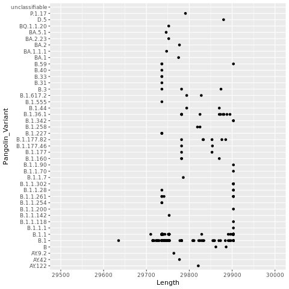
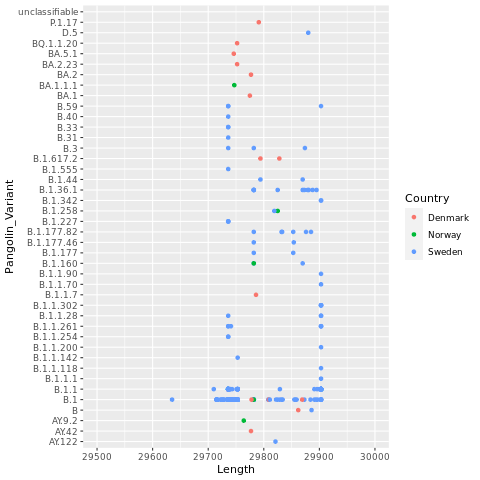

---
title: "NCGR NISE-Bioinformatics"
site: bookdown::bookdown_site
documentclass: book
bibliography: [book.bib, packages.bib]
# url: your book url like https://bookdown.org/yihui/bookdown
# cover-image: path to the social sharing image like images/cover.jpg
description: |
  This is the material for the NISE Bioinformatics Experience offered by NCGR in collaboration with NM-INBRE.
link-citations: yes
github-repo: ncgr/NISE-Bioinformatics

---

# National Center for Genome Resources {-}

This publication was supported by an Institutional Development Award (IDeA) from the National Institute of General Medical Sciences of the National Institutes of Health under grant number P20GM103451. 


## License and Copyright {-}

Creative Commons Attribution-NonCommercial-NoDerivatives 4.0
https://creativecommons.org/licenses/by-nc-nd/4.0/

© 2023 National Center for Genome Resources


```{r include=FALSE}
# automatically create a bib database for R packages
knitr::write_bib(c(
  .packages(), 'bookdown', 'knitr', 'rmarkdown'
), 'packages.bib')
```

<!--chapter:end:index.Rmd-->

# Linux

**Linux operating system (OS) and Bourne-Again SHell (bash) command-language basics**

## A little shell... aka the $ prompt is the command line interface

+ A shell is a user interface to the operating system.
    + CLI (Command Line Interface)
    + GUI (Graphical User Interface)
+ Bourne-Again SHell (bash) is a Unix shell and command language
+ Each command drives a program or script by talking to the Operating System
(Linux)

## Directory Structure

{width=100%}

In a Finder window, you would see this:

{width=60%}

## Find the shell in system you’ll use to log into the NCGR’s server

+ For **Windows**: search for MobaXterm from the start menu.
    + It may be useful to drag the terminal icon to the **desktop** for easier access in the future.

+ For **Mac**: search for "terminal" in the bar located in the Launchpad (rocket icon in the taskbar).
    + It may be useful to drag the terminal icon into the **Dock** for easier access in the future.

## Log on to logrus server 

Enter the following command to log on to logrus:

+ substitute **your** personal username in for "username"

```
ssh -p 44111 username@gateway.training.ncgr.org
```

Notes:

+ Because we’re logging in remotely, the -p option is required to specify port 44111. 
+ If you’re prompted to confirm the connection, say "yes", then enter your password.

## Now that I logged on, where am I?

You’re at the command line interface of the logrus analysis server!

To the left of the command prompt, you should see something like this: 

+ [eprice@logrus ~]$

Command **output** is shown after the "##" in this document.

## Part I: Basic Topics

### Understanding Directories

print working directory (pwd), mkdir (make directory), and list contents (ls)

```
pwd
```

```
## /home/eprice
```

+ This is your "home" directory.

Now, create a dir under your home directory for this linux class:

```
mkdir linuxc

ls
```

```
## linuxc
```

### Listing options

using the ls command

+ **l**ong list:

```
ls -l
```

```
## total 4
## drwxrwxr-x 2 eprice eprice 4096 Aug 17 22:50 linuxc
```

+ **l**ong list, by **t**ime, **r**everse order -old to new:

```
ls -ltr
```
    
```
## total 4
## drwxrwxr-x 2 eprice eprice 4096 Aug 17 22:50 linuxc
```

### Navigation

1) "**c**hange **d**irectory" to the directory you made
+ where ~ is shorthand for your home directory

```
cd ~/linuxc

pwd
```

```
## /home/eprice/linuxc
```

### Files: creating with touch command

1) Create a file

```
touch newfile.txt

ls -l
```

```
## total 0
## -rw-rw-r-- 1 eprice eprice 0 Aug 17 22:50 newfile.txt
```

2) Change to your home dir

```
cd ~ 

pwd
```

```
## /home/eprice
```

### History command

lists the commands you have entered

```
history
```

```
## 17 ls -ltr
## 18 cd ../linuxc
## 19 ls -ltr
## 20 history
```

Scroll through recent commands with the up and down arrows.

To perform a command from the list by number:

```
!17
```

To perform the last command you made:

```
!!
```

### Files: creating by redirecting standard out

redirect operator **>**

To send output to a file instead of standard out:

+ standard out is just the terminal
   
    
```
history > history.txt

ls -l
```

```
## total 4
## -rw-rw-r-- 1 eprice eprice 0    Aug 17 22:50 history.txt
## drwxrwxr-x 2 eprice eprice 4096 Aug 17 22:50 linuxc
```

```
cat history.txt
```

```
## 17 ls -ltr
## 18 cd ../linuxc
## 19 ls -ltr
## 20 history
## 21 ls -ltr
## 20 history > history
```

Now you have a file with your commands!

### File name completion with tab

To autocomplete remainder of file name instead of typing it all in:

+ cat h...(press tab)
    + cat history
+ prevents typos and saves time

### Files: moving files from one filename to another

**m**o**v**ing "mv" command

#### Syntax: mv sourcefilename destinationfilename{-}

```
mv history.txt history_file.txt

ls -l
```

```
## total 4
## -rw-rw-r-- 1 eprice eprice 0    Aug 17 22:50 history_file.txt 
## drwxrwxr-x 2 eprice eprice 4096 Aug 17 22:50 linuxc
```

### Files: copying files from one filename to another

**c**o**p**ying "cp" command

#### Syntax: cp sourcefilename destinationfilename{-}

1) Change back to the linuxc directory:

```
cd ~/linuxc
```

2) Make a "back up" copy of a file in your working directory:

```
cp ~/linuxc/newfile.txt newfile_bu.txt
```

3) Check if the newly copied file is there:

```
ls
```

```
## newfile_bu.txt
## newfile.txt
```

### Files: securely copying files between your laptop and logrus 

**s**ecure **c**o**p**y "scp" command

+ a secure way to copy files to/from a server while you're working on an outside network
    + like from your home or starbucks to logrus and vice versa

#### Syntax: scp [options] sourcepath destinationpath{-}

1) Create a file to copy

```
touch scp_test.txt
```

2) 
+ **Mac** users
    + open a **local** terminal
    + do **not** connect it to logrus
+ **Windows** users
    + open a new MobaXterm session (shell)
    
3) Run the scp command from your **local** terminal window:
+ to **download** the file **to your computer** from logrus
+ the last period means that the destination is your working directory

```
scp -P 44111 <user>@gateway.training.ncgr.org:~/linuxc/scp_test.txt .
```

Note: When you designate a port with secure copy (scp), you use a capital P.

You will be prompted for your logrus password if not using MobaXterm.

4) Check to see if the file you copied from logrus is on **your** computer!

5) Now **upload** a file **to logrus** from your computer
+ Again, run the scp command from your **local** terminal window:

```
scp -P 44111 scp_test.txt <user>@gateway.training.ncgr.org:~/linuxc
```

6) Check to see if the file you copied from your computer is on **logrus**!

### Files and directories: removing files is deleting files

**r**e**m**oving "rm" command

#### Syntax: rm [options] filename{-}

```
rm -i newfile_bu.txt
```

```
## rm: remove regular empty file newfile_bu.txt?
```

Enter "yes" or "y" in response to the question:

```
yes

ls -l
```

```
## total 0
## -rw-rw-r-- 1 eprice eprice 0 Aug 17 22:50 newfile.txt
```

At this point everyone should have the above in their linuxc class directory.

### Tool box: How to abort a command/process

Hold "control" key then hit "c" key, then release. 

+ Control-key often referred to as CTRL. 

Let’s say you type a command and nothing happens; it hangs.
This can happen when the syntax doesn’t make sense. 
Good time for CTRL c

```
cat
```

If you can't execute commands, then CTRL c

```
## ^C
```

You should be returned to your prompt: [username@logrus linuxc]$


## PART II: Advanced Topics

### Files: Symbolic links and the soft link (-s)

#### Syntax: ln -s FileYouWantToLink/PointTo NameYouWantToGiveIt{-}

```
ln -s /home/eprice/covid.fasta covid.fasta

ls -l
```

```
## total 0
## lrwxrwxrwx 1 eprice eprice 26 Aug 17 22:50 covid.fasta -> /home/eprice/covid.fasta 
## -rw-rw-r-- 1 eprice Aug 17 22:50 newfile.txt
```

### Understanding a fasta file format

Fasta files (.fasta or .fa) contain one or more sequences, each preceded by a **header** starting with ">".

Show only the **first 10 lines** of a file with "head" command:

```
head covid.fasta
```

```
## >NC_045512.2 |Severe acute respiratory syndrome coronavirus 2 isolate Wuhan-Hu-1, co
## ATTAAAGGTTTATACCTTCCCAGGTAACAAACCAACCAACTTTCGATCTCTTGTAGATCT
## GTTCTCTAAACGAACTTTAAAATCTGTGTGGCTGTCACTCGGCTGCATGCTTAGTGCACT
## CACGCAGTATAATTAATAACTAATTACTGTCGTTGACAGGACACGAGTAACTCGTCTATC
## TTCTGCAGGCTGCTTACGGTTTCGTCCGTGTTGCAGCCGATCATCAGCACATCTAGGTTT
## CGTCCGGGTGTGACCGAAAGGTAAGATGGAGAGCCTTGTCCCTGGTTTCAACGAGAAAAC
## ACACGTCCAACTCAGTTTGCCTGTTTTACAGGTTCGCGACGTGCTCGTACGTGGCTTTGG
## AGACTCCGTGGAGGAGGTCTTATCAGAGGCACGTCAACATCTTAAAGATGGCACTTGTGG
## CTTAGTAGAAGTTGAAAAAGGCGTTTTGCCTCAACTTGAACAGCCCTATGTGTTCATCAA
## ACGTTCGGATGCTCGAACTGCACCTCATGGTCATGTTATGGTTGAGCTGGTAGCAGAACT
```

Now show only the **last 10 lines** of a file using the "tail" command:

```
tail covid.fasta
```

```
## TATTGACGCATACAAAACATTCCCACCAACAGAGCCTAAAAAGGACAAAAAGAAGAAGGC
## TGATGAAACTCAAGCCTTACCGCAGAGACAGAAGAAACAGCAAACTGTGACTCTTCTTCC
## TGCTGCAGATTTGGATGATTTCTCCAAACAATTGCAACAATCCATGAGCAGTGCTGACTC
## AACTCAGGCCTAAACTCATGCAGACCACACAAGGCAGATGGGCTATATAAACGTTTTCGC
## TTTTCCGTTTACGATATATAGTCTACTCTTGTGCAGAATGAATTCTCGTAACTACATAGC
## ACAAGTAGATGTAGTTAACTTTAATCTCACATAGCAATCTTTAATCAGTGTGTAACATTA
## GGGAGGACTTGAAAGAGCCACCACATTTTCACCGAGGCCACGCGGAGTACGATCGAGTGT
## ACAGTGAACAATGCTAGGGAGAGCTGCCTATATGGAAGAGCCCTAATGTGTAAAATTAAT
## TTTAGTAGTGCTATCCCCATGTGATTTTAATAGCTTCTTAGGAGAATGACAAAAAAAAAA
## AAAAAAAAAAAAAAAAAAAAAAA
```

#### The pipe operator will redirect output of a command to another command.{-}

Use the pipe operator to redirect "cat" output to "head":

+ The symbol "|" denotes a pipe

```
cat covid.fasta | head
```

```
## >NC_045512.2 |Severe acute respiratory syndrome coronavirus 2 isolate Wuhan-Hu-1, co
## ATTAAAGGTTTATACCTTCCCAGGTAACAAACCAACCAACTTTCGATCTCTTGTAGATCT
## GTTCTCTAAACGAACTTTAAAATCTGTGTGGCTGTCACTCGGCTGCATGCTTAGTGCACT
## CACGCAGTATAATTAATAACTAATTACTGTCGTTGACAGGACACGAGTAACTCGTCTATC
## TTCTGCAGGCTGCTTACGGTTTCGTCCGTGTTGCAGCCGATCATCAGCACATCTAGGTTT
## CGTCCGGGTGTGACCGAAAGGTAAGATGGAGAGCCTTGTCCCTGGTTTCAACGAGAAAAC
## ACACGTCCAACTCAGTTTGCCTGTTTTACAGGTTCGCGACGTGCTCGTACGTGGCTTTGG
## AGACTCCGTGGAGGAGGTCTTATCAGAGGCACGTCAACATCTTAAAGATGGCACTTGTGG
## CTTAGTAGAAGTTGAAAAAGGCGTTTTGCCTCAACTTGAACAGCCCTATGTGTTCATCAA
## ACGTTCGGATGCTCGAACTGCACCTCATGGTCATGTTATGGTTGAGCTGGTAGCAGAACT
```

```
cat covid.fasta | tail
```

```
## TATTGACGCATACAAAACATTCCCACCAACAGAGCCTAAAAAGGACAAAAAGAAGAAGGC
## TGATGAAACTCAAGCCTTACCGCAGAGACAGAAGAAACAGCAAACTGTGACTCTTCTTCC
## TGCTGCAGATTTGGATGATTTCTCCAAACAATTGCAACAATCCATGAGCAGTGCTGACTC
## AACTCAGGCCTAAACTCATGCAGACCACACAAGGCAGATGGGCTATATAAACGTTTTCGC
## TTTTCCGTTTACGATATATAGTCTACTCTTGTGCAGAATGAATTCTCGTAACTACATAGC
## ACAAGTAGATGTAGTTAACTTTAATCTCACATAGCAATCTTTAATCAGTGTGTAACATTA
## GGGAGGACTTGAAAGAGCCACCACATTTTCACCGAGGCCACGCGGAGTACGATCGAGTGT
## ACAGTGAACAATGCTAGGGAGAGCTGCCTATATGGAAGAGCCCTAATGTGTAAAATTAAT
## TTTAGTAGTGCTATCCCCATGTGATTTTAATAGCTTCTTAGGAGAATGACAAAAAAAAAA
## AAAAAAAAAAAAAAAAAAAAAAA
```

### Understanding fastq (fq) file format

Fastq files contain sequence reads and associated **meta data**.

```
ln -s /home/fds/unix_basics/SP1.fq SP1.fq

ls -ltr
```

```
## total 0
## -rw-rw-r-- 1 eprice eprice 0 Aug 17 22:50 newfile.txt
## lrwxrwxrwx 1 eprice eprice 26 Aug 17 22:50 covid.fasta -> /home/eprice/covid.fasta 
## lrwxrwxrwx 1 eprice eprice Aug 17 22:50 SP1.fq -> /home/fds/unix_basics/SP1.fq
```

Tail the last 4 lines:

```
tail -n 4 SP1.fq
```

```
## @cluster_834:UMI_TTAAGG
## AGGGTGGGGGATCACATTTATTGTATTGAGG 
## +
## =A=@AB===>4?A=??EEB?EB@C?ECB=A?
```

A fastq file has 4 lines per record:

+ The header; starts with "@"
+ The sequence
+ Throwaway line; begins with "+" 
+ Phred-scaled quality scores

##### What is the difference between this and a fasta file?{-}

### Using grep (global regular expression print) to extract metrics

Grep will output the lines containing a provided expression.

#### Syntax: grep [options] "expression" filename{-}

```
grep ">" covid.fasta
```

```
## >NC_045512.2 |Severe acute respiratory syndrome coronavirus 2 isolate Wuhan-Hu-1, co
## >MT627325.1 |Severe acute respiratory syndrome coronavirus 2 isolate SARS-CoV-2/huma
## >MT622319.1 |Severe acute respiratory syndrome coronavirus 2 isolate SARS-CoV-2/huma
## >MT568634.1 |Severe acute respiratory syndrome coronavirus 2 isolate SARS-CoV-2/huma
## >MT568635.1 |Severe acute respiratory syndrome coronavirus 2 isolate SARS-CoV-2/huma
## >MT568636.1 |Severe acute respiratory syndrome coronavirus 2 isolate SARS-CoV-2/huma
## >MT568637.1 |Severe acute respiratory syndrome coronavirus 2 isolate SARS-CoV-2/huma
## >MT568638.1 |Severe acute respiratory syndrome coronavirus 2 isolate SARS-CoV-2/huma
## >MT568639.1 |Severe acute respiratory syndrome coronavirus 2 isolate SARS-CoV-2/huma
## >MT568640.1 |Severe acute respiratory syndrome coronavirus 2 isolate SARS-CoV-2/huma
## >MT568641.1 |Severe acute respiratory syndrome coronavirus 2 isolate SARS-CoV-2/huma
## >MT407649.1 |Severe acute respiratory syndrome coronavirus 2 isolate SARS-CoV-2/huma
## >MT407650.1 |Severe acute respiratory syndrome coronavirus 2 isolate SARS-CoV-2/huma
## >MT407651.1 |Severe acute respiratory syndrome coronavirus 2 isolate SARS-CoV-2/huma
## >MT407652.1 |Severe acute respiratory syndrome coronavirus 2 isolate SARS-CoV-2/huma
## >MT407653.1 |Severe acute respiratory syndrome coronavirus 2 isolate SARS-CoV-2/huma
## >MT407654.1 |Severe acute respiratory syndrome coronavirus 2 isolate SARS-CoV-2/huma
## >MT407655.1 |Severe acute respiratory syndrome coronavirus 2 isolate SARS-CoV-2/huma
## >MT407656.1 |Severe acute respiratory syndrome coronavirus 2 isolate SARS-CoV-2/huma
## >MT407657.1 |Severe acute respiratory syndrome coronavirus 2 isolate SARS-CoV-2/huma
## >MT407658.1 |Severe acute respiratory syndrome coronavirus 2 isolate SARS-CoV-2/huma
## >MT407659.1 |Severe acute respiratory syndrome coronavirus 2 isolate SARS-CoV-2/huma
## >MT534630.1 |Severe acute respiratory syndrome coronavirus 2 isolate SARS-CoV-2/huma
## >MT510727.1 |Severe acute respiratory syndrome coronavirus 2 isolate SARS-CoV-2/huma
## >MT510728.1 |Severe acute respiratory syndrome coronavirus 2 isolate SARS-CoV-2/huma
## >MT079843.1 |Severe acute respiratory syndrome coronavirus 2 isolate SARS-CoV-2/huma
## >MT079844.1 |Severe acute respiratory syndrome coronavirus 2 isolate SARS-CoV-2/huma
## >MT079845.1 |Severe acute respiratory syndrome coronavirus 2 isolate SARS-CoV-2/huma
## >MT079846.1 |Severe acute respiratory syndrome coronavirus 2 isolate SARS-CoV-2/huma
## >MT079847.1 |Severe acute respiratory syndrome coronavirus 2 isolate SARS-CoV-2/huma
## >MT079848.1 |Severe acute respiratory syndrome coronavirus 2 isolate SARS-CoV-2/huma
## >MT079849.1 |Severe acute respiratory syndrome coronavirus 2 isolate SARS-CoV-2/huma
## >MT079850.1 |Severe acute respiratory syndrome coronavirus 2 isolate SARS-CoV-2/huma
## >MT079851.1 |Severe acute respiratory syndrome coronavirus 2 isolate SARS-CoV-2/huma
## >MT079852.1 |Severe acute respiratory syndrome coronavirus 2 isolate SARS-CoV-2/huma
## >MT079853.1 |Severe acute respiratory syndrome coronavirus 2 isolate SARS-CoV-2/huma
## >MT079854.1 |Severe acute respiratory syndrome coronavirus 2 isolate SARS-CoV-2/huma
## >MT446312.1 |Severe acute respiratory syndrome coronavirus 2 isolate SARS-CoV-2/huma
## >MT412134.1 |Severe acute respiratory syndrome coronavirus 2 isolate SARS-CoV-2/huma
## >MT396241.1 |Severe acute respiratory syndrome coronavirus 2 isolate SARS-CoV-2/huma
## >MT039874.1 |Severe acute respiratory syndrome coronavirus 2 isolate SARS-CoV-2/huma
## >MT281577.1 |Severe acute respiratory syndrome coronavirus 2 isolate SARS-CoV-2/huma
## >MT291826.1 |Severe acute respiratory syndrome coronavirus 2 isolate SARS-CoV-2/huma
## >MT291827.1 |Severe acute respiratory syndrome coronavirus 2 isolate SARS-CoV-2/huma
## >MT291828.1 |Severe acute respiratory syndrome coronavirus 2 isolate SARS-CoV-2/huma
## >MT291829.1 |Severe acute respiratory syndrome coronavirus 2 isolate SARS-CoV-2/huma
## >MT291830.1 |Severe acute respiratory syndrome coronavirus 2 isolate SARS-CoV-2/huma
## >MT291831.1 |Severe acute respiratory syndrome coronavirus 2 isolate SARS-CoV-2/huma
## >MT291832.1 |Severe acute respiratory syndrome coronavirus 2 isolate SARS-CoV-2/huma
## >MT291833.1 |Severe acute respiratory syndrome coronavirus 2 isolate SARS-CoV-2/huma
## >MT291834.1 |Severe acute respiratory syndrome coronavirus 2 isolate SARS-CoV-2/huma
## >MT291835.2 |Severe acute respiratory syndrome coronavirus 2 isolate SARS-CoV-2/huma
## >MT291836.1 |Severe acute respiratory syndrome coronavirus 2 isolate SARS-CoV-2/huma
## >MT259226.1 |Severe acute respiratory syndrome coronavirus 2 isolate SARS-CoV-2/huma
## >MT259227.1 |Severe acute respiratory syndrome coronavirus 2 isolate SARS-CoV-2/huma
## >MT259228.1 |Severe acute respiratory syndrome coronavirus 2 isolate SARS-CoV-2/huma
## >MT259229.1 |Severe acute respiratory syndrome coronavirus 2 isolate SARS-CoV-2/huma
## >MT259230.1 |Severe acute respiratory syndrome coronavirus 2 isolate SARS-CoV-2/huma
## >MT259231.1 |Severe acute respiratory syndrome coronavirus 2 isolate SARS-CoV-2/huma
## >MT253696.1 |Severe acute respiratory syndrome coronavirus 2 isolate SARS-CoV-2/huma
## >MT253697.1 |Severe acute respiratory syndrome coronavirus 2 isolate SARS-CoV-2/huma
## >MT253698.1 |Severe acute respiratory syndrome coronavirus 2 isolate SARS-CoV-2/huma
## >MT253699.1 |Severe acute respiratory syndrome coronavirus 2 isolate SARS-CoV-2/huma
## >MT253700.1 |Severe acute respiratory syndrome coronavirus 2 isolate SARS-CoV-2/huma
## >MT253701.1 |Severe acute respiratory syndrome coronavirus 2 isolate SARS-CoV-2/huma
## >MT253702.1 |Severe acute respiratory syndrome coronavirus 2 isolate SARS-CoV-2/huma
## >MT253703.1 |Severe acute respiratory syndrome coronavirus 2 isolate SARS-CoV-2/huma
## >MT253704.1 |Severe acute respiratory syndrome coronavirus 2 isolate SARS-CoV-2/huma
## >MT253705.1 |Severe acute respiratory syndrome coronavirus 2 isolate SARS-CoV-2/huma
## >MT253706.1 |Severe acute respiratory syndrome coronavirus 2 isolate SARS-CoV-2/huma
## >MT253707.1 |Severe acute respiratory syndrome coronavirus 2 isolate SARS-CoV-2/huma
## >MT253708.1 |Severe acute respiratory syndrome coronavirus 2 isolate SARS-CoV-2/huma
## >MT253709.1 |Severe acute respiratory syndrome coronavirus 2 isolate SARS-CoV-2/huma
## >MT253710.1 |Severe acute respiratory syndrome coronavirus 2 isolate SARS-CoV-2/huma
## >MT226610.1 |Severe acute respiratory syndrome coronavirus 2 isolate SARS-CoV-2/huma
## >MT121215.1 |Severe acute respiratory syndrome coronavirus 2 isolate SARS-CoV-2/huma
## >MT135041.1 |Severe acute respiratory syndrome coronavirus 2 isolate SARS-CoV-2/huma
## >MT135042.1 |Severe acute respiratory syndrome coronavirus 2 isolate SARS-CoV-2/huma
## >MT135043.1 |Severe acute respiratory syndrome coronavirus 2 isolate SARS-CoV-2/huma
## >MT135044.1 |Severe acute respiratory syndrome coronavirus 2 isolate SARS-CoV-2/huma
## >MT123290.1 |Severe acute respiratory syndrome coronavirus 2 isolate SARS-CoV-2/huma
## >MT123291.2 |Severe acute respiratory syndrome coronavirus 2 isolate SARS-CoV-2/huma
## >MT123292.2 |Severe acute respiratory syndrome coronavirus 2 isolate SARS-CoV-2/huma
## >MT123293.2 |Severe acute respiratory syndrome coronavirus 2 isolate SARS-CoV-2/huma
## >MT093631.2 |Severe acute respiratory syndrome coronavirus 2 isolate SARS-CoV-2/huma
## >MT049951.1 |Severe acute respiratory syndrome coronavirus 2 isolate SARS-CoV-2/huma
## >MT039873.1 |Severe acute respiratory syndrome coronavirus 2 isolate HZ-1, complete
## >MT019529.1 |Severe acute respiratory syndrome coronavirus 2 isolate BetaCoV/Wuhan/I
## >MT019530.1 |Severe acute respiratory syndrome coronavirus 2 isolate BetaCoV/Wuhan/I
## >MT019531.1 |Severe acute respiratory syndrome coronavirus 2 isolate BetaCoV/Wuhan/I
## >MT019532.1 |Severe acute respiratory syndrome coronavirus 2 isolate BetaCoV/Wuhan/I
## >MT019533.1 |Severe acute respiratory syndrome coronavirus 2 isolate BetaCoV/Wuhan/I
## >MN996527.1 |Severe acute respiratory syndrome coronavirus 2 isolate WIV02, complete
## >MN996528.1 |Severe acute respiratory syndrome coronavirus 2 isolate WIV04, complete
## >MN996529.1 |Severe acute respiratory syndrome coronavirus 2 isolate WIV05, complete
## >MN996530.1 |Severe acute respiratory syndrome coronavirus 2 isolate WIV06, complete
## >MN996531.1 |Severe acute respiratory syndrome coronavirus 2 isolate WIV07, complete
## >MN988668.1 |Severe acute respiratory syndrome coronavirus 2 isolate 2019-nCoV WHU01
## >MN988669.1 |Severe acute respiratory syndrome coronavirus 2 isolate 2019-nCoV WHU02
## >MN938384.1 |Severe acute respiratory syndrome coronavirus 2 isolate 2019-nCoV_HKU-S
## >MN975262.1 |Severe acute respiratory syndrome coronavirus 2 isolate 2019-nCoV_HKU-S
## >MN908947.3 |Severe acute respiratory syndrome coronavirus 2 isolate Wuhan-Hu-1, com
```

Adding the "-c" option counts the number of lines containing a match 

+ **not** the number of matches!

```
grep -c ">" covid.fasta
```

```
## 102
```

The "-v" option reverses the grep search, which is the first step towards finding the total length of sequences

```
grep -v ">" covid.fasta
```

Use <CTRL> c to halt the overflow of output.

We can add in the pipe operator to redirect our output to the "wc" command. 

The output shows the number of newline characters, followed by line count and total character count.

```
grep -v ">" covid.fasta | wc
```

wc: prints newline, word, and byte counts for each file:

```
## 50812 50812 3096018
```

Let’s trim out the newline characters with "tr -d" before doing the word count:

```
grep -v ">" covid.fasta | tr -d ’\n’ | wc
```

```
##       0       1 3045206
```

### Working with compressed files

Powerful Z commands (zcat) 

+ p. 1 of 2

Let’s copy another file:

```
cp /home/fds/unix_basics/table1.txt.gz /home/<user>/linuxczcat table1.txt.gz
```

```
## 1, Justin Timberlake, Title 545, Price $7.30
## 2, Taylor Swift, Title 723, Price $7.90
## 3, Mick Jagger, Title 610, Price $7.90
## 4, Lady Gaga, Title 118, Price $7.30
## 5, Johnny Cash, Title 482, Price $6.50
## 6, Elvis Presley, Title 335, Price $7.30
## 7, John Lennon, Title 271, Price $7.90
## 8, Michael Jackson, Title 373, Price $5.50
```

```
zgrep "Jagger" table1.txt.gz
```

```
## 3, Mick Jagger, Title 610, Price $7.90
```

!! = last command

:s = substitute /word1/with word2

```
!!:s/Jagger/John
```

```
## 5, Johnny Cash, Title 482, Price $6.50
## 7, John Lennon, Title 271, Price $7.90
```

### Start ^ and end $ symbols

Powerful Z commands (zgrep) 

+ p. 2 of 2

Display all the lines that start with 8:

```
zgrep "^8" table1.txt.gz
```

```
## 8, Michael Jackson, Title 373, Price $5.50
```

Display all the lines that end with 50:

```
zgrep "50$" table1.txt.gz
```

```
## 5, Johnny Cash, Title 482, Price $6.50
## 8, Michael Jackson, Title 373, Price $5.50
```

### Files: parsing and creating data-subsets

p.1 of 5

Be sure you are in linuxc directory (as usual)


AWK command

+ **A**ho, **W**einberger and **K**ernighan 
    + the authors of the language

General syntax:

+ awk ’pattern {action}’ input-file
    + output goes to standard out=terminal
+ awk ’pattern {action}’ input-file > output-file
    + or send to an output file

#### Exercise:{-}

How many fields does the 1st row of table1.txt have?

Let’s look at the 1st row of table1.txt:

1, Justin Timberlake, Title 545, Price $7.30

How many fields does it have?

### Files: parsing and creating data-subsets 

p. 2 of 5

```
gunzip table1.txt.gz

cat table1.txt
```

```
## 1, Justin Timberlake, Title 545, Price $7.30
## 2, Taylor Swift, Title 723, Price $7.90
## 3, Mick Jagger, Title 610, Price $7.90
## 4, Lady Gaga, Title 118, Price $7.30
## 5, Johnny Cash, Title 482, Price $6.50
## 6, Elvis Presley, Title 335, Price $7.30
## 7, John Lennon, Title 271, Price $7.90
## 8, Michael Jackson, Title 373, Price $5.50
```

```
awk '{print $1 $3 $5}' table1.txt
```

```
## 1,Timberlake,545,
## 2,Swift,723,
## 3,Jagger,610,
## 4,Gaga,118,
## 5,Cash,482,
## 6,Presley,335,
## 7,Lennon,271,
## 8,Jackson,373,
```

### Files: parsing and creating data-subsets 

p. 3 of 5

Using field separator command -F

```
cat table1.txt
```

```
## 1, Justin Timberlake, Title 545, Price $7.30
## 2, Taylor Swift, Title 723, Price $7.90
## 3, Mick Jagger, Title 610, Price $7.90
## 4, Lady Gaga, Title 118, Price $7.30
## 5, Johnny Cash, Title 482, Price $6.50
## 6, Elvis Presley, Title 335, Price $7.30
## 7, John Lennon, Title 271, Price $7.90
## 8, Michael Jackson, Title 373, Price $5.50
```

```
awk -F, '{print $3}' table1.txt
```

```
##  Title 545
##  Title 723
##  Title 610
##  Title 118
##  Title 482
##  Title 335
##  Title 271
##  Title 373
```

### Files: parsing and creating data-subsets 

p. 4 of 5: Conditional awk 

Time to really watch for syntax errors!

1) Statements inside the curly brackets {statement} are called a block.

2) If you put a conditional expression in front of a block with with ==, the statement inside the block will be executed **only if** the condition is **true**.

3) The whole awk command is inside ' '. 
+ For example: 
    + awk '$7=="$7.30"{print $3}' table1.txt
+ The condition is: 
    + if $7=="$7.30"
    + meaning if the element at column 7 is equal to "$7.30", then execute statement(s) in the block {print $3}.

### Revisiting table1 and *previous* awk command 

p. 5 of 5

```
awk '$7=="$7.30" {print $3}' table1.txt
```

```
## Timberlake,
## Gaga,
## Presley,
```

{width=60%}

### Files: **S**tream **ED**itor (sed)

text substitution

#### Syntax: sed s/pattern/replacement{-}

Examples:

```
echo "it’s a trap" | sed s/ra/ar/
```

```
## it’s a tarp
```

Say you want to change all price occurrences of $7.90 to $8.90 from table1.txt, and save the changes to a new file. 

You can do this with sed.

```
sed 's/7.90/8.90/' table1.txt > table2.txt
```

Use cat to display the contens of the new file:

```
cat table2.txt
```

```
## 1, Justin Timberlake, Title 545, Price $7.30
## 2, Taylor Swift, Title 723, Price $8.90
## 3, Mick Jagger, Title 610, Price $8.90
## 4, Lady Gaga, Title 118, Price $7.30
## 5, Johnny Cash, Title 482, Price $6.50
## 6, Elvis Presley, Title 335, Price $7.30
## 7, John Lennon, Title 271, Price $8.90
## 8, Michael Jackson, Title 373, Price $5.50
```

### The Bash "for" Loop

Suppose we want to run a command for a **group of files** in a directory. We can use a for loop to target all of them at once.

#### Syntax: for variablename in filenameexpression; do command ${variablename}; done {-}

```
for file in *; do echo ${file}; done
```

```
## covid.fasta
## newfile.txt
## SP1.fq
## table1.txt
## table2.txt
```

+ The part up to the first semicolon targets every file in the working directory with the "*" wildcard
+ The second part will sequentially echo each file in the working directory 
+ The third part is required to terminate the loop

### Help with command syntax

If you forget details of a certain command, documentation can easily be found with a web search.

There is also cheat sheet on the weebly site under Supplemental Documents.

## Exercises

1. Using awk, print to output the first names of artists with album prices over $7.50 from ta- ble1.txt. Then redirect this output to a file named homework_1.txt

2. Using sed, replace all commas with semicolons in table1.txt. Save this to a file named home- work_2.txt

3. Piping history to grep, show all commands you’ve used with the expression "ls". Save this to a file named homework_3.txt

4. Piping cat to wc -l on the history text file made during the tutorial, count the number of lines in it.

5. Using scp, download table1.txt to your own machine. Check it’s there, then upload it back to logrus.

## PART III

1) Log on to logrus server

2) Enter the following command to log on to logrus: 

```
ssh -p 44111 username@gateway.training.ncgr.org
```

+ Don't forget to substitute **your** personal username in

3) Make a new directory under **your home directory**:

```
mkdir fastq_files
```

4) Enter into the new directory:

```
cd fastq_files
```

5) Move the fastq file from yesterday to the present working directory:

```
mv ~/linuxc/SP1.fq .

ls -ltr
```

```
## total 0
## lrwxrwxrwx 1 elavelle elavelle 28 Aug 17 22:50 SP1.fq -> /home/fds/unix_basics/SP1.f
```

6) How can we count the number of records in a fastq file?

```
grep -c "@cluster" SP1.fq
```

```
## 250
```

7) If you want to determine the number of lines in a file, you can use the "wc" command.

```
cat SP1.fq | wc -l
```

```
## 1000
```


8) Why does the first command output 250 and the second 1000?


## More Exercises
1. With one command, send a copy of table1.txt in the linuxc directory to your home directory with the name table1_bu.txt

2. Print to standard output the last line of table1.txt

3. Use a loop to count the number of lines in all files in the linuxc directory.

4. Print to standard output the last names of music artists with album prices less than or equal to $7.30

5. Create a file with only the accession numbers of the sequences contained in the covid.fasta file (with no additional spaces or symbols).


<!--chapter:end:02-linux.Rmd-->

# Parsing Data

## Practice

Let's practice with a small file. Make sure you are in a **screen**.

1. Make a directory under your home directory called "parse".

2. Go into that directory.

3. Copy the file "pandemics.csv" from this directory: "/home/jm/linux_practice/" to the directory you just made.

4. Take a look at the file.

5. Sort by year an put it into a new file called "sort.pandemic.csv"
		Note that you will need to change the delimiter to a comma (-t), tell it to sort numerically (-n), and tell it which column to sort (-k) sort -t, -n -k3 pandemics.csv > sort.pandemics.csv

6. Pull out all the instances that mention plague
		Note that grep is case sensitive by default so you might want to use the -i flag to make it case insensitive in case the is inconsistent

7. Pull out all the instance of the flu

8. Let's count the number of each type of pathogen (column 2). You could do this with a series of grep commands but with a big file you might not know all the possible pathogens and it would get tedious. So let's do this in a step-wise fashion and make sure each piece is as expected, then pipe it into the next step.\
		a. First pull out column 2 using awk or cut\
		b. Get the unique values (make sure you "sort" before you "uniq" or you will only deredundify adjacent identical values).\
		c. Get the count (hint: add -c to the uniq step)

9. Grab and count the organisms for the instances that mention plague

Hint: It is the same as #8 except you need to grab the plague lines first. When you put a command after the pipe it will read in the output of the previous command so only use the file name on the first command.

<details>
  <summary>Click for All Answers</summary>
  
Note that there are often several ways to do things in linux and not all methods are shown.
```
1. mkdir ~/parse

2. cd ~/parse

3. cp /home/jm/linux_practice/pandemics.csv . [Don't forget the space and period at the end; the period says to name it the same thing.]

4. cat table1.diff.txt [you could also use more, less, head, tail, or other commands]

5. sort -t, -nk 3 pandemics.csv > sort.pandemics.csv

6. grep -i plague sort.pandemics.csv

7. grep -i flu sort.pandemics.csv

8. awk -F, '{print $2}' sort.pandemics.csv | sort | uniq -c
     [Note that you can also use: "cut -d, -f2 pandemics.csv" for the first step]

9. grep -i plague sort.pandemics.csv | awk -F, '{print $2}' | sort | uniq -c
```
</details> 


## Our World in Data

Now let's use the data from "Our World In Data". For things that are new, we have added some in-line answers but before you reveal the answer, try it yourself first using the hints provided.

10. Copy the file "owid-covid-data.csv" from this directory: "/home/jm/linux_practice/" to your "parse" directory.

11. Make sure you are in the "parse" directory.

12. How many rows are in the file? Use wc -l (wc = word count, -l = lines)

<details>
  <summary>Click for Answer</summary>
		wc -l owid-covid-data.csv
</details>
\

13. How many columns? There is a special variable, NF, in awk, which prints the number of fields

Note: this will print the number of fields in each row. You can hit ctrl-c if you don't want to go through the whole file

<details>
  <summary>Click for Answer</summary>
		awk -F, '{print NF}' owid-covid-data.csv
</details>
\

14. Let's look at hospital_beds_per_thousand (column 60). We also need to get the location (country) from column 3 and the date from column 4. We'll pipe it into less so that we can scroll through it (to get out of less, hit "q").

<details>
  <summary>Click for Answer</summary>
		cut -d, -f 3,4,60 owid-covid-data.csv | less
</details>
\


15. There are lots of dates for each country. Let's limit it to early in the pandemic (2020-01-03), which is the first available date. Put it into a file called "beds.2020-01-03.csv" so we don't have to keep generating it.

16. What country had the least beds per thousand on 2020-01-03 and which has the most? Hint: Sort by the number of beds and pipe it into less.

Note: Some lines have missing data and will sort at the top of the file so you will have to scroll down.
		
17. How many beds were there in the United States on 2020-01-03?

Hint: There is a "United States" and a "United States Virgin Islands". To avoid getting the latter, have the match end with a comma. Also, require grep to start the match at the beginning of the line (^). It is good practice to be specific when using grep.

<details>
  <summary>Click for Answer</summary>
		grep "^United States," beds.2020-01-03.csv
</details>
\

18. How many beds were there in your three countries on 2020-01-03?

If your countries don't have data on that date, go back to the original file and see if you can find data for any date.

Hint: we'll use the extended version of grep which will allow us to search all 3 at once. Use the -E flag and put the things you are searching for in double quotes, seperated by pipes.

<details>
  <summary>Click for Answer</summary>
		grep -E "^Sweden,|^Norway,|^Denmark," beds.2020-01-03.csv
</details>
\

19. Create a file that has only the United States data for beds with the same three columns we have been using. Call it usbeds.csv. We'll use this file for the questions below.

20. Get the number of beds in the United States for each day in 2020.

21. Get the number of beds in the United States for the first COVID wave (March through September 2020).

Hint: Use sed to remove the dashes then awk with $2>=20200301&&$2<=20200930.

<details>
  <summary>Click for Answer</summary>
    sed 's/-//g' usbeds.csv | awk '$2>=20200301&&$2<=20200930{print}'
</details>
\

22. BONUS: Get the average number of beds in the United States for the first COVID wave (March through September 2020). This is a tough one. See if you can understand the code.


<details>
  <summary>Click for Answer</summary>
    sed 's/-//g' usbeds.csv | sed 's/-//g' |awk -F, '$2>=20200301&&$2<=20200930{SUM+=$3;CNT+=1}END{print SUM/CNT}'
</details>
\
		
<details>
  <summary>Click for All Answers</summary>
```
10. cp /home/jm/linux_practice/owid-covid-data.csv . 

11. pwd [If you aren't in that directory you can: "cd ~/parse"]

12. wc -l owid-covid-data.csv

13. awk -F, '{print NF}' owid-covid-data.csv

14. cut -d, -f 3,4,60 owid-covid-data.csv | less

15. cut -d, -f 3,4,60 owid-covid-data.csv | grep 2020-01-03 > beds.2020-01-03.csv

16. sort -t, -n -k3 beds.2020-01-03.csv | less

	Least: Mali,2020-01-03,0.1
	
	Most: Monaco,2020-01-03,13.8

17. grep "^United States," beds.2020-01-03.csv

18. grep -E "^Sweden,|^Norway,|^Denmark," beds.2020-01-03.csv

19. cut -d, -f 3,4,60 owid-covid-data.csv | grep "^United States," > usbeds.csv

20. grep 2020 usbeds.csv

21. sed 's/-//g' usbeds.csv | sed 's/-//g' |awk -F, '$2>=20200301&&$2<=20200930{print}'

22. sed 's/-//g' usbeds.csv | sed 's/-//g' |awk -F, '$2>=20200301&&$2<=20200930{SUM+=$3;CNT+=1}END{print SUM/CNT}'


```
</details>

## Practice with your 3 countries

Now practice on your own. Choose another variable and see if there are any interesting differences between your 3 countries. Explore at least 3 other variables.
	
Hint: You can look at the variables by heading the first line of the file.

		head -1 owid-covid-data.csv


Hint: If you prefer to have them each on their own line you can use sed to replace the commas with hard returns. Make sure to use the global "g" at the end so that every comma is replaced and not just the first one on each line.

		head -1 owid-covid-data.csv | sed 's/,/\n/g'
	

Hint: awk will also print out the row number for you (which corresponds to the column number for that variable in the original file). The NR variable is a special awk variable that will print the row.

		head -1 owid-covid-data.csv | sed 's/,/\n/g' |awk '{print NR "\t" $1}'


<!--chapter:end:03-parsing.Rmd-->

<!-- For next year, we should have the students change the name of the sequence file to something that tells which countries it contains. It would be a good reminder about the mv command and help to keep the practice file distinct from their 3 country file. -->

<!-- Add in pictures of the plots. -->

# NCBI SARS-CoV-2 Genome Sequences

## Getting Sequences from NCBI

See pdf.

## Exploring Sequence Files

Let's start with the Denmark, Norway, Sweden files. Make sure you are in the NCBIdata directory.

1. Grab just the sequence header lines.

2. How many sequences are there for Denmark?

3. Grab just the country out of the fasta headers

Your headers should have these fields, delimitted by a pipe (make sure you put the pipes in quotes so it doesn't interpret it):

```
  1) Accession
  2) Genbank Title
  3) Collection Date
  4) Country
  5) GEO Location
  6) Length
  7) Pangolin (variant)
  8) SRA Accession
  9) Sequence Type
```

4. How many sequences are there for each country?

Hint: Use sort then uniq -c (the latter gets counts of all the unique values).

5. How many sequences are there for each Geo Location? Some will just have the country there but others will have more granular information.

6. How many sequences are there for each pangolin variant? What is the dominant one? Look up more information for the dominant lineage at this site: https://cov-lineages.org/lineage_list.html

7. Haw many sequences are there for each pangolin variant in each country?

8. How many sequences are not blank in the collection data field?

```
Hint: Use "^$" in grep to find lines that have nothing between the start "^" and end "$" of the line.
```

9. What is the first and last date in your sequence file?

Hint: There are lots of different ways to do this, some of which involve more scrolling than others. Here is one strategy that just gets the earliest and latest dates. Do each step and check it then pipe it into the next step.

```
  1) Get the header lines
  2) Grab the collection data column (#3)
  3) Remove blanks
  4) Sort numerically: sort -n
  5) grab the first and last lines--you need the parentheses: (head -1; tail -1)
```

10. Find the first and last collection date in your sequence file for each country. Try to use a for loop. Since we haven't used these much I'll put an answer here for you.

Note: for some reason, the (head -1; tail -1) trick doesn't seem to work inside a for loop. So, do the earliest date first. Then use the up arrow to get the command back and alter it for the latest date.

<details>
  <summary>Click for Answer</summary>
  
  ```
    for i in 'Denmark' 'Norway' 'Sweden'; do
      echo $i
      grep $i sequences.fasta | cut -f 3 -d '|' | grep -v "^$" | sort -n | head -1
  done
  ```
  
</details>
\

<details>
  <summary>Click for All Answers</summary>
  
Note that there are often several ways to do things in linux and not all methods are shown.
```
1. grep '>' sequences.fasta

2. grep -c 'Denmark' sequences.fasta

14 sequences for Denmark

3. grep '>' sequences.fasta | cut -f 4 -d '|'

4. grep '>' sequences.fasta | cut -f 4 -d '|' | sort |uniq -c

     14 Denmark
     
      5 Norway
      
    616 Sweden

5. grep '>' sequences.fasta | cut -f 5 -d '|' | sort |uniq -c

     14 Denmark
     
      2 Norway
      
      3 Norway: Bergen
      
    566 Sweden
    
      1 Sweden:Goteborg
      
     44 Sweden: Orebro
     
      5 Sweden:Stockholm, Sweden

6. grep '>' sequences.fasta | cut -f 7 -d '|' | sort |uniq -c

The dominant pangolin variant is B.1 which occurs 429 times.

7. grep '>' sequences.fasta | cut -f 4,7 -d '|' | sort |uniq -c

8. grep '>' sequences.fasta | cut -f 3 -d '|' |grep -c "^$"

9. grep '>' sequences.fasta | cut -f 3 -d '|' | grep -v "^$" | sort -n | (head -1; tail -1)

10. The first is for the earliest date and the second for the latest date.

for i in 'Denmark' 'Norway' 'Sweden'; do
  echo $i
  grep $i sequences.fasta | cut -f 3 -d '|' | grep -v "^$" | sort -n | head -1
done

for i in 'Denmark' 'Norway' 'Sweden'; do
  echo $i
  grep $i sequences.fasta | cut -f 3 -d '|' | grep -v "^$" | sort -n | tail -1
done

```
</details> 

## Practice with your 3 countries

Run through these exercises again with your 3 countries and record the answers in your project powerpoint or elsewhere. We'll talk about what you found.

## Plotting

We'll plot some of the information about our sequences using R on the command line and the ggplot2 library. Get into a screen if you aren't already in one (screen -dr will reconnect you to a previous screen). Navigate to your NCBIdata directory.

## R

The R Project for Statistical Computing

https://www.r-project.org/

R studio (Integrated Development Environment)

https://posit.co/download/rstudio-desktop/

## ggplot2

Handy gglot2 references:

ggplot2 gallery

http://www.r-graph-gallery.com/portfolio/ggplot2-package/

ggplot2 cheatsheets

http://ggplot2.tidyverse.org/reference/

ggplot2 documentation

https://cran.r-project.org/web/packages/ggplot2/ggplot2.pdf

\

11. Make a tab-delimitted text file with the information from your sequence headers.

```
1) Grab the sequence headers
2) Remove the greater than sign at the beginning of the header line
3) Replace the pipes with tabs (Hint: In sed use \t to represent a tab)
4) Make the date numeric by replacing the dashes. The sed command below will allow you to replace dashes only in the date.
```
If you are interested in understanding the sed command: It looks for one or more (+) numbers ([0-9]) then a dash, more numbers, a dash and more numbers. The parentheses capture the sets of numbers so that it can return them as \1 for the first set, \2 for the second set, and \3 for the third set.
```
sed -E 's/([0-9]+)-([0-9]+)-([0-9]+)/\1\2\3/'
5) Put it into a file called Denmark_Norway_Sweden_seq_info.txt
```

The R environment on logrus needs to be activated (note that on some systems it is installed differently and you don't need to activate).

```
source activate visualization
```

Open up R.

```
R
```

Now we are in R. The R command line is similar to linux but the commands are a little bit different as you will notice as we walk through it. Note that you can use the up arrow to get back previous commands as in linux. ctrl-c works the same as well.

Load the ggplot2 library.

```
library(ggplot2)
```

See what your working directory is (it should be the directory you were in when you entered R). Note that you can change your working directory with the setwd() command, putting the path to the new directory in the parentheses.

```
getwd()
```

Let's read in the tab-delimitted file we created. We'll use the read.table command. To find out more, let's look at the help for that command using a question mark before the command (equivalent to the man command in linux).

```
?read.table
```

It prints out a lot of documentation including commands that are similar. The first part is below. The help documentation describes the command and gives you all the arguments you can use along with their defaults. Arguments go in the parentheses. Some are required but others are optional.

12. The two arguments that I use the most are "header" and "sep". Look at the usage section of the help below or in your terminal. What are the defaults for these two arguments?

13. Scroll down in the help (the up and down arrows go up or down line by line; the space bar jumps you down a page at a time) to the arguments section. Read about header and sep. What do these arguments do? What do the defaults mean?

Note: To get out of help, hit "q".

Read in our data file and put it into a variable. We'll name our variable dns for Denmark, Norway, Sweden.

```
dns = read.table("Denmark_Norway_Sweden_seq_info.txt", header=FALSE, sep="\t")
```

Let's take a look at the variable with our data The head command in R has 6 rows by default and it wraps lines as a group if they are too long for the screen.

```
head(dns)
```

14. Take a look at the help for the head command and see if you can figure out how to show 10 lines.

15. How do you think you could look at the end of the dns variable?

When you look at the dns variable, it shows column and row names. Since we didn't have a header line in our tab-delimitted file, it just defaults to V1, V2 (V stands for vector). Since we didn't have row names, it defaults to numbers. Let's fix the column names. The "c" concatenates a list of things together to be fed in as a group.

```
colnames(dns) = c("Accession", "Genbank_Title", "Collection_Date", "Country", "GEO_Location", "Length", "Pangolin_Variant", "SRA_Accession", "Sequence_Type")
```

Then check it with the head command.

```
    Accession
1 OR079912.1
2 OQ843561.1
3 OQ816151.1
4 OQ816152.1
5 OQ816154.1
6 OQ816156.1
                                                                                                           Genbank Title
1                  Severe acute respiratory syndrome coronavirus 2 isolate SARS-CoV-2/human/NOR/P9/2020, complete genome
2             Severe acute respiratory syndrome coronavirus 2 isolate SARS-CoV-2/human/DNK/DK-AHH8/2022, complete genome
3 Severe acute respiratory syndrome coronavirus 2 isolate SARS-CoV-2/human/SWE/01_SE100_21CS503718/2020, complete genome
4 Severe acute respiratory syndrome coronavirus 2 isolate SARS-CoV-2/human/SWE/01_SE100_21CS504474/2020, complete genome
5 Severe acute respiratory syndrome coronavirus 2 isolate SARS-CoV-2/human/SWE/01_SE100_21CS503085/2020, complete genome
6 Severe acute respiratory syndrome coronavirus 2 isolate SARS-CoV-2/human/SWE/01_SE100_21CS502014/2020, complete genome
  Collection Date Country GEO Location Length Pangolin Variant SRA Accession
1      2020-10-14  Norway       Norway  29825          B.1.258
2      2022-12-01 Denmark      Denmark  29752        BQ.1.1.20
3      2020-03-03  Sweden       Sweden  29736              B.1
4      2020-03-10  Sweden       Sweden  29736              B.1
5      2020-03-11  Sweden       Sweden  29736              B.1
6      2020-03-13  Sweden       Sweden  29736              B.1
  Sequence Type
1       GenBank
2       GenBank
3       GenBank
4       GenBank
5       GenBank
6       GenBank
```
\


The Collection Date wasn't recognized as numeric so let's fix that. The $ after the dns refers to a column. We will just overwrite it in the same column.

```
dns$"Collection_Date" = as.numeric(dns$"Collection_Date")
```

Time to plot!

The gglot2 library allows you to have a large amount of control over nearly all aspects of the plot. It also allows you to plot in layers, getting a base plot and then adding colors, lines, text, etc on top of it. It is part of the tidyverse universe and uses a Layered Grammar of Graphics (https://towardsdatascience.com/a-comprehensive-guide-to-the-grammar-of-graphics-for-effective-visualization-of-multi-dimensional-1f92b4ed4149 and https://www.jstor.org/stable/pdf/25651297.pdf?casa_token=KAMBWbsPZdwAAAAA:VHQTVEC762l7U6s6GWzRlYJNz5JaqfduQy1S04_LF6f3PUZjAh71Bva7WEIpROPBUx2BF9GL5bM0HOtDH_Zft81ycAcJ0971YeHDfrfHKBrgyw6G6fAG) to concisely describe graphical components that are shared across different graphs. In other words, it gives you tools to add and manipulate specific pieces of graphical output.


We will put each plot into a png file. Note that we can also put it into a pdf file by changing the code below to pdf. The pdf has the advantage of being able to put in multiple plots on separate pages. After plotting we need to use dev.off() so that R closes the file it is printing to.

### Histogram of Collection Dates

```
png("dates_histogram.png")

ggplot(dns, aes(x=Collection_Date)) + geom_histogram()

dev.off()
```

{width=50%}


### Plot Length x Variants

Let's plot the genome length by the variant to see if there are any patterns. Some variants have insertions or deletions compared to others, for instance. On the other hand, not all genome assemblies make it to the ends of the viral RNA genome so this will add some noise. 

We'll use a scatter plot. First we identify the data frame (dns) that we want to use. Then we assign fields to the x and y axis. After that we'll add the scatter plot layer (geom_point). We'll add another layer to limit the x axis.

```
png("lengthxvariants.png")

ggplot(dns, aes(x=Length,y=Pangolin_Variant)) + geom_point() + xlim(29500,30000)

dev.off()
```

{width=50%}


Now, let's color the points by Country.

```
png("lengthxvariants.color.png")

ggplot(dns, aes(x=Length,y=Pangolin_Variant,color=Country)) + geom_point() + xlim(29500,30000)

dev.off()
```

{width=50%}


### Plot Collection Date x Variants

16. Now try to plot the collection date (x axis) by the variants (y axis), coloring by the country.

### Plot Collection Date x Variants for your 3 countries

Now make a plot of Collection Date x Variants for your 3 countries and add it to your powerpoint.

Go to https://covariants.org/ to scroll down to the table and the phylogenetic tree to put some context around the variants.

At that same site, explore the "per country" and "cases" buttons for your 3 countries. Note that the graphs are interactive so you can hover over specific dates where you might have a lot of NCBI genome sequences. Grab screenshots to put into your powerpoint (be sure to record the date you grabbed the screenshot on the slide). How representative are the NCBI genome sequences?

Note: we'll be getting sequences from another source as well so don't worry if they aren't too representative.

<details>
  <summary>Click for All Answers</summary>
  
```
11. grep '>' sequences.fasta | sed 's/>//'|sed 's/|/\t/g'|sed -E 's/([0-9]+)-([0-9]+)-([0-9]+)/\1\2\3/' > Denmark_Norway_Sweden_seq_info.txt

12. header = FALSE and sep = ""

13. The header arguement determines whether you have a header line in your file with the names of variables.

While the header default is false, if you don't explicitly put in header=FALSE, it might decide that there is a header line if the first row has one fewer field than the rest. I like to explicitly tell read.table whether there is a header row or not.

The sep variable determines the field separator character.

The sep default is blank ("") and means white space. In other words, read.table will split the file up on one or more spaces, tabs, etc. With tab-delimitted files, you don't normally have to specify the tab variable but since we also have spaces in some of our fields, if we keep sep as whitespace, it will separate on all the spaces as well. So we will need to specify it.

14. head(dns, n=10) or head(dns, n=10L)

15. tail(dns)

16.

png("datexvariants.color.png")

ggplot(dns, aes(x=Collection_Date,y=Pangolin_Variant,color=Country)) + geom_point()

dev.off()

```
</details>

<!--chapter:end:04-NCBIsequences.Rmd-->

# Acknowledgements

This publication was supported by an Institutional Development Award (IDeA) from the National Institute of General Medical Sciences of the National Institutes of Health under grant number P20GM103451. Additional support came from National Science Foundation Award numbers 1759522 (Collaborative Research: Innovation: Pioneering New Approaches to Explore Pangenomic Space at Scale) and 2105391 (CRII: III: Toward the Compression of Pangenomic DNA Sequence Data Using Context-Free Grammars).


<br>

<center>
{width=50%} 

<br>

{width=50%} 
</center>

# License and Copyright

Creative Commons Attribution-NonCommercial-NoDerivatives 4.0
https://creativecommons.org/licenses/by-nc-nd/4.0/

© 2023 National Center for Genome Resources

<!--chapter:end:10-Acknowledgements.Rmd-->

